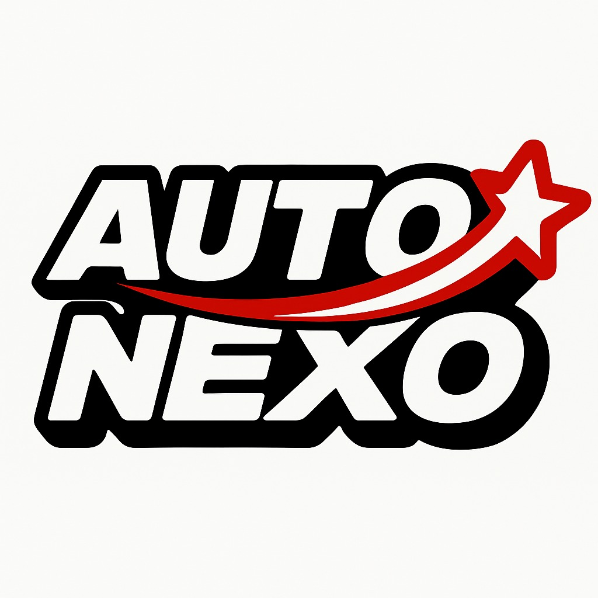
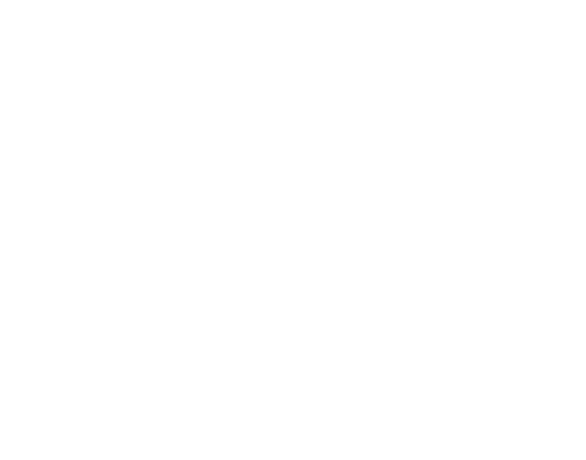

# <font color="skyblue"> **Capítulo III: Solution UI/UX Design** </font>

## **3.1. Product design**

### **3.1.1. Style Guidelines**

#### **3.1.1.1. General Style Guidelines**

Un “style guideline” o guía de estilo es un conjunto de reglas y pautas que establecen la forma en que se deben diseñar, redactar y presentar los elementos visuales y funcionales de un proyecto digital. Estas guías garantizan consistencia, coherencia y una identidad sólida a lo largo de todas las interfaces y materiales del producto.

A continuación, se detallan los parámetros implementados en la estructura visual y conceptual del proyecto AutoNexo, una aplicación móvil desarrollada por el equipo ATG, como parte de una iniciativa tecnológica orientada a optimizar la gestión y conexión entre talleres mecánicos y propietarios de vehículos.

**Branding**

Brand Overview

AutoNexo es una aplicación móvil desarrollada por el equipo ATG, enfocada en conectar talleres mecánicos, técnicos independientes y propietarios de vehículos dentro de un ecosistema digital integral. Su propósito principal es optimizar la gestión, comunicación y trazabilidad de los servicios automotrices, ofreciendo una experiencia más eficiente tanto para los clientes como para los talleres.

La aplicación permite administrar servicios, citas, historial de mantenimiento, inventario y facturación, todo desde una misma plataforma. A través de sus módulos, los talleres pueden organizar el flujo de trabajo, comunicarse directamente con los propietarios y analizar su rendimiento operativo mediante reportes visuales.

Una de las principales fortalezas de AutoNexo es su capacidad de adaptación a distintos tipos de talleres y mecánicos, integrando tecnologías móviles y notificaciones inteligentes para mejorar la atención al cliente. Además, su diseño modular facilita la expansión a nuevas funciones como recordatorios automáticos, integración con seguros y análisis de desempeño.

**Misión**

Digitalizar y optimizar la gestión de servicios automotrices mediante una plataforma móvil inteligente que conecte talleres, técnicos y propietarios, garantizando eficiencia, transparencia y satisfacción del cliente.

**Visión**

Convertirse en la aplicación líder en gestión automotriz en Latinoamérica, ofreciendo soluciones tecnológicas que impulsen la productividad de los talleres y fortalezcan la confianza entre clientes y mecánicos.

**Logo de ATG**

El logotipo de ATG representa innovación, colaboración y tecnología aplicada al sector automotriz. Sus elementos visuales refuerzan la idea de conexión y dinamismo, pilares fundamentales de la identidad de AutoNexo.

<p align="center">
  
</p>

 **Brand Name**

El nombre AutoNexo combina los términos “Auto” (vehículo) y “Nexo” (conexión, enlace), simbolizando su función principal como punto de unión digital entre los actores del ecosistema automotriz. Representa agilidad, confianza y control sobre los procesos de mantenimiento y servicio.

El nombre refleja también su visión de comunidad, en la que cada interacción entre taller, técnico y cliente contribuye a un sistema más inteligente, ordenado y conectado.

<p align="center">
  
</p>

**Colores**

La identidad visual de AutoNexo se fundamenta en una paleta cromática que transmite confianza, tecnología y conexión. Cada color ha sido seleccionado para reflejar la esencia de la marca: profesionalismo, precisión y cercanía con el usuario.

El azul primario (#202D36) simboliza solidez y tecnología, siendo el color principal de la interfaz y de los elementos de navegación. Este tono refuerza la percepción de confianza y modernidad que caracteriza a la aplicación.

El blanco primario (#FFFFFF) proporciona equilibrio y claridad visual, garantizando una lectura limpia y una experiencia de usuario fluida.

Los colores secundarios complementan la identidad principal con acentos de energía y contraste. El crimson (#800C1F) y el dark red (#3C0007) representan fuerza, determinación y energía mecánica, ideales para destacar alertas o secciones relacionadas con acciones importantes.

Por su parte, los tonos metálicos como el steel blue y el light blue-gray aportan una sensación de modernidad industrial, evocando el entorno técnico de los talleres y la conexión digital entre sistemas. (Nota: falta definir sus códigos HEX exactos.)

En los prototipos y wireframes, se emplean tonos neutros que garantizan jerarquía visual sin distraer al usuario: gris claro (#D9D9D9) para contenedores, gris medio (#8E8E8E) para texto auxiliar, y negro (#282828) para íconos y tipografía principal sobre fondos claros.

Los colores de texto mantienen un alto contraste para asegurar legibilidad: negro (#000000) sobre fondos claros y blanco grisáceo (#D9D9D9) sobre fondos oscuros.

En conjunto, esta paleta cromática refuerza la identidad moderna, confiable y funcional de AutoNexo, creando una experiencia visual coherente con su propósito tecnológico y su enfoque en la eficiencia del servicio automotriz.

<p align="center">
  
</p>

<section id="typography">
  <h2>Tipografía</h2>
  <p>
    La tipografía seleccionada para <strong>AutoNexo</strong> es <strong>Inter</strong>, en sus variantes <em>Medium</em> y <em>Bold</em>. 
    Esta fuente <em>sans-serif</em> fue elegida por su modernidad, claridad visual y excelente legibilidad en pantallas móviles, 
    características esenciales para una experiencia de usuario fluida y profesional.
  </p>
  <p>
    Su estructura geométrica y balanceada refuerza la identidad tecnológica y confiable de la aplicación, 
    manteniendo coherencia en todos los componentes de la interfaz.
  </p>

  <p>Se aplica de forma jerarquizada en los siguientes niveles:</p>

  <table border="1" cellspacing="0" cellpadding="8">
    <thead>
      <tr>
        <th>Nivel</th>
        <th>Uso principal</th>
        <th>Estilo</th>
        <th>Tamaño</th>
        <th>Line Height</th>
      </tr>
    </thead>
    <tbody>
      <tr>
        <td>Heading 01</td>
        <td>Títulos principales, encabezados generales</td>
        <td>Inter Medium</td>
        <td>70 px</td>
        <td>84 px</td>
      </tr>
      <tr>
        <td>Heading 02</td>
        <td>Secciones destacadas y subtítulos</td>
        <td>Inter Medium</td>
        <td>40 px</td>
        <td>52 px</td>
      </tr>
      <tr>
        <td>Heading 03</td>
        <td>Bloques de contenido intermedio</td>
        <td>Inter Medium</td>
        <td>25 px</td>
        <td>34 px</td>
      </tr>
      <tr>
        <td>Large Text Bold</td>
        <td>Textos de énfasis o botones principales</td>
        <td>Inter Bold</td>
        <td>25 px</td>
        <td>34 px</td>
      </tr>
      <tr>
        <td>Medium Text Bold</td>
        <td>Subtítulos o texto destacado secundario</td>
        <td>Inter Bold</td>
        <td>18 px</td>
        <td>30 px</td>
      </tr>
      <tr>
        <td>Normal Text Bold</td>
        <td>Texto informativo o párrafos breves</td>
        <td>Inter Bold</td>
        <td>16 px</td>
        <td>24 px</td>
      </tr>
      <tr>
        <td>Small Text Bold</td>
        <td>Etiquetas, menús o elementos de interfaz compactos</td>
        <td>Inter Bold</td>
        <td>14 px</td>
        <td>21 px</td>
      </tr>
    </tbody>
  </table>

<p align="center">
  
</p>

  <p>
    La jerarquía tipográfica de <strong>AutoNexo</strong> busca mantener consistencia visual y equilibrio, 
    permitiendo una lectura fluida y una clara diferenciación entre niveles de información.
  </p>
  <p>
    De este modo, la aplicación proyecta una imagen moderna, estructurada y profesional, 
    coherente con su enfoque tecnológico y su propósito de conectar digitalmente a talleres y propietarios de vehículos.
  </p>
</section>

### **3.1.2. Information Architecture**

#### **3.1.2.1. Organization Systems**

El sistema de navegación de AutoNexo está diseñado para ofrecer una experiencia intuitiva, fluida y centrada en la usabilidad móvil, asegurando que tanto mecánicos como propietarios puedan acceder fácilmente a las funciones principales sin perder el contexto de su actividad.

**Estructura de Navegación Principal**

En la pantalla Home, la navegación parte de una estructura principal de barra inferior (bottom navigation bar) que contiene los accesos directos a las secciones más utilizadas:

- **Home**: Vista principal con el estado actual de citas y agenda, proporcionando una visión general del día y las actividades pendientes.

- **Request**: Permite gestionar solicitudes de servicio de los clientes, facilitando la comunicación bidireccional entre taller y propietarios.

- **Offer**: Muestra promociones o servicios destacados del taller, permitiendo a los mecánicos promocionar sus especialidades.

- **Workshop**: Acceso directo al perfil del taller y a las funciones administrativas, incluyendo gestión de inventario y configuración.

- **Service**: Historial y seguimiento de servicios realizados, proporcionando trazabilidad completa de las intervenciones.

Cada icono cuenta con una etiqueta breve y un color activo que destaca la sección seleccionada, reforzando la claridad del recorrido visual y manteniendo al usuario orientado en todo momento.

**Navegación Superior y Menú Lateral**

En la parte superior de la interfaz se ubica una barra de encabezado (App Bar) con el nombre del usuario, ícono de notificaciones y un menú lateral desplegable (hamburger menu). Este último ofrece accesos secundarios organizados en categorías lógicas:

**Gestión de Perfil:**
- Profile
- Support and Assistance

**Configuración y Legal:**
- Terms of Use
- Privacy Policy
- Logout

**Personalización:**
- Cambio de idioma (Español / English)
- Modo de tema (oscuro o claro)

Esta estructura brinda al usuario flexibilidad y control sobre su experiencia de uso, manteniendo las opciones de configuración accesibles pero no intrusivas.

**Navegación Contextual en Pantallas de Detalle**

En las pantallas de detalle, como la vista de Workshop, la navegación mantiene la misma coherencia visual y funcional. El encabezado superior permite regresar a la vista anterior mediante una flecha de retroceso (Back Arrow), mientras que los botones inferiores ("Generate Code", "Edit Workshop") proporcionan acceso directo a las acciones específicas de gestión.

**Principios de Usabilidad**

Cada transición entre pantallas es suave y contextual, evitando recargar al usuario con demasiada información. Se prioriza la simplicidad y la eficiencia: los usuarios pueden moverse entre módulos con un número mínimo de toques, manteniendo siempre visibles los elementos de navegación principales.

**Consistencia y Accesibilidad**

En conjunto, este sistema de navegación garantiza que AutoNexo mantenga una experiencia uniforme, clara y accesible, adaptada tanto a la operatividad técnica del mecánico como a la practicidad del usuario final. La organización de la información sigue principios de jerarquía visual, agrupación lógica y feedback inmediato, asegurando que cada usuario pueda encontrar rápidamente lo que necesita.

#### **3.1.2.2. Labelling Systems**

El sistema de etiquetado de AutoNexo está diseñado para proporcionar claridad, consistencia y comprensión inmediata de las funciones y contenidos de la aplicación. Cada etiqueta ha sido cuidadosamente seleccionada para reflejar la terminología del sector automotriz mientras mantiene accesibilidad para usuarios de diferentes niveles técnicos.

**Principios de Etiquetado**

**Claridad y Precisión:**
- Cada etiqueta comunica exactamente su función sin ambigüedad
- Se evita jerga técnica innecesaria que pueda confundir a usuarios no especializados
- Se utilizan términos familiares del contexto automotriz cuando es apropiado

**Consistencia Terminológica:**
- Mismo término para la misma función en toda la aplicación
- Vocabulario unificado entre mecánicos y propietarios de vehículos
- Mantenimiento de convenciones establecidas en la industria

**Jerarquía Visual:**
- Etiquetas principales en tipografía más prominente
- Etiquetas secundarias con menor peso visual
- Uso de colores y tamaños para establecer prioridad informativa

**Estructura de Etiquetado por Módulos**

**Navegación Principal:**
- **Home**: Término universalmente reconocido para la pantalla principal
- **Request**: Indica claramente la gestión de solicitudes de servicio
- **Offer**: Comunica promociones y ofertas especiales
- **Workshop**: Identifica el perfil y gestión del taller
- **Service**: Refiere al historial y seguimiento de servicios

**Gestión de Servicios:**
- **Schedule Appointment**: Programar cita de manera clara y directa
- **Service History**: Historial de servicios con terminología estándar
- **Maintenance Reminder**: Recordatorio de mantenimiento
- **Quote Request**: Solicitud de cotización
- **Service Status**: Estado del servicio en tiempo real

**Perfil y Configuración:**
- **Profile Settings**: Configuración de perfil
- **Workshop Information**: Información del taller
- **Notification Preferences**: Preferencias de notificaciones
- **Language Settings**: Configuración de idioma
- **Theme Selection**: Selección de tema visual

**Comunicación y Soporte:**
- **Contact Support**: Contactar soporte
- **Help Center**: Centro de ayuda
- **FAQ**: Preguntas frecuentes
- **Report Issue**: Reportar problema
- **Feedback**: Retroalimentación

**Estados y Acciones:**
- **Pending**: Pendiente
- **In Progress**: En progreso
- **Completed**: Completado
- **Cancelled**: Cancelado
- **Rescheduled**: Reprogramado

**Etiquetado de Formularios**

**Campos de Entrada:**
- **Vehicle Make**: Marca del vehículo
- **Vehicle Model**: Modelo del vehículo
- **Year**: Año
- **License Plate**: Placa de matrícula
- **VIN Number**: Número de VIN
- **Service Type**: Tipo de servicio
- **Estimated Duration**: Duración estimada
- **Service Description**: Descripción del servicio

**Botones de Acción:**
- **Save**: Guardar
- **Cancel**: Cancelar
- **Submit**: Enviar
- **Edit**: Editar
- **Delete**: Eliminar
- **Confirm**: Confirmar
- **Back**: Atrás
- **Next**: Siguiente

**Mensajes y Alertas:**
- **Success**: Éxito
- **Warning**: Advertencia
- **Error**: Error
- **Information**: Información
- **Confirmation Required**: Confirmación requerida

**Localización y Accesibilidad**

**Soporte Multilingüe:**
- Etiquetas disponibles en español e inglés
- Adaptación cultural de términos técnicos
- Mantenimiento de consistencia entre idiomas

**Accesibilidad:**
- Etiquetas descriptivas para lectores de pantalla
- Texto alternativo para iconos y elementos gráficos
- Contraste adecuado para legibilidad
- Tamaños de fuente accesibles

**Convenciones de Nomenclatura**

**CamelCase para IDs técnicos:**
- `serviceHistory`
- `workshopProfile`
- `maintenanceReminder`

**kebab-case para URLs:**
- `/service-history`
- `/workshop-profile`
- `/maintenance-reminder`

**PascalCase para componentes:**
- `ServiceCard`
- `WorkshopProfile`
- `MaintenanceReminder`

Este sistema de etiquetado asegura que AutoNexo mantenga una comunicación clara y efectiva con sus usuarios, facilitando la adopción de la aplicación y reduciendo la curva de aprendizaje tanto para mecánicos como para propietarios de vehículos.

#### **3.1.2.3. SEO Tags and Meta Tags**

La estrategia de SEO y Meta Tags para AutoNexo está diseñada para optimizar la visibilidad en motores de búsqueda y mejorar la experiencia del usuario tanto en la Landing Page como en la Web Application. Además, se incluyen elementos de ASO (App Store Optimization) para maximizar la descarga y adopción de la aplicación móvil.

**Landing Page - SEO Tags y Meta Tags**

**Página Principal:**
```html
<title>AutoNexo - Servicio Rápido de Mecánicos Especializados | Reserva Instantánea</title>
<meta name="description" content="Conectamos mecánicos certificados con propietarios de vehículos de manera rápida y confiable. Reserva tu servicio de mantenimiento o reparación en minutos. Servicio automotriz completo con reserva instantánea.">
<meta name="keywords" content="servicio rápido, mecánicos certificados, reserva instantánea, mantenimiento vehicular, reparación automotriz, AutoNexo, servicio automotriz completo, mecánicos especializados, citas automotrices">
<meta name="author" content="ATG - AutoNexo Team">
<meta name="robots" content="index, follow">
<meta name="viewport" content="width=device-width, initial-scale=1.0">
<meta property="og:title" content="AutoNexo - Servicio Rápido de Mecánicos Especializados">
<meta property="og:description" content="Conectamos mecánicos certificados con propietarios de vehículos. Reserva tu servicio de mantenimiento o reparación en minutos con nuestro sistema de reserva instantánea.">
<meta property="og:type" content="website">
<meta property="og:url" content="https://autonexo.com">
<meta property="og:image" content="https://autonexo.com/assets/og-image.jpg">
<meta name="twitter:card" content="summary_large_image">
<meta name="twitter:title" content="AutoNexo - Servicio Rápido de Mecánicos">
<meta name="twitter:description" content="Reserva instantánea de servicios automotrices con mecánicos certificados. Servicio rápido y confiable.">
```

**Página de Características:**
```html
<title>Características - AutoNexo | Todo para Servicio Automotriz Completo</title>
<meta name="description" content="Descubre todas las características de AutoNexo. Reserva instantánea, servicio automotriz completo, conexión con mecánicos certificados y más funcionalidades.">
<meta name="keywords" content="características AutoNexo, reserva instantánea, servicio automotriz completo, funcionalidades, mecánicos certificados, sistema automático">
<meta name="author" content="ATG - AutoNexo Team">
```

**Página de Precios:**
```html
<title>Precios - AutoNexo | Planes Básico y Pro para Mecánicos</title>
<meta name="description" content="Elige tu plan en AutoNexo. Plan Básico $10/mes para comenzar o Plan Pro $30/mes para profesionales. Actualiza cuando tus necesidades crezcan.">
<meta name="keywords" content="precios AutoNexo, plan básico, plan pro, planes mensuales, profesionales mecánicos, actualización planes">
<meta name="author" content="ATG - AutoNexo Team">
```

**Página de Testimonios:**
```html
<title>Testimonios - AutoNexo | Lo que Dicen Nuestros Usuarios</title>
<meta name="description" content="Lee testimonios reales de usuarios de AutoNexo. Descubre cómo nuestra app se ha convertido en herramienta esencial para usuarios alrededor del mundo.">
<meta name="keywords" content="testimonios AutoNexo, opiniones usuarios, reseñas, experiencia usuarios, herramienta esencial, usuarios mundo">
<meta name="author" content="ATG - AutoNexo Team">
```

**Página de Equipo:**
```html
<title>Equipo - AutoNexo | Conoce a los Creadores del Proyecto</title>
<meta name="description" content="Conoce al equipo ATG creador de AutoNexo. Profesionales dedicados y adaptables que aportan dedicación y actitud positiva al proyecto.">
<meta name="keywords" content="equipo AutoNexo, creadores proyecto, equipo ATG, profesionales dedicados, actitud positiva, desarrolladores">
<meta name="author" content="ATG - AutoNexo Team">
```

**Página de Contacto:**
```html
<title>Contacto - AutoNexo | ¿Necesitas Ayuda? Estamos Aquí</title>
<meta name="description" content="¿Necesitas ayuda? Contacta con AutoNexo. Estamos aquí para ayudarte con cualquier pregunta o problema. Teléfono, email y dirección disponibles.">
<meta name="keywords" content="contacto AutoNexo, ayuda, soporte, preguntas, problemas, teléfono, email, dirección, atención al cliente">
<meta name="author" content="ATG - AutoNexo Team">
```

**Web Application - SEO Tags y Meta Tags**

**Dashboard Principal:**
```html
<title>Dashboard - AutoNexo | Panel de Control</title>
<meta name="description" content="Panel de control de AutoNexo. Gestiona tus citas, servicios y comunicación con mecánicos especializados.">
<meta name="keywords" content="dashboard AutoNexo, panel de control, gestión automotriz, citas programadas">
<meta name="author" content="ATG - AutoNexo Team">
<meta name="robots" content="noindex, nofollow">
```

**Perfil de Usuario:**
```html
<title>Mi Perfil - AutoNexo | Configuración de Cuenta</title>
<meta name="description" content="Gestiona tu perfil en AutoNexo. Configura tus datos, preferencias y configuración de cuenta.">
<meta name="keywords" content="perfil usuario, configuración cuenta, AutoNexo, datos personales">
<meta name="author" content="ATG - AutoNexo Team">
<meta name="robots" content="noindex, nofollow">
```

**Historial de Servicios:**
```html
<title>Historial de Servicios - AutoNexo | Registro de Mantenimiento</title>
<meta name="description" content="Consulta tu historial completo de servicios automotrices en AutoNexo. Mantén un registro detallado de todos los mantenimientos realizados.">
<meta name="keywords" content="historial servicios, registro mantenimiento, AutoNexo, servicios automotrices">
<meta name="author" content="ATG - AutoNexo Team">
<meta name="robots" content="noindex, nofollow">
```

**App Store Optimization (ASO) - Elementos para Aplicación Móvil**

**Google Play Store:**

**App Title:**
```
AutoNexo - Mecánicos y Talleres
```

**App Subtitle:**
```
Conecta con mecánicos especializados y gestiona el mantenimiento de tu vehículo
```

**App Description:**
```
AutoNexo es la aplicación móvil que revoluciona la gestión automotriz, conectando propietarios de vehículos con mecánicos especializados y talleres certificados.

 FUNCIONALIDADES PRINCIPALES:
• Conecta con mecánicos especializados en tu zona
• Programa citas de mantenimiento de forma fácil
• Gestiona el historial completo de tu vehículo
• Recibe recordatorios de mantenimiento automático
• Comunícate directamente con tu taller
• Accede a promociones y ofertas especiales
• Sistema de calificaciones y reseñas

 PARA MECÁNICOS Y TALLERES:
• Gestiona tu agenda de citas
• Administra tu perfil y servicios
• Comunícate con clientes
• Genera reportes de servicios
• Accede a herramientas de gestión

 BENEFICIOS:
• Ahorro de tiempo en la gestión de citas
• Transparencia en precios y servicios
• Historial completo de mantenimiento
• Acceso a mecánicos certificados
• Comunicación directa y eficiente

Descarga AutoNexo y transforma tu experiencia automotriz. Disponible para propietarios de vehículos y profesionales del sector automotriz.

Desarrollado por el equipo ATG.
```

**App Keywords:**
```
mecánico, taller automotriz, mantenimiento vehicular, citas automotrices, servicios automotrices, reparación automotriz, gestión de vehículos, AutoNexo, taller mecánico, mantenimiento preventivo, diagnóstico automotriz, mecánicos especializados, talleres cerca, servicios de reparación, gestión automotriz, app automotriz, citas programadas, historial vehicular, recordatorios mantenimiento, comunicación taller
```

**Apple App Store:**

**App Title:**
```
AutoNexo - Mecánicos y Talleres
```

**App Subtitle:**
```
Conecta con mecánicos especializados
```

**App Description:**
```
AutoNexo conecta propietarios de vehículos con mecánicos especializados, ofreciendo una plataforma integral para la gestión automotriz.

CARACTERÍSTICAS:
• Conexión directa con mecánicos certificados
• Programación de citas simplificada
• Historial completo de mantenimiento
• Recordatorios automáticos de servicio
• Comunicación en tiempo real
• Sistema de calificaciones
• Promociones y ofertas especiales

PARA MECÁNICOS:
• Gestión de agenda y citas
• Administración de perfil
• Comunicación con clientes
• Herramientas de gestión

Transforma tu experiencia automotriz con AutoNexo.

Desarrollado por ATG.
```

**App Keywords:**
```
mecánico, taller, automotriz, mantenimiento, citas, servicios, reparación, vehículo, AutoNexo, diagnóstico, especializado, gestión, app, móvil
```

**Estrategia de Keywords y Posicionamiento**

**Keywords Primarias:**
- AutoNexo
- servicio rápido mecánicos
- reserva instantánea
- mecánicos certificados
- servicio automotriz completo

**Keywords Secundarias:**
- mantenimiento vehicular
- planes básico pro
- testimonios usuarios
- equipo ATG

**Keywords de Cola Larga:**
- "reserva instantánea servicios automotrices"
- "servicio rápido mecánicos certificados"
- "planes básico pro AutoNexo"
- "testimonios usuarios AutoNexo"
- "equipo creadores proyecto AutoNexo"
- "características servicio automotriz completo"
- "conecta mecánicos propietarios vehículos"

Esta estrategia de SEO y ASO asegura que AutoNexo sea fácilmente encontrable tanto en motores de búsqueda como en las tiendas de aplicaciones, maximizando la visibilidad y adopción de la plataforma.

#### **3.1.2.4. Searching Systems**

El sistema de búsqueda de AutoNexo está diseñado para proporcionar a los usuarios herramientas eficientes y precisas para encontrar mecánicos, talleres y servicios específicos, evitando que se sientan perdidos entre el volumen de información disponible. El sistema combina búsqueda textual, filtros avanzados y navegación por tags para optimizar la experiencia de descubrimiento.

**Opciones de Búsqueda Disponibles**

**Búsqueda por Texto Libre:**
- **Campo de búsqueda principal:** Permite a los usuarios escribir términos relacionados con servicios, ubicaciones o nombres de talleres
- **Búsqueda inteligente:** Sistema que sugiere autocompletado basado en servicios populares, ubicaciones y talleres registrados
- **Búsqueda por voz:** Opción de dictado para facilitar la búsqueda en dispositivos móviles

**Búsqueda por Ubicación:**
- **Búsqueda geográfica:** Filtro por ciudad, distrito o proximidad (radio en kilómetros)
- **Detección automática:** Utiliza GPS para sugerir talleres cercanos automáticamente
- **Mapa interactivo:** Visualización de talleres disponibles en un mapa con marcadores

**Búsqueda por Servicios Específicos:**
- **Tags de servicios:** Sistema de etiquetas como "Tire change", "Oil change", "Gas System", "Car wash"
- **Categorías principales:** Mantenimiento preventivo, reparaciones, diagnósticos, servicios especializados
- **Búsqueda por marca/modelo:** Filtros específicos para vehículos (Ford, Toyota, etc.)

**Filtros Avanzados Disponibles**

**Filtros por Calificación y Reputación:**
- **Rating mínimo:** Filtro por calificación de talleres (ej: 4.0 ★ o superior)
- **Número de reseñas:** Filtrar por talleres con mínimo de reseñas para mayor confiabilidad
- **Certificaciones:** Mostrar solo talleres con certificaciones específicas

**Filtros por Disponibilidad:**
- **Horarios de atención:** Filtrar por talleres abiertos en horario específico
- **Disponibilidad inmediata:** Mostrar talleres con disponibilidad para el mismo día
- **Citas programadas:** Filtro por fechas específicas disponibles

**Filtros por Precio y Servicios:**
- **Rango de precios:** Filtro por presupuesto estimado
- **Servicios incluidos:** Selección múltiple de servicios requeridos
- **Tipo de servicio:** Urgente, programado, mantenimiento preventivo

**Filtros por Características del Taller:**
- **Tamaño del taller:** Individual, pequeño, mediano, grande
- **Especialización:** General, especializado en marca específica, servicios premium
- **Facilidades:** Estacionamiento, sala de espera, Wi-Fi, café

**Sistema de Tags y Etiquetado**

**Tags de Servicios (Filtros Rápidos):**
- **Mantenimiento Básico:** "Oil change", "Filter change", "Brake check"
- **Reparaciones:** "Engine repair", "Transmission", "Electrical system"
- **Servicios Especializados:** "Tire change", "Gas System", "Car wash", "Diagnostics"
- **Emergencias:** "24/7 service", "Roadside assistance", "Emergency repair"

**Tags de Ubicación:**
- **Distritos:** "Surco", "Miraflores", "San Isidro", "La Molina"
- **Ciudades:** "Lima", "Arequipa", "Cusco", "Trujillo"
- **Zonas comerciales:** "Centro", "Zona residencial", "Zona industrial"

**Tags de Características:**
- **Horarios:** "24/7", "Fines de semana", "Solo citas"
- **Certificaciones:** "Certificado", "Especializado", "Premium"
- **Facilidades:** "Estacionamiento", "Sala de espera", "Wi-Fi"

**Presentación de Resultados de Búsqueda**

**Vista de Lista (Resultados Principales):**
- **Tarjeta de taller:** Nombre del taller, calificación (4.0 ★), ubicación (Surco, Lima)
- **Servicios destacados:** Tags de servicios más relevantes para la búsqueda
- **Información clave:** Dirección, horarios, disponibilidad inmediata
- **Acciones rápidas:** "Ver perfil", "Contactar", "Agendar cita"

**Vista de Mapa:**
- **Marcadores interactivos:** Ubicación exacta de cada taller
- **Clusters:** Agrupación de talleres cercanos para mejor visualización
- **Información emergente:** Vista previa al hacer clic en marcador

**Vista de Detalle del Taller:**
- **Información completa:** Nombre, calificación, dirección específica (Av. Arequipa 1234)
- **Galería de imágenes:** Fotos del taller, equipos y vehículos en servicio
- **Servicios disponibles:** Lista completa con tags clickeables
- **Personal del taller:** Mecánicos disponibles con roles (Workshop owner, Workshop member)
- **Reseñas y testimonios:** Opiniones de clientes anteriores

**Funcionalidades de Búsqueda Avanzada**

**Búsqueda Combinada:**
- **Múltiples filtros simultáneos:** Combinar ubicación + servicios + precio + disponibilidad
- **Búsqueda guardada:** Permitir guardar combinaciones de filtros frecuentes
- **Historial de búsquedas:** Recordar búsquedas anteriores para facilitar repetición

**Resultados Inteligentes:**
- **Relevancia personalizada:** Priorizar resultados basados en historial del usuario
- **Sugerencias contextuales:** Recomendar servicios complementarios
- **Alertas de disponibilidad:** Notificar cuando talleres favoritos tengan disponibilidad

**Herramientas de Comparación:**
- **Comparar talleres:** Selección múltiple para comparar precios, servicios y calificaciones
- **Tabla comparativa:** Vista lado a lado de características principales
- **Recomendación inteligente:** Sugerir el mejor taller basado en criterios del usuario

Este sistema de búsqueda integral asegura que los usuarios de AutoNexo puedan encontrar rápidamente el taller y los servicios que necesitan, proporcionando múltiples vías de descubrimiento y filtrado para optimizar su experiencia de búsqueda.

#### **3.1.2.5. Navigation Systems**

El sistema de navegación de AutoNexo está diseñado para guiar eficientemente a los usuarios a través de la Landing Page y las aplicaciones móviles, permitiéndoles cumplir sus objetivos de manera intuitiva y satisfactoria. La navegación se estructura en múltiples niveles para adaptarse a diferentes contextos de uso y necesidades del usuario.

**Navegación de Landing Page**

**Header Navigation (Navegación Superior):**
- **Logo AutoNexo:** Elemento principal que lleva siempre al inicio de la página
- **Menú de navegación horizontal:** "Valores", "Características", "Precios", "Testimonios", "Preguntas", "Equipo"
- **Botones de acción:** "REGISTRARSE" (destacado en rojo) y selector de idioma "ES"
- **Comportamiento:** Menú fijo que permanece visible durante el scroll para acceso constante

**Navegación por Secciones:**
- **Scroll suave:** Transiciones fluidas entre secciones sin recargas de página
- **Enlaces de ancla:** Cada elemento del menú superior lleva directamente a la sección correspondiente
- **Indicadores visuales:** Resaltado del elemento activo en el menú según la sección visible

**Navegación de Contenido:**
- **Hero Section:** Botón "Comenzar" que lleva a registro o descarga de app
- **Sección Valores:** Navegación por cards con información de confiabilidad
- **Sección Características:** Cards interactivos que expanden información al hover
- **Sección Precios:** Botones de selección de planes que llevan a proceso de registro
- **Sección Testimonios:** Carrusel de testimonios con navegación por puntos
- **Sección Equipo:** Tarjetas de perfil con información expandible
- **Sección Contacto:** Formulario directo con validación en tiempo real

**Navegación de Aplicación Móvil**

**Bottom Navigation Bar (Navegación Inferior):**
- **Home:** Vista principal con dashboard de citas y agenda del día
- **Request:** Gestión de solicitudes de servicio y comunicación con clientes
- **Offer:** Promociones, ofertas especiales y servicios destacados
- **Workshop:** Perfil del taller, configuración y herramientas administrativas
- **Service:** Historial completo de servicios y seguimiento de intervenciones

**Top Navigation (App Bar):**
- **Flecha de retroceso:** Navegación hacia atrás contextual
- **Título de sección:** Indica ubicación actual en la aplicación
- **Icono de notificaciones:** Acceso directo a alertas y mensajes
- **Menú hamburguesa:** Acceso a funciones secundarias y configuración

**Menú Lateral (Drawer Navigation):**
- **Perfil de usuario:** Acceso a configuración personal y datos del taller
- **Soporte y asistencia:** Centro de ayuda y contacto técnico
- **Términos de uso:** Información legal y políticas
- **Política de privacidad:** Documentación de protección de datos
- **Configuración de idioma:** Cambio entre español e inglés
- **Selección de tema:** Modo claro u oscuro
- **Cerrar sesión:** Logout seguro de la aplicación

**Navegación Contextual**

**Navegación por Breadcrumbs:**
- **Ruta de navegación:** Indica la ubicación actual dentro de la jerarquía
- **Navegación rápida:** Permite regresar a niveles superiores con un toque
- **Ejemplo:** Home > Workshop > Adonz Automotive > Mechanics

**Navegación por Gestos:**
- **Swipe horizontal:** Navegación entre pestañas en la misma pantalla
- **Swipe vertical:** Scroll en listas y contenido extenso
- **Pinch to zoom:** Ampliación de imágenes en galerías de talleres
- **Pull to refresh:** Actualización de contenido en listas y feeds

**Navegación por Acciones:**

**Botones de Acción Primaria:**
- **"Comenzar":** Inicio del proceso de registro o descarga
- **"Registrarse":** Acceso directo al formulario de creación de cuenta
- **"Generate Code":** Generación de código para compartir taller
- **"Edit Workshop":** Edición de información del taller

**Botones de Acción Secundaria:**
- **"Ver perfil":** Acceso al detalle completo del taller
- **"Contactar":** Inicio de comunicación directa
- **"Agendar cita":** Programación de servicios
- **"Copy to Clipboard":** Copia de información para compartir

**Flujos de Navegación Principales**

**Flujo de Registro:**
1. Landing Page → Botón "Comenzar"
2. Formulario de registro → Validación
3. Verificación de email → Confirmación
4. Onboarding → Configuración inicial
5. Dashboard principal → Primera experiencia

**Flujo de Búsqueda de Taller:**
1. Home → Búsqueda o filtros
2. Lista de resultados → Vista previa
3. Detalle del taller → Información completa
4. Contacto o agendado → Acción final

**Flujo de Gestión de Taller:**
1. Workshop → Perfil del taller
2. Edición → Modificación de datos
3. Servicios → Gestión de ofertas
4. Mecánicos → Administración de personal
5. Guardar cambios → Confirmación

**Principios de Navegación**

**Consistencia:**
- Mismos patrones de navegación en toda la aplicación
- Iconografía uniforme y reconocible
- Colores y tipografías consistentes

**Accesibilidad:**
- Navegación por teclado en web
- Lectores de pantalla compatibles
- Contraste adecuado para visibilidad
- Tamaños de toque apropiados (mínimo 44px)

**Feedback Visual:**
- Estados hover y active claramente definidos
- Animaciones suaves en transiciones
- Indicadores de carga durante procesos
- Confirmaciones visuales de acciones

**Eficiencia:**
- Acceso directo a funciones principales
- Número mínimo de toques para tareas comunes
- Navegación contextual basada en el flujo de trabajo
- Búsqueda rápida y filtros accesibles

**Recuperación de Errores:**
- Botones de retroceso siempre disponibles
- Mensajes de error claros y accionables
- Opciones de cancelación en procesos largos
- Historial de navegación para regresar fácilmente

Este sistema de navegación integral asegura que los usuarios puedan moverse de manera intuitiva y eficiente a través de AutoNexo, cumpliendo sus objetivos sin fricción y manteniendo una experiencia satisfactoria tanto en la Landing Page como en las aplicaciones móviles.

### **3.1.3. Landing Page UI Design**

#### **3.1.3.1. Landing Page Wireframe**

#### **3.1.3.2. Landing Page Mock-up**

### **3.1.4. Mobile Applications UX/UI Design**

#### **3.1.4.1. Mobile Applications Wireframes**

#### **3.1.4.2. Mobile Applications Wireflow Diagrams**

#### **3.1.4.3. Mobile Applications Mock-ups**

#### **3.1.4.4. Mobile Applications User Flow Diagrams**

#### **3.1.4.5. Mobile Applications Prototyping**
