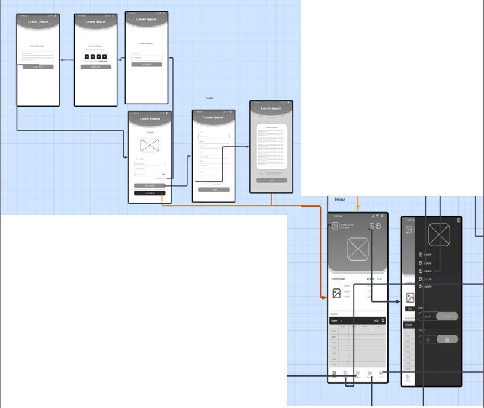
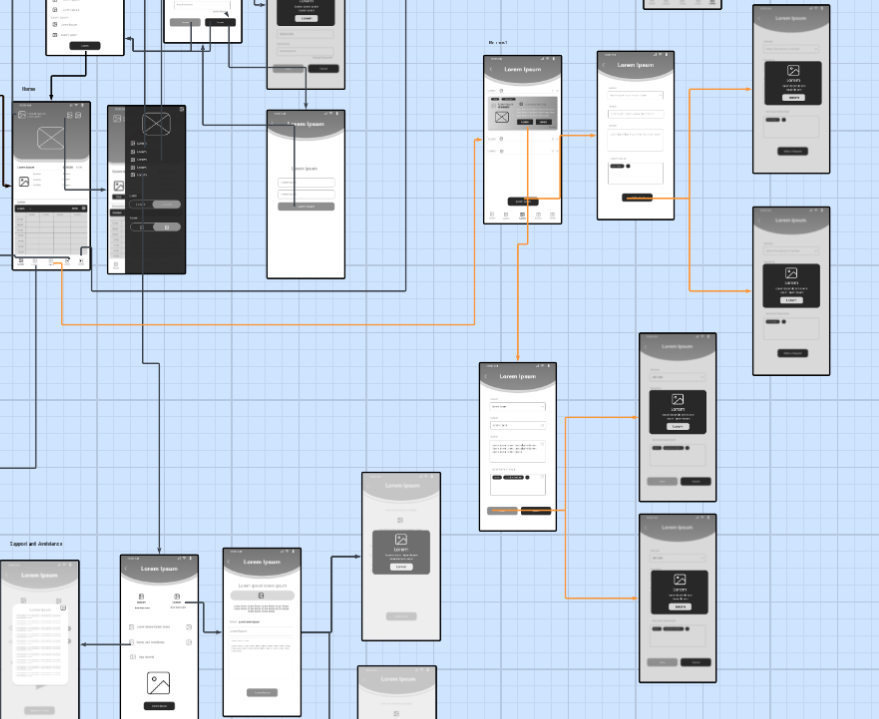
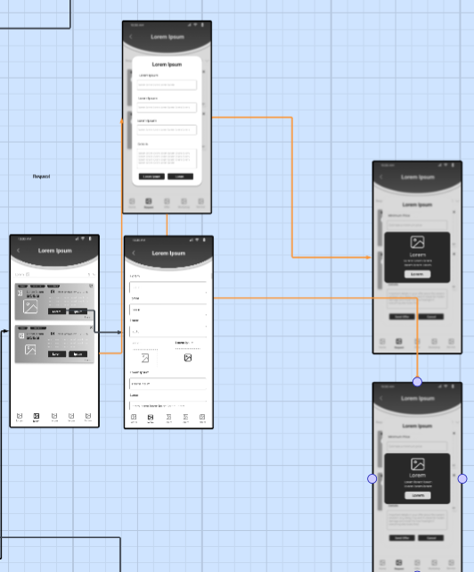
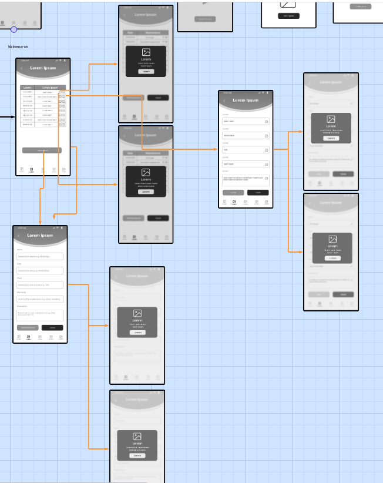
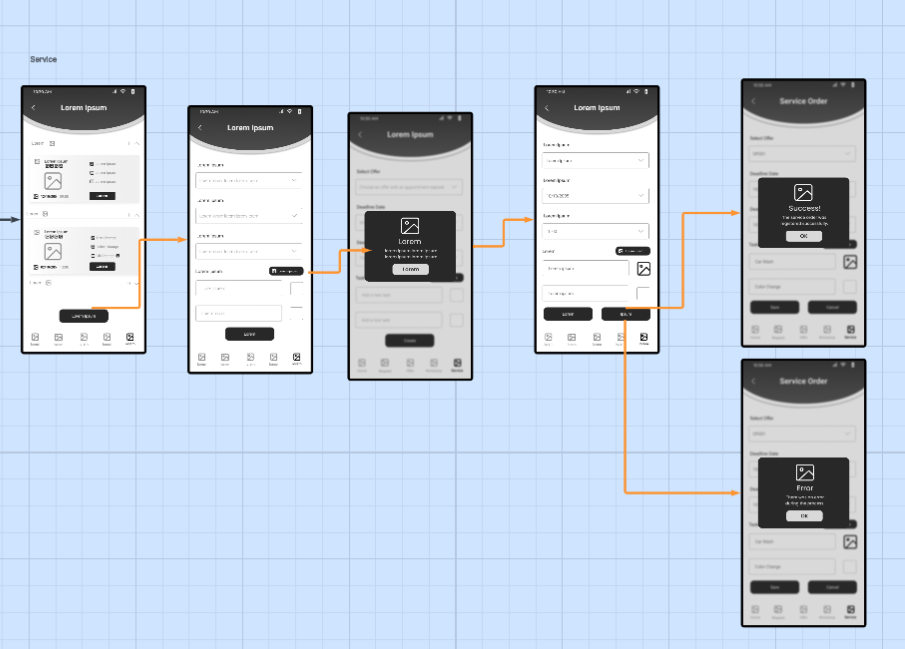
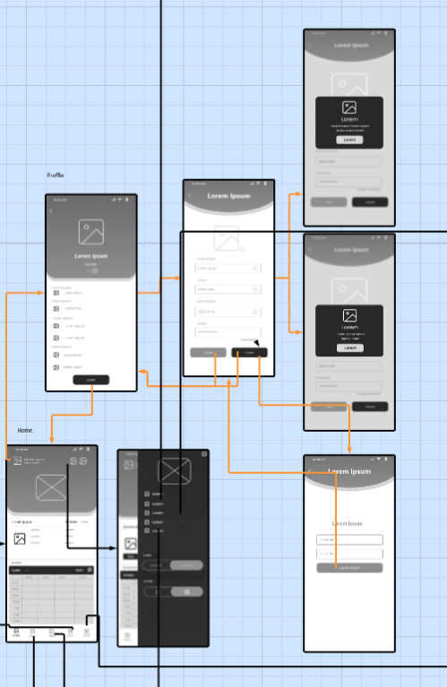
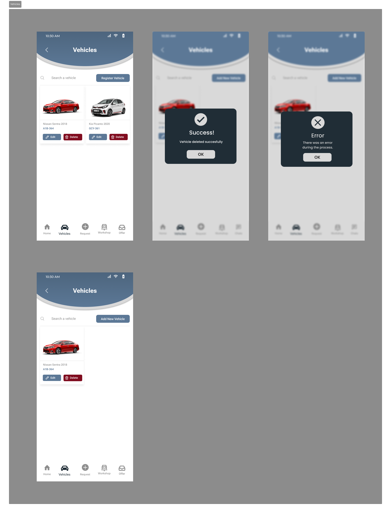
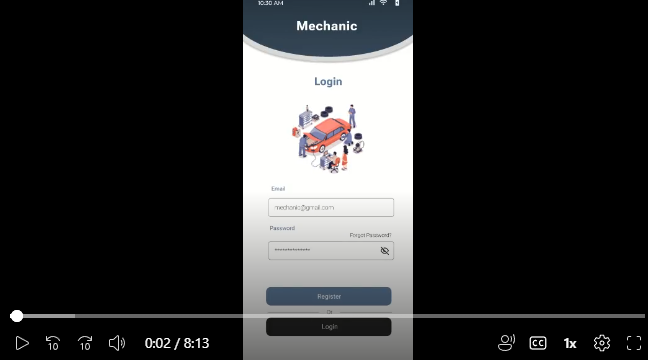
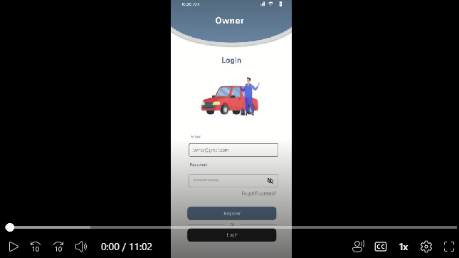

# **Capítulo III: Solution UI/UX Design**

## **3.1. Product design**

### **3.1.1. Style Guidelines**

#### **3.1.1.1. General Style Guidelines**

Un “style guideline” o guía de estilo es un conjunto de reglas y pautas que establecen la forma en que se deben diseñar, redactar y presentar los elementos visuales y funcionales de un proyecto digital. Estas guías garantizan consistencia, coherencia y una identidad sólida a lo largo de todas las interfaces y materiales del producto.

A continuación, se detallan los parámetros implementados en la estructura visual y conceptual del proyecto AutoNexo, una aplicación móvil desarrollada por el equipo ATG, como parte de una iniciativa tecnológica orientada a optimizar la gestión y conexión entre talleres mecánicos y propietarios de vehículos.

**Branding**

Brand Overview

AutoNexo es una aplicación móvil desarrollada por el equipo ATG, enfocada en conectar talleres mecánicos, técnicos independientes y propietarios de vehículos dentro de un ecosistema digital integral. Su propósito principal es optimizar la gestión, comunicación y trazabilidad de los servicios automotrices, ofreciendo una experiencia más eficiente tanto para los clientes como para los talleres.

La aplicación permite administrar servicios, citas, historial de mantenimiento, inventario y facturación, todo desde una misma plataforma. A través de sus módulos, los talleres pueden organizar el flujo de trabajo, comunicarse directamente con los propietarios y analizar su rendimiento operativo mediante reportes visuales.

Una de las principales fortalezas de AutoNexo es su capacidad de adaptación a distintos tipos de talleres y mecánicos, integrando tecnologías móviles y notificaciones inteligentes para mejorar la atención al cliente. Además, su diseño modular facilita la expansión a nuevas funciones como recordatorios automáticos, integración con seguros y análisis de desempeño.

**Misión**

Digitalizar y optimizar la gestión de servicios automotrices mediante una plataforma móvil inteligente que conecte talleres, técnicos y propietarios, garantizando eficiencia, transparencia y satisfacción del cliente.

**Visión**

Convertirse en la aplicación líder en gestión automotriz en Latinoamérica, ofreciendo soluciones tecnológicas que impulsen la productividad de los talleres y fortalezcan la confianza entre clientes y mecánicos.

**Logo de ATG**

El logotipo de ATG representa innovación, colaboración y tecnología aplicada al sector automotriz. Sus elementos visuales refuerzan la idea de conexión y dinamismo, pilares fundamentales de la identidad de AutoNexo.

<p align="center">
  
</p>

 **Brand Name**

El nombre AutoNexo combina los términos “Auto” (vehículo) y “Nexo” (conexión, enlace), simbolizando su función principal como punto de unión digital entre los actores del ecosistema automotriz. Representa agilidad, confianza y control sobre los procesos de mantenimiento y servicio.

El nombre refleja también su visión de comunidad, en la que cada interacción entre taller, técnico y cliente contribuye a un sistema más inteligente, ordenado y conectado.

<p align="center">
  
</p>

**Colores**

La identidad visual de AutoNexo se fundamenta en una paleta cromática que transmite confianza, tecnología y conexión. Cada color ha sido seleccionado para reflejar la esencia de la marca: profesionalismo, precisión y cercanía con el usuario.

El azul primario (#202D36) simboliza solidez y tecnología, siendo el color principal de la interfaz y de los elementos de navegación. Este tono refuerza la percepción de confianza y modernidad que caracteriza a la aplicación.

El blanco primario (#FFFFFF) proporciona equilibrio y claridad visual, garantizando una lectura limpia y una experiencia de usuario fluida.

Los colores secundarios complementan la identidad principal con acentos de energía y contraste. El crimson (#800C1F) y el dark red (#3C0007) representan fuerza, determinación y energía mecánica, ideales para destacar alertas o secciones relacionadas con acciones importantes.

Por su parte, los tonos metálicos como el steel blue y el light blue-gray aportan una sensación de modernidad industrial, evocando el entorno técnico de los talleres y la conexión digital entre sistemas. (Nota: falta definir sus códigos HEX exactos.)

En los prototipos y wireframes, se emplean tonos neutros que garantizan jerarquía visual sin distraer al usuario: gris claro (#D9D9D9) para contenedores, gris medio (#8E8E8E) para texto auxiliar, y negro (#282828) para íconos y tipografía principal sobre fondos claros.

Los colores de texto mantienen un alto contraste para asegurar legibilidad: negro (#000000) sobre fondos claros y blanco grisáceo (#D9D9D9) sobre fondos oscuros.

En conjunto, esta paleta cromática refuerza la identidad moderna, confiable y funcional de AutoNexo, creando una experiencia visual coherente con su propósito tecnológico y su enfoque en la eficiencia del servicio automotriz.

<p align="center">
  
</p>

<section id="typography">
  <h2>Tipografía</h2>
  <p>
    La tipografía seleccionada para <strong>AutoNexo</strong> es <strong>Inter</strong>, en sus variantes <em>Medium</em> y <em>Bold</em>. 
    Esta fuente <em>sans-serif</em> fue elegida por su modernidad, claridad visual y excelente legibilidad en pantallas móviles, 
    características esenciales para una experiencia de usuario fluida y profesional.
  </p>
  <p>
    Su estructura geométrica y balanceada refuerza la identidad tecnológica y confiable de la aplicación, 
    manteniendo coherencia en todos los componentes de la interfaz.
  </p>

  <p>Se aplica de forma jerarquizada en los siguientes niveles:</p>

  <table border="1" cellspacing="0" cellpadding="8">
    <thead>
      <tr>
        <th>Nivel</th>
        <th>Uso principal</th>
        <th>Estilo</th>
        <th>Tamaño</th>
        <th>Line Height</th>
      </tr>
    </thead>
    <tbody>
      <tr>
        <td>Heading 01</td>
        <td>Títulos principales, encabezados generales</td>
        <td>Roboto Flex</td>
        <td>70 px</td>
        <td>84 px</td>
      </tr>
      <tr>
        <td>Heading 02</td>
        <td>Secciones destacadas y subtítulos</td>
        <td>Roboto Flex</td>
        <td>40 px</td>
        <td>52 px</td>
      </tr>
      <tr>
        <td>Heading 03</td>
        <td>Bloques de contenido intermedio</td>
        <td>Roboto Flex</td>
        <td>25 px</td>
        <td>34 px</td>
      </tr>
      <tr>
        <td>Large Text Bold</td>
        <td>Textos de énfasis o botones principales</td>
        <td>Roboto</td>
        <td>25 px</td>
        <td>34 px</td>
      </tr>
      <tr>
        <td>Medium Text Bold</td>
        <td>Subtítulos o texto destacado secundario</td>
        <td>Roboto</td>
        <td>18 px</td>
        <td>30 px</td>
      </tr>
      <tr>
        <td>Normal Text Bold</td>
        <td>Texto informativo o párrafos breves</td>
        <td>Roboto</td>
        <td>16 px</td>
        <td>24 px</td>
      </tr>
      <tr>
        <td>Small Text Bold</td>
        <td>Etiquetas, menús o elementos de interfaz compactos</td>
        <td>Roboto</td>
        <td>14 px</td>
        <td>21 px</td>
      </tr>
    </tbody>
  </table>

<p align="center">
  
</p>

  <p>
    La jerarquía tipográfica de <strong>AutoNexo</strong> busca mantener consistencia visual y equilibrio, 
    permitiendo una lectura fluida y una clara diferenciación entre niveles de información.
  </p>
  <p>
    De este modo, la aplicación proyecta una imagen moderna, estructurada y profesional, 
    coherente con su enfoque tecnológico y su propósito de conectar digitalmente a talleres y propietarios de vehículos.
  </p>
</section>

### **3.1.2. Information Architecture**

#### **3.1.2.1. Organization Systems**

El sistema de navegación de AutoNexo está diseñado para ofrecer una experiencia intuitiva, fluida y centrada en la usabilidad móvil, asegurando que tanto mecánicos como propietarios puedan acceder fácilmente a las funciones principales sin perder el contexto de su actividad.

**Estructura de Navegación Principal**

En la pantalla Home, la navegación parte de una estructura principal de barra inferior (bottom navigation bar) que contiene los accesos directos a las secciones más utilizadas:

- **Home**: Vista principal con el estado actual de citas y agenda, proporcionando una visión general del día y las actividades pendientes.

- **Request**: Permite gestionar solicitudes de servicio de los clientes, facilitando la comunicación bidireccional entre taller y propietarios.

- **Offer**: Muestra promociones o servicios destacados del taller, permitiendo a los mecánicos promocionar sus especialidades.

- **Workshop**: Acceso directo al perfil del taller y a las funciones administrativas, incluyendo gestión de inventario y configuración.

- **Service**: Historial y seguimiento de servicios realizados, proporcionando trazabilidad completa de las intervenciones.

Cada icono cuenta con una etiqueta breve y un color activo que destaca la sección seleccionada, reforzando la claridad del recorrido visual y manteniendo al usuario orientado en todo momento.

**Navegación Superior y Menú Lateral**

En la parte superior de la interfaz se ubica una barra de encabezado (App Bar) con el nombre del usuario, ícono de notificaciones y un menú lateral desplegable (hamburger menu). Este último ofrece accesos secundarios organizados en categorías lógicas:

**Gestión de Perfil:**
- Profile
- Support and Assistance

**Configuración y Legal:**
- Terms of Use
- Privacy Policy
- Logout

**Personalización:**
- Cambio de idioma (Español / English)
- Modo de tema (oscuro o claro)

Esta estructura brinda al usuario flexibilidad y control sobre su experiencia de uso, manteniendo las opciones de configuración accesibles pero no intrusivas.

**Navegación Contextual en Pantallas de Detalle**

En las pantallas de detalle, como la vista de Workshop, la navegación mantiene la misma coherencia visual y funcional. El encabezado superior permite regresar a la vista anterior mediante una flecha de retroceso (Back Arrow), mientras que los botones inferiores ("Generate Code", "Edit Workshop") proporcionan acceso directo a las acciones específicas de gestión.

**Principios de Usabilidad**

Cada transición entre pantallas es suave y contextual, evitando recargar al usuario con demasiada información. Se prioriza la simplicidad y la eficiencia: los usuarios pueden moverse entre módulos con un número mínimo de toques, manteniendo siempre visibles los elementos de navegación principales.

**Consistencia y Accesibilidad**

En conjunto, este sistema de navegación garantiza que AutoNexo mantenga una experiencia uniforme, clara y accesible, adaptada tanto a la operatividad técnica del mecánico como a la practicidad del usuario final. La organización de la información sigue principios de jerarquía visual, agrupación lógica y feedback inmediato, asegurando que cada usuario pueda encontrar rápidamente lo que necesita.

#### **3.1.2.2. Labelling Systems**

El sistema de etiquetado de AutoNexo está diseñado para proporcionar claridad, consistencia y comprensión inmediata de las funciones y contenidos de la aplicación. Cada etiqueta ha sido cuidadosamente seleccionada para reflejar la terminología del sector automotriz mientras mantiene accesibilidad para usuarios de diferentes niveles técnicos.

**Principios de Etiquetado**

**Claridad y Precisión:**
- Cada etiqueta comunica exactamente su función sin ambigüedad
- Se evita jerga técnica innecesaria que pueda confundir a usuarios no especializados
- Se utilizan términos familiares del contexto automotriz cuando es apropiado

**Consistencia Terminológica:**
- Mismo término para la misma función en toda la aplicación
- Vocabulario unificado entre mecánicos y propietarios de vehículos
- Mantenimiento de convenciones establecidas en la industria

**Jerarquía Visual:**
- Etiquetas principales en tipografía más prominente
- Etiquetas secundarias con menor peso visual
- Uso de colores y tamaños para establecer prioridad informativa

**Estructura de Etiquetado por Módulos**

**Navegación Principal:**
- **Home**: Término universalmente reconocido para la pantalla principal
- **Request**: Indica claramente la gestión de solicitudes de servicio
- **Offer**: Comunica promociones y ofertas especiales
- **Workshop**: Identifica el perfil y gestión del taller
- **Service**: Refiere al historial y seguimiento de servicios

**Gestión de Servicios:**
- **Schedule Appointment**: Programar cita de manera clara y directa
- **Service History**: Historial de servicios con terminología estándar
- **Maintenance Reminder**: Recordatorio de mantenimiento
- **Quote Request**: Solicitud de cotización
- **Service Status**: Estado del servicio en tiempo real

**Perfil y Configuración:**
- **Profile Settings**: Configuración de perfil
- **Workshop Information**: Información del taller
- **Notification Preferences**: Preferencias de notificaciones
- **Language Settings**: Configuración de idioma
- **Theme Selection**: Selección de tema visual

**Comunicación y Soporte:**
- **Contact Support**: Contactar soporte
- **Help Center**: Centro de ayuda
- **FAQ**: Preguntas frecuentes
- **Report Issue**: Reportar problema
- **Feedback**: Retroalimentación

**Estados y Acciones:**
- **Pending**: Pendiente
- **In Progress**: En progreso
- **Completed**: Completado
- **Cancelled**: Cancelado
- **Rescheduled**: Reprogramado

**Etiquetado de Formularios**

**Campos de Entrada:**
- **Vehicle Make**: Marca del vehículo
- **Vehicle Model**: Modelo del vehículo
- **Year**: Año
- **License Plate**: Placa de matrícula
- **VIN Number**: Número de VIN
- **Service Type**: Tipo de servicio
- **Estimated Duration**: Duración estimada
- **Service Description**: Descripción del servicio

**Botones de Acción:**
- **Save**: Guardar
- **Cancel**: Cancelar
- **Submit**: Enviar
- **Edit**: Editar
- **Delete**: Eliminar
- **Confirm**: Confirmar
- **Back**: Atrás
- **Next**: Siguiente

**Mensajes y Alertas:**
- **Success**: Éxito
- **Warning**: Advertencia
- **Error**: Error
- **Information**: Información
- **Confirmation Required**: Confirmación requerida

**Localización y Accesibilidad**

**Soporte Multilingüe:**
- Etiquetas disponibles en español e inglés
- Adaptación cultural de términos técnicos
- Mantenimiento de consistencia entre idiomas

**Accesibilidad:**
- Etiquetas descriptivas para lectores de pantalla
- Texto alternativo para iconos y elementos gráficos
- Contraste adecuado para legibilidad
- Tamaños de fuente accesibles

**Convenciones de Nomenclatura**

**CamelCase para IDs técnicos:**
- `serviceHistory`
- `workshopProfile`
- `maintenanceReminder`

**kebab-case para URLs:**
- `/service-history`
- `/workshop-profile`
- `/maintenance-reminder`

**PascalCase para componentes:**
- `ServiceCard`
- `WorkshopProfile`
- `MaintenanceReminder`

Este sistema de etiquetado asegura que AutoNexo mantenga una comunicación clara y efectiva con sus usuarios, facilitando la adopción de la aplicación y reduciendo la curva de aprendizaje tanto para mecánicos como para propietarios de vehículos.

#### **3.1.2.3. SEO Tags and Meta Tags**

La estrategia de SEO y Meta Tags para AutoNexo está diseñada para optimizar la visibilidad en motores de búsqueda y mejorar la experiencia del usuario tanto en la Landing Page como en la Web Application. Además, se incluyen elementos de ASO (App Store Optimization) para maximizar la descarga y adopción de la aplicación móvil.

**Landing Page - SEO Tags y Meta Tags**

**Página Principal:**
```html
<title>AutoNexo - Servicio Rápido de Mecánicos Especializados | Reserva Instantánea</title>
<meta name="description" content="Conectamos mecánicos certificados con propietarios de vehículos de manera rápida y confiable. Reserva tu servicio de mantenimiento o reparación en minutos. Servicio automotriz completo con reserva instantánea.">
<meta name="keywords" content="servicio rápido, mecánicos certificados, reserva instantánea, mantenimiento vehicular, reparación automotriz, AutoNexo, servicio automotriz completo, mecánicos especializados, citas automotrices">
<meta name="author" content="ATG - AutoNexo Team">
<meta name="robots" content="index, follow">
<meta name="viewport" content="width=device-width, initial-scale=1.0">
<meta property="og:title" content="AutoNexo - Servicio Rápido de Mecánicos Especializados">
<meta property="og:description" content="Conectamos mecánicos certificados con propietarios de vehículos. Reserva tu servicio de mantenimiento o reparación en minutos con nuestro sistema de reserva instantánea.">
<meta property="og:type" content="website">
<meta property="og:url" content="https://autonexo.com">
<meta property="og:image" content="https://autonexo.com/assets/og-image.jpg">
<meta name="twitter:card" content="summary_large_image">
<meta name="twitter:title" content="AutoNexo - Servicio Rápido de Mecánicos">
<meta name="twitter:description" content="Reserva instantánea de servicios automotrices con mecánicos certificados. Servicio rápido y confiable.">
```

**Página de Características:**
```html
<title>Características - AutoNexo | Todo para Servicio Automotriz Completo</title>
<meta name="description" content="Descubre todas las características de AutoNexo. Reserva instantánea, servicio automotriz completo, conexión con mecánicos certificados y más funcionalidades.">
<meta name="keywords" content="características AutoNexo, reserva instantánea, servicio automotriz completo, funcionalidades, mecánicos certificados, sistema automático">
<meta name="author" content="ATG - AutoNexo Team">
```

**Página de Precios:**
```html
<title>Precios - AutoNexo | Planes Básico y Pro para Mecánicos</title>
<meta name="description" content="Elige tu plan en AutoNexo. Plan Básico $10/mes para comenzar o Plan Pro $30/mes para profesionales. Actualiza cuando tus necesidades crezcan.">
<meta name="keywords" content="precios AutoNexo, plan básico, plan pro, planes mensuales, profesionales mecánicos, actualización planes">
<meta name="author" content="ATG - AutoNexo Team">
```

**Página de Testimonios:**
```html
<title>Testimonios - AutoNexo | Lo que Dicen Nuestros Usuarios</title>
<meta name="description" content="Lee testimonios reales de usuarios de AutoNexo. Descubre cómo nuestra app se ha convertido en herramienta esencial para usuarios alrededor del mundo.">
<meta name="keywords" content="testimonios AutoNexo, opiniones usuarios, reseñas, experiencia usuarios, herramienta esencial, usuarios mundo">
<meta name="author" content="ATG - AutoNexo Team">
```

**Página de Equipo:**
```html
<title>Equipo - AutoNexo | Conoce a los Creadores del Proyecto</title>
<meta name="description" content="Conoce al equipo ATG creador de AutoNexo. Profesionales dedicados y adaptables que aportan dedicación y actitud positiva al proyecto.">
<meta name="keywords" content="equipo AutoNexo, creadores proyecto, equipo ATG, profesionales dedicados, actitud positiva, desarrolladores">
<meta name="author" content="ATG - AutoNexo Team">
```

**Página de Contacto:**
```html
<title>Contacto - AutoNexo | ¿Necesitas Ayuda? Estamos Aquí</title>
<meta name="description" content="¿Necesitas ayuda? Contacta con AutoNexo. Estamos aquí para ayudarte con cualquier pregunta o problema. Teléfono, email y dirección disponibles.">
<meta name="keywords" content="contacto AutoNexo, ayuda, soporte, preguntas, problemas, teléfono, email, dirección, atención al cliente">
<meta name="author" content="ATG - AutoNexo Team">
```

**Web Application - SEO Tags y Meta Tags**

**Dashboard Principal:**
```html
<title>Dashboard - AutoNexo | Panel de Control</title>
<meta name="description" content="Panel de control de AutoNexo. Gestiona tus citas, servicios y comunicación con mecánicos especializados.">
<meta name="keywords" content="dashboard AutoNexo, panel de control, gestión automotriz, citas programadas">
<meta name="author" content="ATG - AutoNexo Team">
<meta name="robots" content="noindex, nofollow">
```

**Perfil de Usuario:**
```html
<title>Mi Perfil - AutoNexo | Configuración de Cuenta</title>
<meta name="description" content="Gestiona tu perfil en AutoNexo. Configura tus datos, preferencias y configuración de cuenta.">
<meta name="keywords" content="perfil usuario, configuración cuenta, AutoNexo, datos personales">
<meta name="author" content="ATG - AutoNexo Team">
<meta name="robots" content="noindex, nofollow">
```

**Historial de Servicios:**
```html
<title>Historial de Servicios - AutoNexo | Registro de Mantenimiento</title>
<meta name="description" content="Consulta tu historial completo de servicios automotrices en AutoNexo. Mantén un registro detallado de todos los mantenimientos realizados.">
<meta name="keywords" content="historial servicios, registro mantenimiento, AutoNexo, servicios automotrices">
<meta name="author" content="ATG - AutoNexo Team">
<meta name="robots" content="noindex, nofollow">
```

**App Store Optimization (ASO) - Elementos para Aplicación Móvil**

**Google Play Store:**

**App Title:**
```
AutoNexo - Mecánicos y Talleres
```

**App Subtitle:**
```
Conecta con mecánicos especializados y gestiona el mantenimiento de tu vehículo
```

**App Description:**
```
AutoNexo es la aplicación móvil que revoluciona la gestión automotriz, conectando propietarios de vehículos con mecánicos especializados y talleres certificados.

 FUNCIONALIDADES PRINCIPALES:
• Conecta con mecánicos especializados en tu zona
• Programa citas de mantenimiento de forma fácil
• Gestiona el historial completo de tu vehículo
• Recibe recordatorios de mantenimiento automático
• Comunícate directamente con tu taller
• Accede a promociones y ofertas especiales
• Sistema de calificaciones y reseñas

 PARA MECÁNICOS Y TALLERES:
• Gestiona tu agenda de citas
• Administra tu perfil y servicios
• Comunícate con clientes
• Genera reportes de servicios
• Accede a herramientas de gestión

 BENEFICIOS:
• Ahorro de tiempo en la gestión de citas
• Transparencia en precios y servicios
• Historial completo de mantenimiento
• Acceso a mecánicos certificados
• Comunicación directa y eficiente

Descarga AutoNexo y transforma tu experiencia automotriz. Disponible para propietarios de vehículos y profesionales del sector automotriz.

Desarrollado por el equipo ATG.
```

**App Keywords:**
```
mecánico, taller automotriz, mantenimiento vehicular, citas automotrices, servicios automotrices, reparación automotriz, gestión de vehículos, AutoNexo, taller mecánico, mantenimiento preventivo, diagnóstico automotriz, mecánicos especializados, talleres cerca, servicios de reparación, gestión automotriz, app automotriz, citas programadas, historial vehicular, recordatorios mantenimiento, comunicación taller
```

**Apple App Store:**

**App Title:**
```
AutoNexo - Mecánicos y Talleres
```

**App Subtitle:**
```
Conecta con mecánicos especializados
```

**App Description:**
```
AutoNexo conecta propietarios de vehículos con mecánicos especializados, ofreciendo una plataforma integral para la gestión automotriz.

CARACTERÍSTICAS:
• Conexión directa con mecánicos certificados
• Programación de citas simplificada
• Historial completo de mantenimiento
• Recordatorios automáticos de servicio
• Comunicación en tiempo real
• Sistema de calificaciones
• Promociones y ofertas especiales

PARA MECÁNICOS:
• Gestión de agenda y citas
• Administración de perfil
• Comunicación con clientes
• Herramientas de gestión

Transforma tu experiencia automotriz con AutoNexo.

Desarrollado por ATG.
```

**App Keywords:**
```
mecánico, taller, automotriz, mantenimiento, citas, servicios, reparación, vehículo, AutoNexo, diagnóstico, especializado, gestión, app, móvil
```

**Estrategia de Keywords y Posicionamiento**

**Keywords Primarias:**
- AutoNexo
- servicio rápido mecánicos
- reserva instantánea
- mecánicos certificados
- servicio automotriz completo

**Keywords Secundarias:**
- mantenimiento vehicular
- planes básico pro
- testimonios usuarios
- equipo ATG

**Keywords de Cola Larga:**
- "reserva instantánea servicios automotrices"
- "servicio rápido mecánicos certificados"
- "planes básico pro AutoNexo"
- "testimonios usuarios AutoNexo"
- "equipo creadores proyecto AutoNexo"
- "características servicio automotriz completo"
- "conecta mecánicos propietarios vehículos"

Esta estrategia de SEO y ASO asegura que AutoNexo sea fácilmente encontrable tanto en motores de búsqueda como en las tiendas de aplicaciones, maximizando la visibilidad y adopción de la plataforma.

#### **3.1.2.4. Searching Systems**

El sistema de búsqueda de AutoNexo está diseñado para proporcionar a los usuarios herramientas eficientes y precisas para encontrar mecánicos, talleres y servicios específicos, evitando que se sientan perdidos entre el volumen de información disponible. El sistema combina búsqueda textual, filtros avanzados y navegación por tags para optimizar la experiencia de descubrimiento.

**Opciones de Búsqueda Disponibles**

**Búsqueda por Texto Libre:**
- **Campo de búsqueda principal:** Permite a los usuarios escribir términos relacionados con servicios, ubicaciones o nombres de talleres
- **Búsqueda inteligente:** Sistema que sugiere autocompletado basado en servicios populares, ubicaciones y talleres registrados
- **Búsqueda por voz:** Opción de dictado para facilitar la búsqueda en dispositivos móviles

**Búsqueda por Ubicación:**
- **Búsqueda geográfica:** Filtro por ciudad, distrito o proximidad (radio en kilómetros)
- **Detección automática:** Utiliza GPS para sugerir talleres cercanos automáticamente
- **Mapa interactivo:** Visualización de talleres disponibles en un mapa con marcadores

**Búsqueda por Servicios Específicos:**
- **Tags de servicios:** Sistema de etiquetas como "Tire change", "Oil change", "Gas System", "Car wash"
- **Categorías principales:** Mantenimiento preventivo, reparaciones, diagnósticos, servicios especializados
- **Búsqueda por marca/modelo:** Filtros específicos para vehículos (Ford, Toyota, etc.)

**Filtros Avanzados Disponibles**

**Filtros por Calificación y Reputación:**
- **Rating mínimo:** Filtro por calificación de talleres (ej: 4.0 ★ o superior)
- **Número de reseñas:** Filtrar por talleres con mínimo de reseñas para mayor confiabilidad
- **Certificaciones:** Mostrar solo talleres con certificaciones específicas

**Filtros por Disponibilidad:**
- **Horarios de atención:** Filtrar por talleres abiertos en horario específico
- **Disponibilidad inmediata:** Mostrar talleres con disponibilidad para el mismo día
- **Citas programadas:** Filtro por fechas específicas disponibles

**Filtros por Precio y Servicios:**
- **Rango de precios:** Filtro por presupuesto estimado
- **Servicios incluidos:** Selección múltiple de servicios requeridos
- **Tipo de servicio:** Urgente, programado, mantenimiento preventivo

**Filtros por Características del Taller:**
- **Tamaño del taller:** Individual, pequeño, mediano, grande
- **Especialización:** General, especializado en marca específica, servicios premium
- **Facilidades:** Estacionamiento, sala de espera, Wi-Fi, café

**Sistema de Tags y Etiquetado**

**Tags de Servicios (Filtros Rápidos):**
- **Mantenimiento Básico:** "Oil change", "Filter change", "Brake check"
- **Reparaciones:** "Engine repair", "Transmission", "Electrical system"
- **Servicios Especializados:** "Tire change", "Gas System", "Car wash", "Diagnostics"
- **Emergencias:** "24/7 service", "Roadside assistance", "Emergency repair"

**Tags de Ubicación:**
- **Distritos:** "Surco", "Miraflores", "San Isidro", "La Molina"
- **Ciudades:** "Lima", "Arequipa", "Cusco", "Trujillo"
- **Zonas comerciales:** "Centro", "Zona residencial", "Zona industrial"

**Tags de Características:**
- **Horarios:** "24/7", "Fines de semana", "Solo citas"
- **Certificaciones:** "Certificado", "Especializado", "Premium"
- **Facilidades:** "Estacionamiento", "Sala de espera", "Wi-Fi"

**Presentación de Resultados de Búsqueda**

**Vista de Lista (Resultados Principales):**
- **Tarjeta de taller:** Nombre del taller, calificación (4.0 ★), ubicación (Surco, Lima)
- **Servicios destacados:** Tags de servicios más relevantes para la búsqueda
- **Información clave:** Dirección, horarios, disponibilidad inmediata
- **Acciones rápidas:** "Ver perfil", "Contactar", "Agendar cita"

**Vista de Mapa:**
- **Marcadores interactivos:** Ubicación exacta de cada taller
- **Clusters:** Agrupación de talleres cercanos para mejor visualización
- **Información emergente:** Vista previa al hacer clic en marcador

**Vista de Detalle del Taller:**
- **Información completa:** Nombre, calificación, dirección específica (Av. Arequipa 1234)
- **Galería de imágenes:** Fotos del taller, equipos y vehículos en servicio
- **Servicios disponibles:** Lista completa con tags clickeables
- **Personal del taller:** Mecánicos disponibles con roles (Workshop owner, Workshop member)
- **Reseñas y testimonios:** Opiniones de clientes anteriores

**Funcionalidades de Búsqueda Avanzada**

**Búsqueda Combinada:**
- **Múltiples filtros simultáneos:** Combinar ubicación + servicios + precio + disponibilidad
- **Búsqueda guardada:** Permitir guardar combinaciones de filtros frecuentes
- **Historial de búsquedas:** Recordar búsquedas anteriores para facilitar repetición

**Resultados Inteligentes:**
- **Relevancia personalizada:** Priorizar resultados basados en historial del usuario
- **Sugerencias contextuales:** Recomendar servicios complementarios
- **Alertas de disponibilidad:** Notificar cuando talleres favoritos tengan disponibilidad

**Herramientas de Comparación:**
- **Comparar talleres:** Selección múltiple para comparar precios, servicios y calificaciones
- **Tabla comparativa:** Vista lado a lado de características principales
- **Recomendación inteligente:** Sugerir el mejor taller basado en criterios del usuario

Este sistema de búsqueda integral asegura que los usuarios de AutoNexo puedan encontrar rápidamente el taller y los servicios que necesitan, proporcionando múltiples vías de descubrimiento y filtrado para optimizar su experiencia de búsqueda.

#### **3.1.2.5. Navigation Systems**

El sistema de navegación de AutoNexo está diseñado para guiar eficientemente a los usuarios a través de la Landing Page y las aplicaciones móviles, permitiéndoles cumplir sus objetivos de manera intuitiva y satisfactoria. La navegación se estructura en múltiples niveles para adaptarse a diferentes contextos de uso y necesidades del usuario.

**Navegación de Landing Page**

**Header Navigation (Navegación Superior):**
- **Logo AutoNexo:** Elemento principal que lleva siempre al inicio de la página
- **Menú de navegación horizontal:** "Valores", "Características", "Precios", "Testimonios", "Preguntas", "Equipo"
- **Botones de acción:** "REGISTRARSE" (destacado en rojo) y selector de idioma "ES"
- **Comportamiento:** Menú fijo que permanece visible durante el scroll para acceso constante

**Navegación por Secciones:**
- **Scroll suave:** Transiciones fluidas entre secciones sin recargas de página
- **Enlaces de ancla:** Cada elemento del menú superior lleva directamente a la sección correspondiente
- **Indicadores visuales:** Resaltado del elemento activo en el menú según la sección visible

**Navegación de Contenido:**
- **Hero Section:** Botón "Comenzar" que lleva a registro o descarga de app
- **Sección Valores:** Navegación por cards con información de confiabilidad
- **Sección Características:** Cards interactivos que expanden información al hover
- **Sección Precios:** Botones de selección de planes que llevan a proceso de registro
- **Sección Testimonios:** Carrusel de testimonios con navegación por puntos
- **Sección Equipo:** Tarjetas de perfil con información expandible
- **Sección Contacto:** Formulario directo con validación en tiempo real

**Navegación de Aplicación Móvil**

**Bottom Navigation Bar (Navegación Inferior):**
- **Home:** Vista principal con dashboard de citas y agenda del día
- **Request:** Gestión de solicitudes de servicio y comunicación con clientes
- **Offer:** Promociones, ofertas especiales y servicios destacados
- **Workshop:** Perfil del taller, configuración y herramientas administrativas
- **Service:** Historial completo de servicios y seguimiento de intervenciones

**Top Navigation (App Bar):**
- **Flecha de retroceso:** Navegación hacia atrás contextual
- **Título de sección:** Indica ubicación actual en la aplicación
- **Icono de notificaciones:** Acceso directo a alertas y mensajes
- **Menú hamburguesa:** Acceso a funciones secundarias y configuración

**Menú Lateral (Drawer Navigation):**
- **Perfil de usuario:** Acceso a configuración personal y datos del taller
- **Soporte y asistencia:** Centro de ayuda y contacto técnico
- **Términos de uso:** Información legal y políticas
- **Política de privacidad:** Documentación de protección de datos
- **Configuración de idioma:** Cambio entre español e inglés
- **Selección de tema:** Modo claro u oscuro
- **Cerrar sesión:** Logout seguro de la aplicación

**Navegación Contextual**

**Navegación por Breadcrumbs:**
- **Ruta de navegación:** Indica la ubicación actual dentro de la jerarquía
- **Navegación rápida:** Permite regresar a niveles superiores con un toque
- **Ejemplo:** Home > Workshop > Adonz Automotive > Mechanics

**Navegación por Gestos:**
- **Swipe horizontal:** Navegación entre pestañas en la misma pantalla
- **Swipe vertical:** Scroll en listas y contenido extenso
- **Pinch to zoom:** Ampliación de imágenes en galerías de talleres
- **Pull to refresh:** Actualización de contenido en listas y feeds

**Navegación por Acciones:**

**Botones de Acción Primaria:**
- **"Comenzar":** Inicio del proceso de registro o descarga
- **"Registrarse":** Acceso directo al formulario de creación de cuenta
- **"Generate Code":** Generación de código para compartir taller
- **"Edit Workshop":** Edición de información del taller

**Botones de Acción Secundaria:**
- **"Ver perfil":** Acceso al detalle completo del taller
- **"Contactar":** Inicio de comunicación directa
- **"Agendar cita":** Programación de servicios
- **"Copy to Clipboard":** Copia de información para compartir

**Flujos de Navegación Principales**

**Flujo de Registro:**
1. Landing Page → Botón "Comenzar"
2. Formulario de registro → Validación
3. Verificación de email → Confirmación
4. Onboarding → Configuración inicial
5. Dashboard principal → Primera experiencia

**Flujo de Búsqueda de Taller:**
1. Home → Búsqueda o filtros
2. Lista de resultados → Vista previa
3. Detalle del taller → Información completa
4. Contacto o agendado → Acción final

**Flujo de Gestión de Taller:**
1. Workshop → Perfil del taller
2. Edición → Modificación de datos
3. Servicios → Gestión de ofertas
4. Mecánicos → Administración de personal
5. Guardar cambios → Confirmación

**Principios de Navegación**

**Consistencia:**
- Mismos patrones de navegación en toda la aplicación
- Iconografía uniforme y reconocible
- Colores y tipografías consistentes

**Accesibilidad:**
- Navegación por teclado en web
- Lectores de pantalla compatibles
- Contraste adecuado para visibilidad
- Tamaños de toque apropiados (mínimo 44px)

**Feedback Visual:**
- Estados hover y active claramente definidos
- Animaciones suaves en transiciones
- Indicadores de carga durante procesos
- Confirmaciones visuales de acciones

**Eficiencia:**
- Acceso directo a funciones principales
- Número mínimo de toques para tareas comunes
- Navegación contextual basada en el flujo de trabajo
- Búsqueda rápida y filtros accesibles

**Recuperación de Errores:**
- Botones de retroceso siempre disponibles
- Mensajes de error claros y accionables
- Opciones de cancelación en procesos largos
- Historial de navegación para regresar fácilmente

Este sistema de navegación integral asegura que los usuarios puedan moverse de manera intuitiva y eficiente a través de AutoNexo, cumpliendo sus objetivos sin fricción y manteniendo una experiencia satisfactoria tanto en la Landing Page como en las aplicaciones móviles.

### **3.1.3. Landing Page UI Design**

#### **3.1.3.1. Landing Page Wireframe**

<section id="wireframes-landing-autonexo">
  <h2>Wireframes del Landing Page (Desktop & Mobile) – AutoNexo</h2>
  <p>
    Esta sección presenta y explica los <strong>wireframes</strong> del Landing Page para
    <em>Desktop Web Browser</em> y <em>Mobile Web Browser</em>, evidenciando la aplicación de
    <strong>principios de diseño</strong>, <strong>elementos de diseño</strong>, 
    <strong>diseño inclusivo</strong> y <strong>arquitectura de información</strong>.
  </p>

  <!-- Resumen estructural -->
  <h3>Resumen estructural</h3>
  <ul>
    <li><strong>Header fijo:</strong> logo, menú (Inicio, Características, Beneficios, Equipo, Testimonios, Contacto), selector ES/EN y CTA “Solicitar Demo”.</li>
    <li><strong>Hero:</strong> eslogan + párrafo de valor + botón primario (CTA) y visual del producto.</li>
    <li><strong>Características:</strong> 3–6 tarjetas con icono, título y texto breve.</li>
    <li><strong>Beneficios:</strong> grid de tarjetas con evidencia/valor.</li>
    <li><strong>Equipo (ATG):</strong> fotos/íconos, rol y breve bio.</li>
    <li><strong>Testimonios/Partners:</strong> carrusel o grid de logos/opiniones.</li>
    <li><strong>Formulario de contacto/solicitud de demo:</strong> campos básicos y confirmación.</li>
    <li><strong>Footer:</strong> Términos, Privacidad, Soporte y redes.</li>
  </ul>

  <!-- Diferencias Desktop vs Mobile -->
  <h3>Wireframes · Desktop vs Mobile</h3>
  <ul>
    <li><strong>Desktop:</strong> secciones en <em>grid</em> (2–3 columnas); texto e imagen en paralelo; navegación superior visible siempre.</li>
    <li><strong>Mobile:</strong> disposición <em>vertical</em> y apilada; bloques con mayor separación; CTAs centrados; navegación accesible desde el menú.</li>
  </ul>

  <!-- Principios de diseño -->
  <h3>Principios de diseño aplicados</h3>
  <ul>
    <li><strong>Jerarquía visual:</strong> títulos Inter/Medium (H1&gt;H2&gt;H3), CTA destacado, uso consistente de tamaños (70/40/25 px).</li>
    <li><strong>Contraste y énfasis:</strong> primario #202D36 vs fondos #FFFFFF; CTAs con acento (crimson #800C1F).</li>
    <li><strong>Alineación y ritmo:</strong> rejilla base de 8 px; alineación izquierda para texto, centrado para CTAs.</li>
    <li><strong>Proximidad y repetición:</strong> tarjetas con patrón consistente (icono &gt; título &gt; texto &gt; CTA).</li>
    <li><strong>Equilibrio:</strong> distribución homogénea de texto/imagen para evitar sobrecarga cognitiva.</li>
  </ul>

  <!-- Elementos de diseño -->
  <h3>Elementos de diseño evidenciados</h3>
  <ul>
    <li><strong>Tipografía:</strong> Inter (Medium/Bold) por legibilidad y coherencia móvil.</li>
    <li><strong>Color:</strong> primario #202D36, fondo #FFFFFF, grises #D9D9D9/#8E8E8E; acentos #800C1F/#3C0007.</li>
    <li><strong>Espacio:</strong> márgenes/padding 16–24 px; white space para escaneabilidad.</li>
    <li><strong>Iconografía:</strong> pictogramas simples y consistentes para features/beneficios.</li>
    <li><strong>Tamaño/Disposición:</strong> tarjetas modulares; imágenes responsivas (max-width:100%).</li>
  </ul>

  <!-- Diseño inclusivo / Accesibilidad -->
  <h3>Diseño inclusivo y accesibilidad</h3>
  <ul>
    <li><strong>Contraste:</strong> texto oscuro sobre claro y viceversa; metas AA para cuerpo (≥4.5:1) y títulos grandes (≥3:1).</li>
    <li><strong>Legibilidad:</strong> tamaños base 16–18 px; line-height 1.5–1.6; párrafos breves.</li>
    <li><strong>Interacción:</strong> blancos táctiles ≥44×44 px; estados de foco/hover/active visibles.</li>
    <li><strong>Lenguaje claro:</strong> microcopys directos en CTAs (“Solicitar Demo”, “Ver más”).</li>
    <li><strong>Internacionalización:</strong> selector ES/EN desde el header; textos preparados para longitud variable.</li>
    <li><strong>Responsive first:</strong> breakpoints típicos (≤480, ≤768, ≤1024, &gt;=1280); contenido refluye sin pérdida.</li>
  </ul>

  <!-- Arquitectura de información -->
  <h3>Arquitectura de información</h3>
  <ul>
    <li><strong>Organización:</strong> estructura jerárquica por secciones (hero → features → benefits → trust → form → footer).</li>
    <li><strong>Navegación:</strong> menú superior con anclas; CTA persistente en hero; breadcrumb implícito por orden lineal.</li>
    <li><strong>Etiquetado:</strong> nombres claros y consistentes (“Características”, “Beneficios”, “Equipo”, “Contacto”).</li>
    <li><strong>Flujo:</strong> descubrimiento (hero) → valor (features/benefits) → prueba social (testimonios/partners) → conversión (formulario).</li>
  </ul>

  <!-- Criterios de aceptación (concreto) -->
  <h3>Criterios de aceptación (cumplimiento)</h3>
  <ol>
    <li>El header muestra logo, menú y selector ES/EN en Desktop; en Mobile, menú accesible y CTA visible en el primer pantallazo.</li>
    <li>Todos los CTAs tienen tamaño mínimo táctil, contraste suficiente y texto accionable.</li>
    <li>La misma jerarquía se conserva en Mobile con bloques apilados y espaciado adecuado.</li>
    <li>Tarjetas de características y beneficios mantienen patrón visual y lectura en Z/F.</li>
    <li>El formulario captura nombre, correo, mensaje y confirma envío; campos con etiquetas visibles y validación básica.</li>
    <li>Footer incluye Términos, Privacidad, Soporte y redes; accesible en ambas vistas.</li>
  </ol>

  <!-- Nota final -->
  <p><em>
    Con lo anterior, los wireframes del Landing Page demuestran aplicación de principios visuales, elementos de diseño,
    criterios de inclusión/accesibilidad y una arquitectura de información clara que guía hacia la conversión (“Solicitar Demo”).
  </em></p>
</section>

<div>
  <p align="center"></p>
</div>

#### **3.1.3.2. Landing Page Mock-up**

<section id="landing-mockups-autonexo">
  <h2>Landing Page Mock-up (Desktop & Mobile) – AutoNexo</h2>
  <p>
    Esta sección presenta los <strong>mock-ups</strong> finales del Landing Page para
    <em>Desktop Web Browser</em> y <em>Mobile Web Browser</em>. La propuesta evidencia la aplicación de
    <strong>principios y elementos de diseño</strong>, <strong>diseño inclusivo</strong>,
    <strong>arquitectura de información</strong> y la alineación con el <strong>Design System</strong> de AutoNexo.
  </p>

  <!-- Resumen visual -->
  <h3>Resumen visual</h3>
  <ul>
    <li><strong>Hero</strong> con eslogan, párrafo de valor y CTA primario “Solicitar demo”.</li>
    <li><strong>Valores</strong> y <strong>Características</strong> en tarjetas con icono + título + texto.</li>
    <li><strong>Precios/Planes</strong> con comparación Básico vs. Pro.</li>
    <li><strong>Testimonios</strong> en tarjetas compactas de una sola línea.</li>
    <li><strong>FAQs</strong> con acordeones (+) expandibles.</li>
    <li><strong>Equipo (ATG)</strong> con fichas de miembros.</li>
    <li><strong>Contacto</strong> con formulario y datos directos.</li>
    <li><strong>Footer</strong> con Términos, Privacidad, Soporte y redes sociales.</li>
  </ul>

  <!-- Desktop vs Mobile -->
  <h3>Distribución · Desktop vs Mobile</h3>
  <ul>
    <li><strong>Desktop:</strong> secciones en grid (2–3 columnas), pares texto/imagen en paralelo, navegación fija en header.</li>
    <li><strong>Mobile:</strong> flujo vertical apilado; CTAs centrados; tarjetas a 1 columna; acordeones ocupan ancho completo.</li>
  </ul>

  <!-- Principios y elementos -->
  <h3>Principios y elementos de diseño aplicados</h3>
  <ul>
    <li><strong>Jerarquía visual:</strong> Inter Medium para H1/H2/H3 (70/40/25 px); contraste de CTAs para énfasis.</li>
    <li><strong>Contraste:</strong> primario <code>#202D36</code> sobre fondos claros <code>#FFFFFF</code>; acentos <code>#800C1F</code>/<code>#3C0007</code>.</li>
    <li><strong>Alineación y ritmo:</strong> rejilla base de 8 px; alineación izquierda para texto, centrado para acciones.</li>
    <li><strong>Proximidad/repetición:</strong> patrón consistente de tarjeta (icono &gt; título &gt; texto &gt; acción).</li>
    <li><strong>Espacio en blanco:</strong> márgenes/padding 16–24 px para escaneabilidad sin sobrecarga.</li>
  </ul>

  <!-- Inclusión / Accesibilidad -->
  <h3>Diseño inclusivo y accesibilidad</h3>
  <ul>
    <li><strong>Contraste AA:</strong> texto normal ≥ 4.5:1; títulos grandes ≥ 3:1.</li>
    <li><strong>Tipografía legible:</strong> base 16–18 px, line-height 1.5–1.6.</li>
    <li><strong>Targets táctiles:</strong> mínimos de 44×44 px; estados <em>hover/focus/active</em> visibles.</li>
    <li><strong>Lenguaje claro:</strong> microcopys directos (p. ej., “Solicitar demo”, “Ver detalles”).</li>
    <li><strong>Internacionalización:</strong> selector ES/EN en header; textos preparados para distinta longitud.</li>
    <li><strong>Responsive first:</strong> breakpoints ≤480, ≤768, ≤1024, ≥1280; imágenes fluidas (max-width:100%).</li>
  </ul>

  <!-- Arquitectura de Información -->
  <h3>Arquitectura de información (mapeo de secciones)</h3>
  <ol>
    <li><strong>Hero</strong> → Descubrimiento y CTA principal.</li>
    <li><strong>Valores</strong> → Principios de marca que guían el servicio.</li>
    <li><strong>Características</strong> → Qué hace el producto (evidencia funcional).</li>
    <li><strong>Precios/Planes</strong> → Decisión informada (Básico vs Pro).</li>
    <li><strong>Testimonios</strong> → Prueba social y confianza.</li>
    <li><strong>FAQs</strong> → Objeciones comunes y soporte inmediato.</li>
    <li><strong>Equipo</strong> → Credibilidad del grupo ATG.</li>
    <li><strong>Contacto</strong> → Conversión secundaria (formulario y datos directos).</li>
    <li><strong>Footer</strong> → Enlaces legales y canales de soporte.</li>
  </ol>

  <!-- Design System -->
  <h3>Alineación con el Design System de AutoNexo</h3>
  <ul>
    <li><strong>Colores:</strong> Primary Blue <code>#202D36</code>, Primary White <code>#FFFFFF</code>, Grays <code>#D9D9D9</code>/<code>#8E8E8E</code>, Acentos <code>#800C1F</code>/<code>#3C0007</code>.</li>
    <li><strong>Tipografía:</strong> Inter (Medium/Bold) con escalas 70/40/25 y 16–18 px para cuerpo.</li>
    <li><strong>Componentes:</strong> botones primarios/secundarios, tarjetas, acordeones, chips, formularios, navbar y footer.</li>
    <li><strong>Tokens:</strong> espaciado 8 px, radios 10–12 px, sombras sutiles para elevación de tarjetas.</li>
  </ul>

  <!-- Criterios de aceptación -->
  <h3>Criterios de aceptación</h3>
  <ol>
    <li>Header con logo, navegación y selector ES/EN en Desktop; menú accesible en Mobile.</li>
    <li>CTA “Solicitar demo” visible en el primer pantallazo (ambas vistas) y con contraste AA.</li>
    <li>Tarjetas de características/beneficios mantienen patrón y ritmo vertical/columnas según viewport.</li>
    <li>Sección de planes presenta comparación clara (precio, beneficios, acción).</li>
    <li>FAQs con acordeones expandibles; foco/teclado navegable.</li>
    <li>Formulario con validación básica y confirmación de envío; campos etiquetados.</li>
    <li>Footer con Términos, Privacidad, Soporte y redes sociales.</li>
  </ol>

  <p><em>
    Los mock-ups consolidan la propuesta visual y funcional del Landing Page de AutoNexo, demostrando consistencia con el Design System,
    cumplimiento de accesibilidad y una arquitectura de información orientada a la conversión.
  </em></p>
</section>


<div>
  <p align="center"></p>
</div>

### **3.1.4. Mobile Applications UX/UI Design**

#### **3.1.4.1. Mobile Applications Wireframes**

__Register Mechanic__

<div>
  <p align="center"></p>
</div>

__Recover password__

<div>
  <p align="center"></p>
</div>

__Register Workshop__

<div>
  <p align="center"></p>
</div>

__Home Mechanic__

<div>
  <p align="center"></p>
</div>

__Profile Mechanic and Edit__

<div>
  <p align="center"></p>
</div>  

__Support and Assistance Mechanic__

<div>
  <p align="center"></p>
</div>  

__Request Mechanic__

<div>
  <p align="center"></p>
</div>  

__Offer Mechanic__

<div>
  <p align="center"></p>
</div>  

__Service Mechanic__

<div>
  <p align="center"></p>
</div>  

__Payment Mechanic__

<div>
  <p align="center"></p>
</div>  

<!--__Subscription payment__

<div>
  <p align="center"></p>
</div>  
-->

__Register Owner__

<div>
  <p align="center"></p>
</div>  

__Recover Password Owner__

<div>
  <p align="center"></p>
</div>  

__Profile and Edit Owner__

<div>
  <p align="center"></p>
</div>  

__Support and Assistance Owner__

<div>
  <p align="center"></p>
</div>  

__Home Owner__

<div>
  <p align="center"></p>
</div>  

__Vehicles__

<div>
  <p align="center"></p>
</div>  

__Register Vehicle__

<div>
  <p align="center"></p>
</div>  

__Edit Vehicle__

<div>
  <p align="center"></p>
</div>  

__Maintenance Log__

<div>
  <p align="center"></p>
</div>  

__Add Maintenance__

<div>
  <p align="center"></p>
</div>  

__Edit Maintenance__

<div>
  <p align="center"></p>
</div>  

__Workshop Details Owner__

<div>
  <p align="center"></p>
</div>  

__Offer Owner__

<div>
  <p align="center"></p>
</div>  

__Request Owner__

<div>
  <p align="center"></p>
</div> 

__Payment Owner__

<div>
  <p align="center"></p>
</div>  

#### **3.1.4.2. Mobile Applications Wireflow Diagrams**

**User goal: Iniciar sesión y acceder al panel principal**

**User persona: Mecánico o jefe de taller**

El usuario inicia en la pantalla Login, donde introduce su correo electrónico y contraseña. En caso de error, el sistema muestra un mensaje de validación ("Invalid credentials").
Al presionar "Login", se redirige al Home, que muestra las citas programadas, solicitudes pendientes y accesos rápidos a los módulos principales (Request, Offer, Workshop y Service).
El flujo contempla el acceso al menú lateral mediante el ícono "hamburguesa", desde el cual se pueden abrir secciones secundarias como Profile, Payment, Support and Assistance o Logout.

<p align="center">
  
</p>

**User goal: Crear una nueva solicitud de servicio**

**User persona: Propietario de vehículo**

Desde la pantalla principal Home, el usuario selecciona la pestaña Request, accediendo al formulario de solicitud.
Debe ingresar los datos del vehículo, seleccionar el tipo de servicio (Oil change, Brake check, Tire replacement, etc.) y añadir una breve descripción.
Al presionar "Send Request", la solicitud se registra y aparece una pantalla de confirmación con el mensaje "Request sent successfully".
Desde ahí, el flujo continúa hacia el estado Pending, donde el usuario puede visualizar el estado de respuesta de los talleres.

<p align="center">
  
</p>

**User goal: Enviar una oferta de servicio**

**User persona: Mecánico o jefe de taller**

En la pestaña Request, el mecánico visualiza todas las solicitudes recibidas.
Al seleccionar una, accede al detalle del vehículo y presiona "Make an Offer".
El sistema muestra un formulario donde ingresa el precio estimado, fecha y hora de cita, y observaciones adicionales.
Finalmente, al presionar "Send Offer", aparece la confirmación "Offer sent successfully" y el flujo retorna a la lista de solicitudes actualizada.

<p align="center">
  
</p>

**User goal: Registrar mantenimiento completado**

**User persona: Mecánico o jefe de taller**

Desde la pantalla Service, el usuario selecciona "Register Service Order", visualizando un formulario con los campos del vehículo, tipo de mantenimiento, costo y observaciones.
Tras completar los datos y presionar "Register", el flujo conduce a una pantalla de validación con el mensaje "Service successfully registered".
Posteriormente, el servicio aparece en la lista de Done, permitiendo revisar los detalles del trabajo finalizado.

<p align="center">
  
</p>

**User goal: Consultar historial de mantenimiento**

**User persona: Propietario de vehículo**

El usuario accede desde el menú inferior a la pestaña Service, donde se muestra el historial de mantenimientos realizados.
Cada tarjeta contiene información resumida del servicio (fecha, taller, costo y estado).
Al seleccionar una tarjeta, se despliega la vista Service Detail, con datos completos y la opción "Add Maintenance" para registrar nuevas intervenciones.
El flujo cierra con una confirmación visual ("Maintenance added successfully") y regresa a la vista principal del historial.

<p align="center">
  
</p>

**User goal: Gestionar perfil de usuario y taller**

**User persona: Mecánico o jefe de taller**

Desde el menú lateral, el usuario ingresa a Profile, donde puede editar sus datos personales, cambiar contraseña o acceder a la configuración del taller (Workshop Information).
En la vista Edit Profile, el wireflow incluye las acciones "Save" y "Cancel", que redirigen respectivamente al perfil actualizado o al estado anterior.
Si selecciona "Edit Workshop", se despliega el formulario de información comercial y servicios disponibles.
Al guardar, el flujo muestra el mensaje "Workshop updated successfully", completando la iteración de configuración.

<p align="center">
  
</p>
#### **3.1.4.3. Mobile Applications Mock-ups**

__Register Mechanic__

<div>
  <p align="center"></p>
</div>

__Recover password__

<div>
  <p align="center"></p>
</div>

__Register Workshop__

<div>
  <p align="center"></p>
</div>

__Home Mechanic__

<div>
  <p align="center"></p>
</div>

__Profile Mechanic and Edit__

<div>
  <p align="center"></p>
</div>  

__Support and Assitance Mechanic__

<div>
  <p align="center"></p>
</div>  

__Request Mechanic__

<div>
  <p align="center"></p>
</div>  

__Offer Mechanic__

<div>
  <p align="center"></p>
</div>  

__Service Mechanic__

<div>
  <p align="center"></p>
</div>  

__Payment Mechanic__

<div>
  <p align="center"></p>
</div>  

<!--__Subscription payment__

<div>
  <p align="center"></p>
</div>  
-->

__Register Owner__

<div>
  <p align="center"></p>
</div>  

__Recover Password Owner__

<div>
  <p align="center"></p>
</div>  

__Profile and Edit Owner__

<div>
  <p align="center"></p>
</div>  

__Support and Assistance Owner__

<div>
  <p align="center"></p>
</div>  

__Home Owner__

<div>
  <p align="center"></p>
</div>  

__Vehicles__

<div>
  <p align="center"></p>
</div>  

__Register Vehicle__

<div>
  <p align="center"></p>
</div>  

__Edit Vehicle__

<div>
  <p align="center"></p>
</div>  

__Maintenance Log__

<div>
  <p align="center"></p>
</div>  

__Add Maintenance__

<div>
  <p align="center"></p>
</div>  

__Edit Maintenance__

<div>
  <p align="center"></p>
</div>  

__Workshop Details Owner__

<div>
  <p align="center"></p>
</div>  

__Offer Owner__

<div>
  <p align="center"></p>
</div>  

__Request Owner__

<div>
  <p align="center"></p>
</div> 

__Payment Owner__

<div>
  <p align="center"></p>
</div>  

#### **3.1.4.4. Mobile Applications User Flow Diagrams**

User goal: Registrarse como nuevo usuario

User persona: Mecánico o jefe de taller

Al ingresar a la aplicación móvil, los usuarios pueden acceder con su correo y contraseña desde la pantalla Login. Si no tienen una cuenta, pueden seleccionar “Register”, pasando a la pantalla de Registro, donde deberán ingresar su nombre, correo, número de teléfono y contraseña.

De manera opcional, pueden incluir un Workshop Code para asociarse a un taller existente. Si no saben qué es, pueden consultar la opción “What’s this?”, que muestra una breve explicación visual.

Antes de finalizar, los usuarios deben aceptar los Términos y Condiciones y luego presionar “Register” para completar su registro. Una vez creado el usuario, la aplicación los redirige a su pantalla principal Home.

<p align="center">
  
</p>


User goal: Recuperar contraseña

User persona: Mecánico o jefe de taller

Al ingresar a la aplicación, el usuario puede seleccionar la opción “Forgot Password?” desde la pantalla de Login. Luego, se le solicita ingresar su número de teléfono registrado para recibir un código de verificación (OTP).

En la pantalla de OTP Verification, el usuario ingresa el código recibido por mensaje y selecciona “Verify & Proceed”. Una vez validado, pasa a la pantalla donde podrá establecer una nueva contraseña, confirmarla y presionar “Submit” para completar el proceso.

Finalmente, el sistema confirma el cambio y redirige al usuario nuevamente a la pantalla de Login para acceder con sus nuevas credenciales.

<p align="center">
  
</p>

User goal: Iniciar sesión y acceder al panel principal

User persona: Mecánico o Jefe de taller

Al ingresar a la aplicación, el usuario visualiza la pantalla de Login, donde puede acceder ingresando su correo y contraseña. Una vez autenticado, la aplicación lo redirige a la pantalla principal Home, donde se muestra su nombre, próximas citas y el calendario de trabajo con las solicitudes programadas.

Desde el ícono de menú, el usuario puede abrir el panel lateral y acceder a diferentes secciones como Profile, Payment, Support and Assistance, Terms of use, Privacy Policy o Logout, además de cambiar el idioma y el tema de la aplicación.

<p align="center">
  
</p>

User goal: Registrar y configurar un taller

User persona: Mecánico o Jefe de taller

Al ingresar a la sección Workshop, el usuario puede registrar la información de su taller completando los campos de nombre comercial, RUC, distrito, ciudad y dirección. También puede añadir el logo, una imagen representativa y los servicios disponibles.

En la siguiente pantalla, el usuario define los horarios de atención para cada día de la semana y, si lo desea, marca los días libres o la opción de atención las 24 horas.

Finalmente, al presionar “Save”, la aplicación guarda la información y registra el taller correctamente dentro del sistema, quedando listo para ser visualizado o editado posteriormente.

<p align="center">
  
</p>

User goal: Visualizar y compartir el código del taller

User persona: Propietario o jefe de taller

Desde la pantalla principal Home, el usuario puede acceder a la sección Workshop, donde visualiza la información completa de su taller, incluyendo nombre, ubicación, servicios y miembros del equipo.

En esta vista, el usuario puede seleccionar la opción “Generate Code” para crear un Workshop Code, el cual se muestra en una ventana emergente con la opción de copiarlo para compartirlo con nuevos mecánicos que deseen unirse al taller.

Una vez generado, el código puede ser utilizado por un solo usuario y posteriormente caduca. El propietario también puede editar los datos del taller seleccionando “Edit Workshop”.

<p align="center">
  
</p>

User goal: Visualizar y editar perfil de usuario

User persona: Propietario o jefe de taller

Desde el menú lateral, el usuario puede acceder a la sección Profile, donde visualiza su información personal, como nombre, correo, número de teléfono y taller actual. También puede gestionar las notificaciones de mensajes y ofertas.

Al seleccionar el ícono de edición, el usuario ingresa a la pantalla Edit Profile, donde puede actualizar sus datos personales o modificar su contraseña seleccionando la opción “Change Password”.

En la pantalla New Password, debe ingresar y confirmar la nueva contraseña. Finalmente, al presionar “Save”, los cambios se guardan y el usuario regresa a su perfil actualizado.

<p align="center">
  
</p>

User goal: Contactar con soporte técnico

User persona:  Propietario o jefe de taller

Desde el menú lateral, el usuario puede acceder a la sección Support and Assistance, donde se presentan distintas opciones de ayuda como Call Us, Mail Us, Frequently Asked Questions, Terms and Conditions y un tutorial en video.

Al seleccionar Mail Us, se abre la pantalla Contact us via Gmail, donde el usuario puede escribir el asunto y el mensaje dirigido al equipo de soporte de Autonexo.

Finalmente, al presionar “Send Email”, aparece una ventana de confirmación con el mensaje “Success!”, indicando que el correo fue enviado correctamente.

<p align="center">
  
</p>

User goal: Enviar una oferta al propietario del vehículo

User persona:  Propietario o jefe de taller

Desde la pantalla principal Home, el usuario puede ingresar a la sección Request, donde se muestran las solicitudes de mantenimiento enviadas por los propietarios de vehículos.

Al seleccionar Offer en una solicitud, el mecánico puede revisar los detalles del vehículo y completar el formulario Make an Offer, indicando el precio estimado, fecha y hora de cita, además de observaciones adicionales sobre el servicio.

Finalmente, al presionar “Send Offer”, aparece una ventana emergente con el mensaje “Success!”, confirmando que la oferta fue enviada exitosamente al cliente.

<p align="center">
  
</p>

User goal: Visualizar ofertas pendientes y realizadas

User persona: Mecánico o jefe de taller

Desde la pantalla principal Home, el usuario puede acceder a la sección Offer, donde se muestran las ofertas enviadas a los propietarios de vehículos.

En esta pantalla, las ofertas se organizan en dos categorías: Pending, que agrupa las propuestas aún no respondidas, y Realized, que muestra las ofertas aceptadas o completadas.

De esta forma, el usuario puede realizar un seguimiento de sus propuestas y gestionar de manera eficiente sus servicios dentro de la plataforma.

<p align="center">
  
</p>

User goal: Registrar y gestionar órdenes de servicio

User persona: Mecánico o jefe de taller

Desde la pantalla principal Home, el usuario puede ingresar a la sección Service, donde se muestran las órdenes de servicio clasificadas como In progress, Done o Canceled.

Al seleccionar Register Service Order, el mecánico puede crear una nueva orden, eligiendo la oferta asociada, la fecha y hora de entrega, y agregando las tareas específicas del mantenimiento.

Finalmente, al presionar “Register”, la orden se guarda en el sistema y queda disponible para seguimiento dentro del listado de servicios activos.

<p align="center">
  
</p>

User goal: Suscribirse a un plan de pago

User persona: Mecánico o jefe de taller

Desde el menú lateral, el usuario puede acceder a la sección Payment, donde visualiza los planes disponibles (Monthly y Annual) con sus respectivos precios y beneficios.

Tras seleccionar el plan deseado, se muestra la pantalla Billing address, donde el usuario completa los datos de facturación. Luego, pasa a la pantalla Add Payment, en la que debe ingresar la información de su tarjeta o método de pago preferido.

Finalmente, al presionar “Pay”, aparece una ventana de confirmación con el mensaje “Success!”, indicando que la suscripción se realizó correctamente.

<p align="center">
  
</p>


User goal: Registrarse como propietario de vehículo

User persona: Propietario de vehículo

Al ingresar a la aplicación, el usuario propietario accede a la pantalla Login, donde puede iniciar sesión con su correo y contraseña. Si no tiene una cuenta, puede seleccionar la opción “Register” para continuar con el proceso de registro.

En la pantalla Registration, el usuario debe completar los campos con su nombre, correo electrónico, número de teléfono y contraseña, la cual debe ser confirmada. Antes de finalizar, debe aceptar los Términos y Condiciones mostrados en una ventana emergente.

Finalmente, al presionar “Register”, su cuenta se crea exitosamente, quedando listo para acceder a las funciones principales de la aplicación.

<p align="center">
  
</p>

User goal: Recuperar contraseña

User persona: Propietario de vehículo

Desde la pantalla Login, el usuario selecciona la opción “Forgot Password?”, lo que lo dirige a una pantalla donde debe ingresar su número de teléfono registrado.

A continuación, recibe un código de verificación (OTP) que debe ingresar en la pantalla OTP Verification para validar su identidad. Una vez verificado, se habilita la pantalla para establecer una nueva contraseña, la cual debe ser confirmada antes de presionar “Submit”.

Finalmente, el sistema confirma la actualización de la contraseña, permitiendo al usuario volver al inicio de sesión con sus nuevas credenciales.

<p align="center">
  
</p>

User goal: Iniciar sesión y acceder al panel principal

User persona: Propietario de vehículo

Al ingresar a la aplicación, el usuario visualiza la pantalla Login, donde puede acceder ingresando su correo electrónico y contraseña. Una vez autenticado, es redirigido al Home, donde se muestra la información de su cita actual, el taller asignado y el mecánico encargado.

Desde el menú lateral, el usuario puede acceder a secciones como Profile, Payment, Support and Assistance, Terms of use, Privacy Policy y Logout, además de cambiar el idioma y el tema de la aplicación.


<p align="center">
  
</p>

User goal: Visualizar y editar perfil de usuario

User persona: Propietario de vehículo

Desde el menú lateral, el usuario accede a la sección Profile, donde puede visualizar su información personal, como nombre, correo electrónico, número de teléfono, talleres favoritos y configuración de notificaciones.

Al presionar el ícono de edición, se abre la pantalla Edit Profile, que permite modificar los datos personales o cambiar la contraseña seleccionando “Change Password”.

En la pantalla New Password, el usuario ingresa y confirma su nueva contraseña. Finalmente, al presionar “Save”, los cambios se guardan correctamente, actualizando su perfil.

<p align="center">
  
</p>

User goal: Contactar con soporte técnico

User persona: Propietario de vehículo

Desde el menú lateral, el usuario puede acceder a la sección Support and Assistance, donde se muestran opciones de ayuda como Call Us, Mail Us, Frequently Asked Questions, Terms and Conditions y un tutorial en video.

Al seleccionar Mail Us, se abre la pantalla Contact us via Gmail, donde el usuario puede escribir el asunto y el mensaje para comunicarse con el equipo de soporte.

Finalmente, al presionar “Send Email”, aparece una ventana de confirmación con el mensaje “Success!”, indicando que el correo fue enviado correctamente.

<p align="center">
  
</p>

User goal: Eliminar un vehículo registrado

User persona: Propietario de vehículo

Desde el Home, el usuario selecciona la pestaña Vehicles, donde puede visualizar todos los vehículos registrados en su cuenta. Cada vehículo muestra las opciones Edit y Delete.

Al presionar Delete, se muestra un mensaje de confirmación indicando “Success! Vehicle deleted successfully”, confirmando que la eliminación del vehículo se realizó correctamente.

Este flujo permite mantener actualizada la información de los vehículos asociados a la cuenta del usuario, brindando un control fácil y rápido desde la aplicación.

<p align="center">
  
</p>

User goal: Registrar un nuevo vehículo

User persona: Propietario de vehículo

Desde la sección Vehicles, el usuario selecciona la opción Add New Vehicle para registrar un nuevo automóvil.
En la pantalla Register Vehicle, ingresa la información del vehículo, incluyendo marca, modelo, año, placa, fotografía, y una breve descripción del estado o características del vehículo.

Tras completar los campos requeridos, el usuario presiona Register, y el sistema confirma la operación con el mensaje:
“Success! Vehicle registered successfully”, indicando que el vehículo se añadió correctamente a su cuenta.

<p align="center">
  
</p>

User goal: Editar la información de un vehículo registrado

User persona: Propietario de vehículo

Desde la sección Vehicles, el usuario selecciona la opción Edit en el vehículo que desea actualizar.
En la pantalla Edit Vehicle, puede modificar los campos disponibles como marca, modelo, año, fotografía, placa y descripción.

Una vez realizados los cambios, el usuario presiona Save, y el sistema muestra el mensaje de confirmación:
“Success! Vehicle edited successfully”, indicando que la información fue actualizada correctamente.

<p align="center">
  
</p>

User goal: Registrar o editar un mantenimiento del vehículo

User persona: Propietario de vehículo

Desde la pantalla Maintenance Log, el usuario puede visualizar el historial de mantenimientos realizados a su vehículo, con información como fecha y tipo de servicio.

Al seleccionar Add Maintenance, se abre la pantalla Maintenance, donde el usuario puede ingresar o actualizar los datos del mantenimiento: nombre del servicio, fecha, costo, mecánico responsable y una breve descripción.

Tras guardar los cambios con el botón Add Maintenance, el sistema muestra el mensaje de confirmación:
“Success! Maintenance edited successfully”, indicando que el registro fue actualizado correctamente.

<p align="center">
  
</p>

User goal: Buscar y visualizar información de talleres

User persona: Propietario de vehículo

Desde la pantalla principal, el usuario selecciona la opción Workshop en la barra de navegación inferior.
En la pantalla Workshop, puede aplicar filtros por departamento, provincia y distrito para visualizar los talleres disponibles cercanos a su ubicación.

Al seleccionar un taller, se muestra la pantalla con su información detallada: nombre, dirección, teléfono, servicios ofrecidos, calificación promedio y la lista de mecánicos asociados.

De esta manera, el usuario puede elegir el taller más conveniente antes de realizar una solicitud de servicio.

<p align="center">
  
</p>

#### **3.1.4.5. Mobile Applications Prototyping**

[Mechanic Prototype](https://upcedupe-my.sharepoint.com/:v:/g/personal/u202311064_upc_edu_pe/EUX747Y09zxIpXmVbkCaNYoBnK8niDY1xkbvNpeWkuXdHQ?e=sJjhMF&nav=eyJyZWZlcnJhbEluZm8iOnsicmVmZXJyYWxBcHAiOiJTdHJlYW1XZWJBcHAiLCJyZWZlcnJhbFZpZXciOiJTaGFyZURpYWxvZy1MaW5rIiwicmVmZXJyYWxBcHBQbGF0Zm9ybSI6IldlYiIsInJlZmVycmFsTW9kZSI6InZpZXcifX0%3D)

<p align="center">
  
</p>

[Owner Prototype](https://upcedupe-my.sharepoint.com/:v:/g/personal/u202311064_upc_edu_pe/EbKcPfyzVzVEjt88tIi2edYBGt9elB7THGxPFwt44bkgxg?e=W0wZ8G&nav=eyJyZWZlcnJhbEluZm8iOnsicmVmZXJyYWxBcHAiOiJTdHJlYW1XZWJBcHAiLCJyZWZlcnJhbFZpZXciOiJTaGFyZURpYWxvZy1MaW5rIiwicmVmZXJyYWxBcHBQbGF0Zm9ybSI6IldlYiIsInJlZmVycmFsTW9kZSI6InZpZXcifX0%3D)

<p align="center">
  
</p>
