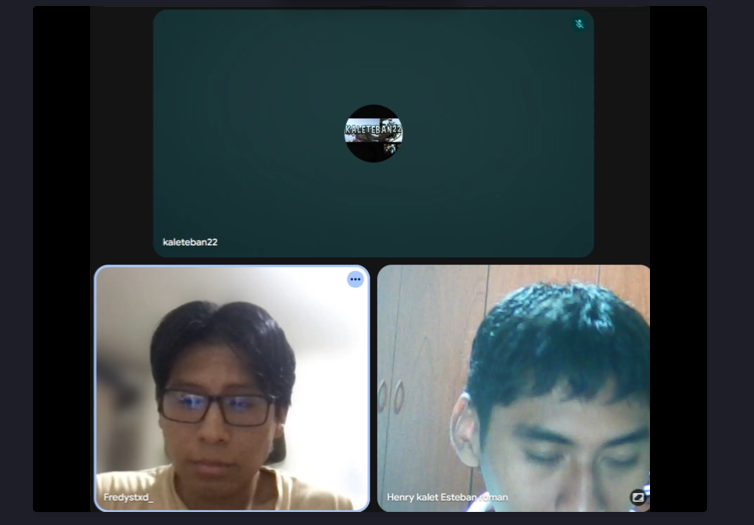
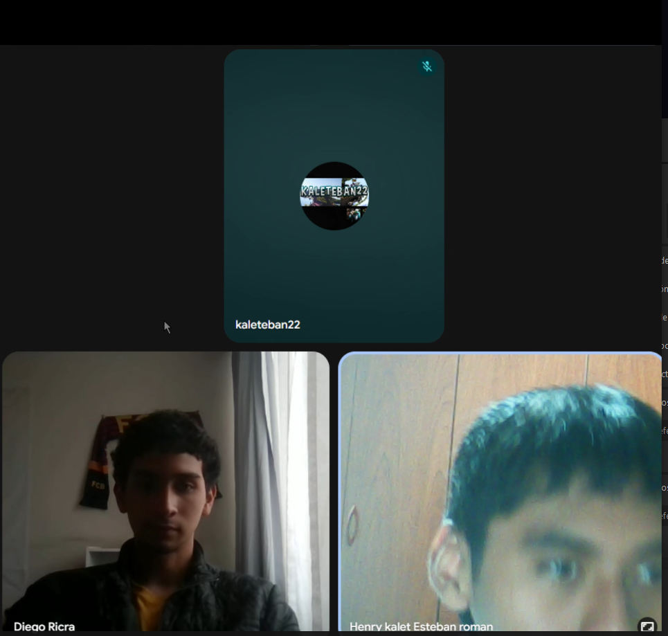
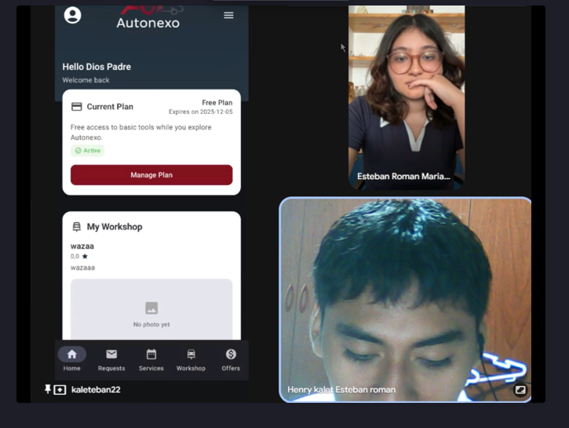
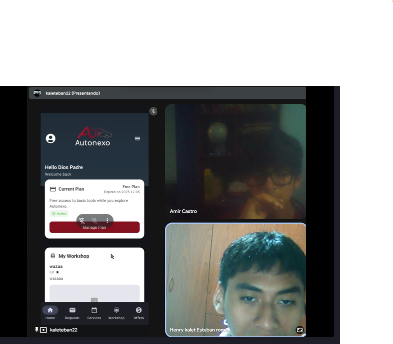
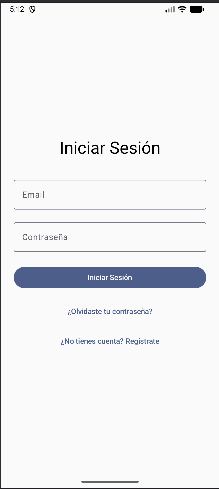
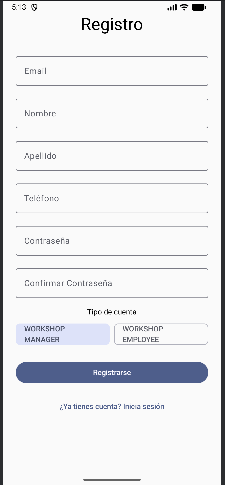
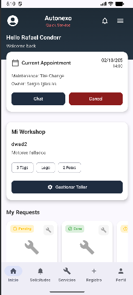
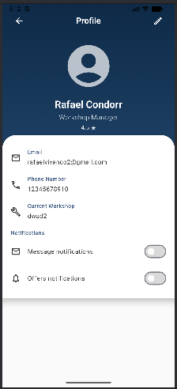

#  **Capítulo IV: Product Implementation & Validation** 

## **4.1. Software Configuration Management**

El equipo definió un conjunto de herramientas y configuraciones destinadas a mantener un entorno de desarrollo coherente y estandarizado. Este entorno busca facilitar la colaboración entre los integrantes del proyecto, garantizar la trazabilidad del código y asegurar la correcta gestión de las versiones y despliegues a lo largo del ciclo de vida del producto digital.

#### **4.1.1. Software Development Environment Configuration**

#### Project Management

**Trello** es la herramienta principal que el equipo utiliza para la gestión ágil del proyecto. A través de tableros, listas y tarjetas, permite planificar, priorizar y hacer seguimiento de las tareas, historias de usuario y actividades de diseño o desarrollo. Su interfaz visual facilita la colaboración y la organización del flujo de trabajo.
 https://trello.com

**Discord** es la plataforma elegida para la comunicación diaria entre los miembros del equipo. Mediante canales temáticos y reuniones virtuales, se coordinan los avances, revisiones y soporte en tiempo real durante todo el proceso de desarrollo.   
https://discord.com

#### Product UX/UI Design

**Figma** es la herramienta principal utilizada para el diseño de la interfaz de usuario (UI) y la experiencia de usuario (UX). Permite la colaboración simultánea del equipo en la creación de prototipos interactivos, estructuras visuales y pruebas de usabilidad.  
https://www.figma.com

**UXPressia** complementa el trabajo de diseño al permitir documentar los elementos de investigación UX, como los User Personas, Customer Journey Maps y Empathy Maps. Esta herramienta facilita comprender mejor las necesidades de los usuarios y orientar el diseño hacia una experiencia más empática.
 https://uxpressia.com

#### Software Development

**Android Studio** es el entorno de desarrollo integrado (IDE) utilizado para construir y probar la aplicación móvil. Ofrece herramientas integradas para programación, diseño de interfaces, depuración y emulación de dispositivos Android, lo que permite un desarrollo fluido y controlado del frontend móvil. 
https://developer.android.com

#### Software Deployment

**Git** es el sistema de control de versiones adoptado por el equipo para gestionar los cambios en el código fuente. Facilita el trabajo colaborativo, el control de versiones y la integración continua mediante ramas y commits organizados. 
https://git-scm.com

**GitHub Pages** se utiliza como plataforma de despliegue para publicar la interfaz del frontend. Al integrarse directamente con los repositorios de GitHub, permite alojar sitios web estáticos de manera sencilla y automatizada. 
https://pages.github.com

**Azure** es la plataforma en la nube seleccionada para el despliegue del backend del sistema. Proporciona servicios escalables, seguros y de alto rendimiento, como App Services y Azure SQL, garantizando la disponibilidad y estabilidad de la aplicación en producción. 
https://azure.microsoft.com

#### Software Documentation and Project Management

**GitHub** cumple la función de repositorio remoto centralizado. Se utiliza para almacenar y versionar el código, documentar el proyecto, gestionar incidencias y coordinar revisiones de código mediante pull requests. 
https://github.com

#### Software Testing

**Gherkin** es el lenguaje utilizado para definir los criterios de aceptación de las User Stories mediante escenarios estructurados. Su formato legible facilita la comunicación entre desarrolladores y analistas, garantizando una comprensión clara de las funcionalidades. 
https://cucumber.io/docs/gherkin/

#### **4.1.2. Source Code Management**

### 4.1.2. Source Code Management

Para el control de versiones del proyecto, el equipo adoptará el flujo de trabajo propuesto por el modelo GitFlow, utilizando GitHub como plataforma principal para la gestión y colaboración del código fuente. Este enfoque permite mantener un desarrollo organizado, controlado y fácilmente escalable entre todos los miembros del equipo.

A continuación, se presenta la estructura general del flujo GitFlow y la distribución de repositorios utilizados por el proyecto:

**Repositorios de GitHub:**

- Enlace para acceder a la organización de GitHub: https://github.com/ATG-UPC
- Enlace para acceder a repositorio de la Landing Page: https://github.com/ATG-UPC/AutoNexo-Landing-Page
- Enlace para acceder a repositorio de FrontEnd Web Mobile Application: https://github.com/ATG-UPC/AutoNexo-Android
- Enlace para acceder a repositorio de BackEnd Web Service: https://github.com/ATG-UPC/AutoNexo-Backend

**Flujo de trabajo GitFlow:**  El proyecto sigue el modelo de ramificación diseñado por Vincent Driessen en “A successful Git branching model”, el cual facilita el desarrollo paralelo de nuevas funcionalidades, la integración continua y la gestión ordenada de versiones estables.

**Estructura de branches (Ramas):**

1. **Main branch (Rama principal):** Contiene las versiones estables y verificadas del sistema. Toda versión en esta rama se considera lista para despliegue en producción. Los cambios solo se incorporan tras pasar por revisiones y pruebas en ramas previas.

2. **Develop branch (Rama de desarrollo):** Es la base de integración de las funcionalidades en progreso. En esta rama se concentran los avances consolidados del equipo antes de generar una versión de lanzamiento.

3. **Feature branches (Ramas de funcionalidad):** Cada nueva funcionalidad, mejora o experimento se desarrolla en una rama independiente, derivada desde develop. Al finalizar y validar su funcionamiento, se fusiona nuevamente con develop

4. **Release branches (Ramas de lanzamiento):** Se crean cuando el sistema está próximo a una versión estable. Permiten realizar pruebas finales, ajustes menores y preparar la documentación de la versión antes de integrarla a main.

5. **Hotfix branches (Ramas de corrección):** Se emplean para resolver errores críticos detectados en la rama principal sin interrumpir el flujo de desarrollo. Una vez corregido el problema, los cambios se integran tanto a main como a develop.

**Versionamiento Semántico:** El equipo aplicará el estándar Semantic Versioning 2.0.0, basado en el formato MAJOR.MINOR.PATCH, para identificar claramente los tipos de cambios entre versiones:

MAJOR: Cambios incompatibles con versiones anteriores.

MINOR: Nuevas funcionalidades compatibles con la versión previa.

PATCH: Correcciones menores o de errores.

**Convenciones de Commits:** Para mantener un historial de cambios consistente y fácil de interpretar, se seguirá la especificación Conventional Commits, inspirada en las Angular Commit Guidelines.
El formato propuesto será:

`git commit -m "<type>[optional scope]: <description">`

Donde:

-**type** indica el tipo de cambio (ej. feat, fix, refactor, docs).

-**scope** describe el módulo o área afectada (opcional).

-**description** es una breve descripción en presente del cambio realizado.

#### **4.1.3. Source Code Style Guide & Conventions**

**Kotlin/Java (Android):** Para garantizar la legibilidad, mantenibilidad y coherencia del código dentro del entorno de Android Studio, el equipo seguirá las siguientes convenciones de estilo:

1. Utilizar camelCase para nombres de variables y métodos, y PascalCase para clases y componentes principales.

2. Mantener una indentación de 4 espacios y procurar que las líneas no superen los 100 caracteres para facilitar la lectura.

3. Redactar comentarios únicamente cuando el fragmento de código no sea autoexplicativo, priorizando la claridad sobre la redundancia.

4. Nombrar los recursos XML (layouts, strings, drawables, ids) en minúsculas y separados por guiones bajos, siguiendo el formato nombre_recurso_tipo.

5. Respetar la arquitectura definida del proyecto, asegurando que las responsabilidades estén claramente separadas dentro de paquetes organizados (por ejemplo, ui/, data/, domain/).

**Gherkin:** Este lenguaje de especificación de comportamiento permite comunicar de manera efectiva los requerimientos entre los equipos técnicos y de negocio, en el contexto de Behavior Driven Development (BDD).
Para su uso, se han seguido las siguientes buenas prácticas:

-Utilización de saltos de línea para mantener la estructura clara entre los distintos escenarios.

-Empleo de las palabras clave Given, When, Then y And para construir escenarios comprensibles, estandarizados 

-Organización de los escenarios en formato descriptivo, manteniendo una redacción orientada al comportamiento esperado del sistema.

#### **4.1.4. Software Deployment Configuration**

**Landing page deployment:**

El despliegue de la página principal del proyecto (Landing Page) se realiza mediante GitHub Pages, aprovechando su integración directa con los repositorios del proyecto. Este proceso permite publicar la interfaz web de manera gratuita y automática, a partir de la rama principal del repositorio.
y fáciles de validar.
A continuación, se detallan los pasos seguidos para su configuración:

1. Crear una carpeta denominada docs, donde se almacenarán los archivos del Landing Page. 

2. Asegurar que la estructura del proyecto contenga los archivos principales con las siguientes convenciones: -index.html → página de inicio. -style.css → hoja de estilos principal. -Carpeta img → recursos gráficos y multimedia.

3. Subir los archivos al repositorio remoto en GitHub.

4. Acceder a Settings → Pages, seleccionar la rama correspondiente (generalmente main o master) y definir la carpeta /docs como origen del contenido. 

5. Guardar los cambios y esperar a que GitHub procese el despliegue automático. 

6. Una vez finalizado el proceso, el sistema genera un enlace público donde se podrá visualizar la landing page en línea. 

#### **4.2.1. Sprint 1**

##### **4.2.1.1. Sprint Planning 1**

En esta sección se describen los elementos principales abordados durante la reunión de planificación del Sprint 1. Se especifican detalles como la fecha y hora del encuentro, los miembros participantes, el objetivo del Sprint, la velocidad estimada del equipo y la cantidad total de puntos de historia comprometidos para este ciclo de desarrollo. A continuación, se expone el resumen correspondiente a dicha planificación.

| Sprint # | Sprint 1 |
|----------|---------|
| Date | 2025 - 10 - 01 |
| Time | 10:20 PM |
| Location | Reunión virtual a través de discord | 
| Prepared by | Solano Armas, Angelo Hector | 
| Attendees (to planning meeting) | Cruz Ibarra, Victor Andres; Iglesias Pérez, Sergio Sebastián; Roman Esteban, Henry Kalet; Solano Armas, Angelo Hector; Vivanco Salazar, Rafael Andres
| Sprint n – 1 Review Summary | No existe sprint previo | 
| Sprint 1 Goal | Nuestro enfoque está en entregar la primera versión integrada del ecosistema AutoNexo, que incluye la Landing Page pública y la conexión funcional inicial entre los servicios backend y la aplicación móvil. Creemos que esto proporcionará visibilidad, confiabilidad y capacidades de interacción temprana tanto a los usuarios finales como a los propietarios de talleres, permitiéndoles explorar la propuesta de valor de la plataforma e interactuar con datos reales a través de la aplicación móvil.  | 
| Sprint 1 Velocity | 19 story points | 
| Sum of story points | 19 story points |

##### **4.2.1.2. Sprint Backlog 1**

El propósito del Sprint 1 es diseñar y poner en marcha una landing page completamente funcional para el proyecto Autonexo. A continuación, se presenta una vista general de las historias de usuario planificadas para este sprint, junto con sus respectivas épicas y el estado de avance de cada una.

 

Link Trello: [Autonexo - Trello](https://trello.com/b/4uTEBz5O/atg-autonexo)

<table border="1" cellpadding="6" cellspacing="0">
  <thead>
    <tr>
      <th>Sprint #</th>
      <th colspan="8">Sprint 1</th>
    </tr>
    <tr>
      <th colspan="2">User Story</th>
      <th colspan="7">Work Item / Task</th>
    </tr>
    <tr>
      <th>ID</th>
      <th>Title</th>
      <th>ID</th>
      <th>Title</th>
      <th>Description</th>
      <th>Estimation (hours)</th>
      <th>Assigned To</th>
      <th>Status</th>
      <th>Story Points</th>
    </tr>
  </thead>
  <tbody>
    <tr>
      <td>US01</td>
      <td>Visualizar información y beneficios (Landing Page)</td>
      <td>T01</td>
      <td>Redactar contenido principal y CTAs</td>
      <td>Escribir y revisar el texto principal de la landing (beneficios + CTA).</td>
      <td>2</td>
      <td>Cruz Ibarra, Victor Andres</td>
      <td>To Do</td>
      <td>2</td>
    </tr>
    <tr>
      <td>US21</td>
      <td>Registro de usuario (propietario o taller)</td>
      <td>T02</td>
      <td>Implementar formulario básico de registro</td>
      <td>Crear formulario con campos esenciales y validaciones front.</td>
      <td>2</td>
      <td>Iglesias Pérez, Sergio Sebastián</td>
      <td>To Do</td>
      <td>3</td>
    </tr>
    <tr>
      <td>US22</td>
      <td>Preguntas frecuentes y soporte</td>
      <td>T03</td>
      <td>Redactar y publicar FAQ</td>
      <td>Redactar FAQ principales y dejar la sección maquetada simple.</td>
      <td>1</td>
      <td>Roman Esteban, Henry Kalet</td>
      <td>To Do</td>
      <td>2</td>
    </tr>
    <tr>
      <td>US23</td>
      <td>Contacto y descarga de la app</td>
      <td>T04</td>
      <td>Configurar formulario de contacto + botones de descarga</td>
      <td>Implementar formulario de contacto y añadir botones con enlaces a tiendas.</td>
      <td>2</td>
      <td>Solano Armas, Angelo Hector</td>
      <td>To Do</td>
      <td>2</td>
    </tr>
    <tr>
      <td>US28</td>
      <td>Visualizar planes de pago para talleres (Landing Page)</td>
      <td>T05</td>
      <td>Diseñar/maquetar sección de planes</td>
      <td>Crear la tabla/tiles de planes con precios y beneficios (responsivo).</td>
      <td>2</td>
      <td>Vivanco Salazar, Rafael Andres</td>
      <td>To Do</td>
      <td>2</td>
    </tr>
    <tr>
      <td>US29</td>
      <td>Seleccionar tipo de mecánico</td>
      <td>T06</td>
      <td>Implementar selector de tipo de mecánico</td>
      <td>Desarrollar componente para que el usuario elija el tipo de mecánico al registrarse.</td>
      <td>2</td>
      <td>Cruz Ibarra, Victor Andres</td>
      <td>To Do</td>
      <td>3</td>
    </tr>
    <tr>
      <td>US30</td>
      <td>Generar y compartir código de taller</td>
      <td>T07</td>
      <td>Implementar generación de código de invitación</td>
      <td>Programar función para generar y compartir código que permite a otros unirse al taller.</td>
      <td>2</td>
      <td>Roman Esteban, Henry Kalet</td>
      <td>To Do</td>
      <td>3</td>
    </tr>
    <tr>
      <td>US32</td>
      <td>Navegación mediante barra de menú</td>
      <td>T08</td>
      <td>Diseñar e implementar barra de navegación</td>
      <td>Crear barra de navegación funcional para moverse entre secciones del sistema.</td>
      <td>2</td>
      <td>Vivanco Salazar, Rafael Andres</td>
      <td>To Do</td>
      <td>2</td>
    </tr>
  </tbody>
</table>

##### **4.2.1.3. Development Evidence for Sprint Review**

En esta sección se presentan los avances logrados durante el Sprint 1, enfocados en la implementación de la Landing Page del proyecto AutoNexo. El objetivo de este sprint fue desarrollar los principales componentes de la página web orientada a talleres mecánicos y propietarios de vehículos, asegurando una interfaz clara, responsiva y funcional.

<table>
  <thead>
    <tr>
      <th>Repository</th>
      <th>Branch</th>
      <th>Commit Id</th>
      <th>Commit Message</th>
      <th>Commit Message Body</th>
      <th>Committed on (Date)</th>
    </tr>
  </thead>
  <tbody>
    <tr>
      <td>ATG-UPC/AutoNexo-Landing-Page</td>
      <td>feature/landing-content</td>
      <td>3fa219b</td>
      <td>feat: add main benefits section</td>
      <td>Se añadió la sección principal con texto descriptivo, beneficios clave y botones de llamada a la acción (CTA). <em>(US01)</em></td>
      <td>2025-10-01</td>
    </tr>
    <tr>
      <td>ATG-UPC/AutoNexo-Landing-Page</td>
      <td>feature/register-form</td>
      <td>7c4f2d9</td>
      <td>feat: implement user registration form</td>
      <td>Se creó el formulario de registro con validación básica y estructura responsiva. <em>(US21)</em></td>
      <td>2025-10-02</td>
    </tr>
    <tr>
      <td>ATG-UPC/AutoNexo-Landing-Page</td>
      <td>feature/faq-support</td>
      <td>61e3a20</td>
      <td>feat: add FAQ component</td>
      <td>Se implementó el componente de preguntas frecuentes con diseño colapsable. <em>(US22)</em></td>
      <td>2025-10-03</td>
    </tr>
    <tr>
      <td>ATG-UPC/AutoNexo-Landing-Page</td>
      <td>feature/contact-section</td>
      <td>b48df23</td>
      <td>feat: add contact form and store links</td>
      <td>Se añadieron el formulario de contacto y los botones con enlaces de descarga. <em>(US23)</em></td>
      <td>2025-10-04</td>
    </tr>
    <tr>
      <td>ATG-UPC/AutoNexo-Landing-Page</td>
      <td>feature/plans-section</td>
      <td>72b26b7</td>
      <td>feat: add pricing plans section</td>
      <td>Se desarrolló la sección de planes de pago para talleres con maquetado responsivo. <em>(US28)</em></td>
      <td>2025-10-05</td>
    </tr>
    <tr>
      <td>ATG-UPC/AutoNexo-Android</td>
      <td>feature/mechanic-selector</td>
      <td>94fca31</td>
      <td>feat: add mechanic type selector</td>
      <td>Se implementó el componente que permite seleccionar el tipo de mecánico al registrarse. <em>(US29)</em></td>
      <td>2025-10-06</td>
    </tr>
    <tr>
      <td>ATG-UPC/AutoNexo-Android</td>
      <td>feature/workshop-code</td>
      <td>a12b57d</td>
      <td>feat: generate and share workshop code</td>
      <td>Se implementó la funcionalidad para generar y compartir el código de taller. <em>(US30)</em></td>
      <td>2025-10-07</td>
    </tr>
    <tr>
      <td>ATG-UPC/AutoNexo-Android</td>
      <td>feature/navbar</td>
      <td>381206e</td>
      <td>feat: add navigation bar and menu links</td>
      <td>Se diseñó y programó la barra de navegación principal, mejorando la accesibilidad entre secciones. <em>(US32)</em></td>
      <td>2025-10-08</td>
    </tr>
  </tbody>
</table>

##### **4.2.1.4. Testing Suite Evidence for Sprint Review**

Durante el Sprint 1, el equipo de AutoNexo desarrolló y ejecutó un conjunto de pruebas automatizadas y manuales para verificar el correcto funcionamiento de los componentes implementados en la Landing Page y la interfaz inicial de la aplicación móvil.

<table> <thead> <tr> <th>Repository</th> <th>Branch</th> <th>Commit Id</th> <th>Commit Message</th> <th>Commit Message Body</th> <th>Committed on (Date)</th> </tr> </thead> <tbody> <tr> <td>ATG-UPC/AutoNexo-Landing-Page</td> <td>test/landing-benefits</td> <td>f28a1b7</td> <td>test: add unit tests for landing benefits section</td> <td>Se agregaron pruebas unitarias para verificar la correcta visualización del texto principal, beneficios y botones CTA de la Landing Page. <em>(US01)</em></td> <td>2025-10-02</td> </tr> <tr> <td>ATG-UPC/AutoNexo-Landing-Page</td> <td>test/user-register-form</td> <td>a91cbf2</td> <td>test: validate registration form fields</td> <td>Se desarrollaron pruebas para comprobar la validación de campos, formato de correo y respuesta al envío correcto del formulario de registro. <em>(US21)</em></td> <td>2025-10-03</td> </tr> <tr> <td>ATG-UPC/AutoNexo-Landing-Page</td> <td>test/faq-support</td> <td>b82e3c4</td> <td>test: verify FAQ toggle behavior</td> <td>Se probaron los comportamientos de expansión y colapso de los ítems del componente de Preguntas Frecuentes (FAQ). <em>(US22)</em></td> <td>2025-10-04</td> </tr> <tr> <td>ATG-UPC/AutoNexo-Landing-Page</td> <td>test/contact-section</td> <td>d24fa15</td> <td>test: test contact form and store links</td> <td>Se validó el funcionamiento del formulario de contacto y los botones de descarga en las tiendas móviles. <em>(US23)</em></td> <td>2025-10-05</td> </tr> <tr> <td>ATG-UPC/AutoNexo-Landing-Page</td> <td>test/plans-section</td> <td>c41e99b</td> <td>test: ensure pricing plans render correctly</td> <td>Se realizaron pruebas de renderizado y consistencia de contenido en los distintos planes de pago para talleres. <em>(US28)</em></td> <td>2025-10-06</td> </tr> <tr> <td>ATG-UPC/AutoNexo-Landing-Page</td> <td>test/mechanic-type</td> <td>e9ad4f8</td> <td>test: add tests for mechanic type selector</td> <td>Se verificó que el selector de tipo de mecánico muestre correctamente las opciones y guarde la selección del usuario. <em>(US29)</em></td> <td>2025-10-06</td> </tr> <tr> <td>ATG-UPC/AutoNexo-Landing-Page</td> <td>test/workshop-code</td> <td>f63db33</td> <td>test: test generation and sharing of workshop code</td> <td>Se implementaron pruebas unitarias para validar la generación, copia y compartición del código de taller. <em>(US30)</em></td> <td>2025-10-07</td> </tr> <tr> <td>ATG-UPC/AutoNexo-Landing-Page</td> <td>test/navbar</td> <td>ac9b7d2</td> <td>test: verify navigation bar routes and active state</td> <td>Se realizaron pruebas para asegurar que los enlaces de navegación funcionen correctamente y mantengan el estado activo de la sección. <em>(US32)</em></td> <td>2025-10-08</td> </tr> </tbody> </table>

##### **4.2.1.5. Execution Evidence for Sprint Review**

Durante este Sprint se logró implementar de forma completa la Landing Page del proyecto AutoNexo, cumpliendo con el objetivo principal del Sprint 1. Esta página inicial permite a los talleres mecánicos y propietarios de vehículos conocer los servicios ofrecidos por la plataforma, registrarse según su rol, acceder a información relevante y explorar los distintos planes de pago disponibles.

El desarrollo se centró en crear una interfaz moderna, funcional y responsiva, asegurando una navegación clara y una presentación coherente con la identidad visual del proyecto. Dentro de las tareas realizadas se incluyeron la redacción del contenido principal, la creación del formulario de registro, la sección de preguntas frecuentes, el módulo de contacto y la visualización de los planes de pago para talleres.

A continuación, se presentan las capturas de pantalla de las vistas desarrolladas como evidencia del trabajo realizado:

 
Header:

 
Sección de beneficios:

 
Preguntas frecuentes (FAQ):

 
Planes de pago para talleres:

 
Sección de contacto y descarga de la aplicación:

 
Registro de usuario (propietario o taller):

 

Video de evidencia: [Autonexo - Landing Video](https://drive.google.com/file/d/163ZhWu71eMLBHduWRDx6wPGMCe84rkoQ/view?usp=sharing)

##### **4.2.1.6. Services Documentation Evidence for Sprint Review**

Durante el Sprint, se implementaron y documentaron correctamente los servicios RESTful correspondientes a los contextos de Workshop e Invitation, garantizando una comunicación eficiente entre el frontend y el backend mediante peticiones HTTP estandarizadas (GET, POST, PUT, DELETE).
A continuación, se detallan las principales evidencias y descripciones de los endpoints desarrollados:

**A. WorkshopController**

Este controlador gestiona las operaciones relacionadas con los talleres (Workshops), incluyendo su creación, consulta, actualización, manejo de ubicaciones, personal, servicios, etiquetas de capacidad y archivos multimedia.

Principales endpoints:

<table>
  <thead>
    <tr>
      <th><strong>Endpoint</strong></th>
      <th><strong>HTTP Method</strong></th>
      <th><strong>Descripción</strong></th>
    </tr>
  </thead>
  <tbody>
    <tr>
      <td>/api/v1/workshops</td>
      <td>POST</td>
      <td>Crea un nuevo taller a partir de los datos del usuario propietario.</td>
    </tr>
    <tr>
      <td>/api/v1/workshops/my-workshop</td>
      <td>GET</td>
      <td>Recupera la información del taller asociado al usuario autenticado.</td>
    </tr>
    <tr>
      <td>/api/v1/workshops/{workshopId}</td>
      <td>GET</td>
      <td>Obtiene la información pública de un taller por su ID.</td>
    </tr>
    <tr>
      <td>/api/v1/workshops/by-owner/{ownerUserId}</td>
      <td>GET</td>
      <td>Recupera el taller perteneciente a un propietario específico.</td>
    </tr>
    <tr>
      <td>/api/v1/workshops</td>
      <td>GET</td>
      <td>Lista todos los talleres activos.</td>
    </tr>
    <tr>
      <td>/api/v1/workshops/by-tag</td>
      <td>GET</td>
      <td>Filtra los talleres según una etiqueta de capacidad.</td>
    </tr>
    <tr>
      <td>/api/v1/workshops</td>
      <td>PUT</td>
      <td>Actualiza la información básica del taller.</td>
    </tr>
    <tr>
      <td>/api/v1/workshops/locations</td>
      <td>POST</td>
      <td>Agrega una nueva ubicación al taller.</td>
    </tr>
    <tr>
      <td>/api/v1/workshops/service-templates</td>
      <td>POST</td>
      <td>Registra una plantilla de servicio en el taller.</td>
    </tr>
    <tr>
      <td>/api/v1/workshops/tags</td>
      <td>POST</td>
      <td>Añade una etiqueta de capacidad (capability tag) al taller.</td>
    </tr>
    <tr>
      <td>/api/v1/workshops/tags</td>
      <td>PUT</td>
      <td>Actualiza el conjunto completo de etiquetas de capacidad.</td>
    </tr>
    <tr>
      <td>/api/v1/workshops/logo</td>
      <td>POST</td>
      <td>Carga y actualiza el logotipo del taller (usa Cloudinary).</td>
    </tr>
    <tr>
      <td>/api/v1/workshops/photos</td>
      <td>POST</td>
      <td>Agrega una foto al carrusel de imágenes del taller.</td>
    </tr>
    <tr>
      <td>/api/v1/workshops/photos/{photoIndex}</td>
      <td>DELETE</td>
      <td>Elimina una foto del carrusel de imágenes del taller.</td>
    </tr>
    <tr>
      <td>/api/v1/workshops/catalog/categories</td>
      <td>GET</td>
      <td>Obtiene las categorías de servicios disponibles en el catálogo.</td>
    </tr>
    <tr>
      <td>/api/v1/workshops/catalog/services</td>
      <td>GET</td>
      <td>Obtiene los servicios disponibles del catálogo general.</td>
    </tr>
    <tr>
      <td>/api/v1/workshops/catalog/capability-tags</td>
      <td>GET</td>
      <td>Lista las etiquetas de capacidad disponibles.</td>
    </tr>
  </tbody>
</table>

**B. InvitationController**

Este controlador administra las invitaciones que permiten a los talleres agregar nuevos miembros de personal (staff members) mediante códigos únicos.

Principales endpoints:

<table>
  <thead>
    <tr>
      <th><strong>Endpoint</strong></th>
      <th><strong>HTTP Method</strong></th>
      <th><strong>Descripción</strong></th>
    </tr>
  </thead>
  <tbody>
    <tr>
      <td>/api/v1/invitations/workshops/{workshopId}</td>
      <td>POST</td>
      <td>Crea una invitación asociada a un taller específico.</td>
    </tr>
    <tr>
      <td>/api/v1/invitations/accept</td>
      <td>POST</td>
      <td>Permite aceptar una invitación y registrar al usuario como miembro del taller.</td>
    </tr>
    <tr>
      <td>/api/v1/invitations/{code}</td>
      <td>GET</td>
      <td>Consulta la información de una invitación mediante su código único.</td>
    </tr>
    <tr>
      <td>/api/v1/invitations/workshops/{workshopId}</td>
      <td>GET</td>
      <td>Lista todas las invitaciones emitidas por un taller determinado.</td>
    </tr>
  </tbody>
</table>

**C. Seguridad, validación y consistencia**
- Todos los endpoints aplican validaciones automáticas mediante @Valid y tipos de recursos (CreateWorkshopResource, AddServiceTemplateResource, etc.).

- Se maneja de forma controlada el flujo de errores y respuestas HTTP (400, 403, 404, 500).

- Se integran patrones de diseño Domain-Driven Design (DDD) y CQRS para mantener la escalabilidad del sistema.

##### **4.2.1.7. Software Deployment Evidence for Sprint Review**

Durante este Sprint se completó con éxito el despliegue de la Landing Page del proyecto AutoNexo mediante el servicio Azure Static Web Apps, siguiendo un enfoque incremental orientado a la entrega continua del producto.

**Actividades realizadas:**
- Se habilitó una cuenta en Azure y se configuró un grupo de recursos compartido, permitiendo una gestión centralizada de los componentes del proyecto.

- Se desplegó la Landing Page directamente desde el repositorio en GitHub, utilizando Azure Static Web Apps para automatizar el proceso de publicación.

- Se configuró un flujo CI/CD (Integración y Entrega Continua) a través de GitHub Actions, de modo que cada commit en la rama main actualiza automáticamente la versión publicada del sitio.

- Se validó el correcto funcionamiento y disponibilidad del producto a través del dominio generado por Azure, comprobando que todas las secciones y enlaces operen de forma óptima.

**Evidencias del proceso de despliegue:**
A continuación, se incluyen las capturas correspondientes al proceso de configuración, vinculación del repositorio en GitHub y la publicación satisfactoria del sitio en Azure.

1. Creación del grupo de recursos:

  

2. Configuración de recurso Static Web App:

  

3. Vinculación con GitHub y configuración del flujo CI/CD:

4. Despliegue exitoso con confirmación del dominio generado por Azure:

  

  

  

##### **4.2.1.8. Team Collaboration Insights during Sprint**

Durante el desarrollo del Sprint, todos los integrantes del equipo participaron activamente en la implementación de la Landing Page de AutoNexo, organizando el trabajo por secciones según el contenido y diseño establecidos previamente. El enfoque principal fue ofrecer una interfaz clara, moderna y alineada con la identidad visual del proyecto, que comunique efectivamente los beneficios y servicios de la plataforma.

A continuación, se detalla la participación específica de cada miembro del equipo:

<table>
  <thead>
    <tr>
      <th><strong>Nombre</strong></th>
      <th><strong>Actividad</strong></th>
    </tr>
  </thead>
  <tbody>
    <tr>
      <td><strong>Cruz Ibarra, Victor Andrés</strong></td>
      <td>Redacción del contenido principal de la landing page, incluyendo secciones de información general y llamados a la acción (CTAs). Apoyo en la estructura visual de los beneficios.</td>
    </tr>
    <tr>
      <td><strong>Iglesias Pérez, Sergio Sebastián</strong></td>
      <td>Implementación del formulario de registro de usuario (propietario o taller) y validaciones de entrada. Participación en la integración de enlaces entre secciones.</td>
    </tr>
    <tr>
      <td><strong>Roman Esteban, Henry Kalet</strong></td>
      <td>Desarrollo de la sección de <strong>Preguntas Frecuentes (FAQ)</strong>, maquetado de los elementos expandibles y redacción de las preguntas base.</td>
    </tr>
    <tr>
      <td><strong>Solano Armas, Angelo Hector</strong></td>
      <td>Configuración de la <strong>sección de contacto y descarga de la aplicación</strong>, asegurando la funcionalidad de los formularios y enlaces hacia las tiendas móviles.</td>
    </tr>
    <tr>
      <td><strong>Vivanco Salazar, Rafael Andrés</strong></td>
      <td>Diseño e implementación de la <strong>sección de planes de pago para talleres</strong>, mostrando los distintos niveles de suscripción y sus beneficios comparativos.</td>
    </tr>
  </tbody>
</table>

##### Evidencia de colaboración en GitHub

A continuación, se presenta la evidencia de participación de los miembros del equipo, extraída del repositorio oficial del proyecto. Se puede observar el trabajo colaborativo y los aportes de cada integrante en las distintas ramas del desarrollo.

##### Repositorio de trabajo:

- [Repositorio de la Landing Page en GitHub](https://github.com/ATG-UPC/AutoNexo-Landing-Page)

### **4.3. Validation Interviews**

#### **4.3.1. Diseño de Entrevistas**

Se realizó investigación cualitativa mediante entrevistas de validación con usuarios de los segmentos objetivo del proyecto: mecánicos/talleres y conductores de vehículos. El objetivo fue validar la funcionalidad, usabilidad y experiencia de usuario de la aplicación móvil AutoNexo y el landing page, identificando áreas de mejora y confirmando que la solución cumple con las expectativas y necesidades de los usuarios.

Se desarrollaron dos bloques de preguntas diferenciados por el segmento objetivo, enfocadas en validar la interacción con el landing page y la aplicación móvil. Las preguntas buscaron recopilar tanto información objetiva (funcionalidades utilizadas, flujos completados) como información subjetiva (percepciones, satisfacción, dificultades encontradas y sugerencias de mejora).

#### Segmento 1: Propietarios de vehículos

**Preguntas sobre el Landing Page**

1. ¿Qué información del landing page te resultó más útil o interesante?
2. ¿La información presentada te ayudó a entender qué es AutoNexo y cómo puede beneficiarte?
3. ¿Encontraste fácilmente las secciones de registro y descarga de la aplicación?
4. ¿Qué mejoras sugerirías para el landing page?

**Preguntas sobre la Aplicación Móvil - Funcionalidades Principales**

1. ¿Cómo calificarías la facilidad de registro e inicio de sesión en la aplicación?
2. ¿Fue intuitivo el proceso de registro de tu vehículo?
3. ¿La navegación entre las diferentes secciones de la aplicación te resultó clara y fácil de usar?
4. ¿Cómo evaluarías el proceso de crear una solicitud de mantenimiento?
5. ¿La visualización de ofertas de mantenimiento te resultó útil y comprensible?
6. ¿Cómo calificarías el proceso de reservar una cita de mantenimiento?
7. ¿La visualización del historial de mantenimientos de tu vehículo cumple con tus expectativas?
8. ¿El sistema de mensajería con los talleres te resultó fácil de usar?
9. ¿Cómo evaluarías el proceso de pago de servicios?
10. ¿La funcionalidad de calificación y reseñas te parece útil?

**Preguntas sobre Usabilidad y Experiencia**

1. ¿Encontraste algún problema o dificultad al usar la aplicación?
2. ¿Qué funcionalidad te gustaría que tuviera la aplicación y actualmente no tiene?
3. ¿Recomendarías AutoNexo a otros propietarios de vehículos? ¿Por qué?
4. ¿Cómo calificarías tu experiencia general con la aplicación (del 1 al 5)?
5. ¿Qué aspectos de la aplicación te gustaron más?
6. ¿Qué aspectos de la aplicación te gustaron menos o mejorarías?

#### Segmento 2: Mecánicos/Talleres

**Preguntas sobre el Landing Page**

1. ¿Qué información del landing page te resultó más útil o interesante?
2. ¿La información sobre los planes de pago para talleres te resultó clara?
3. ¿Encontraste fácilmente las secciones de registro y descarga de la aplicación?
4. ¿Qué mejoras sugerirías para el landing page?

**Preguntas sobre la Aplicación Móvil - Funcionalidades Principales**

1. ¿Cómo calificarías la facilidad de registro e inicio de sesión en la aplicación?
2. ¿Fue intuitivo el proceso de registro y configuración de tu taller?
3. ¿La navegación entre las diferentes secciones de la aplicación te resultó clara y fácil de usar?
4. ¿Cómo evaluarías el proceso de crear una oferta de mantenimiento?
5. ¿La visualización de solicitudes de servicio disponibles te resultó útil?
6. ¿Cómo calificarías el proceso de gestionar las reservas de servicios?
7. ¿La funcionalidad de gestión de empleados e invitaciones te resultó fácil de usar?
8. ¿El sistema de actualización de checklist durante el mantenimiento te resultó práctico?
9. ¿Cómo evaluarías el proceso de finalizar un mantenimiento?
10. ¿La visualización del historial de servicios realizados cumple con tus expectativas?
11. ¿El sistema de mensajería con los propietarios te resultó fácil de usar?
12. ¿Cómo evaluarías el proceso de gestión de suscripciones y pagos?

**Preguntas sobre Usabilidad y Experiencia**

1. ¿Encontraste algún problema o dificultad al usar la aplicación?
2. ¿Qué funcionalidad te gustaría que tuviera la aplicación y actualmente no tiene?
3. ¿Recomendarías AutoNexo a otros talleres o mecánicos? ¿Por qué?
4. ¿Cómo calificarías tu experiencia general con la aplicación (del 1 al 5)?
5. ¿Qué aspectos de la aplicación te gustaron más?
6. ¿Qué aspectos de la aplicación te gustaron menos o mejorarías?

#### **4.3.2. Registro de Entrevistas**

**Segmento 1: Propietarios de vehículos**

<table border="1">
  <tr>
    <th>Entrevista</th>
    <td>1</td>
    <th>Nombre</th>
    <td>[Freddy Fernandez Camacho]</td>
  </tr>
  <tr>
    <th>Edad</th>
    <td>22</td>
    <th>Distrito</th>
    <td>Ate</td>
  </tr>
  <tr>
    <th>Fecha de entrevista</th>
    <td colspan="3">5/12/25</td>
  </tr>
  <tr>
    <th>Captura de la entrevista: </th>
    <td colspan="3">
        Freddy Camacho, conductor habitual con un Hyundai Elantra 2016, señaló que su principal problema es la falta de talleres confiables con precios justos. Durante la interacción con el landing page, dijo que le pareció claro, pero que algunas secciones podrían resaltar más los beneficios. En la aplicación móvil, completó fácilmente el registro y la creación de una solicitud de mantenimiento. Destacó la utilidad del comparador de mecánicos y la claridad del historial. Tuvo ligeras dudas al navegar entre ofertas, pero encontró intuitivo el proceso de reserva. Consideró útil el sistema de mensajes y el proceso de pago digital. Sugirió incluir una opción de filtros avanzados por repuestos y tiempos estimados de servicio.
    </td>
  </tr>
  <tr>
    <th>URL de la grabación</th>
    <td colspan="3">
      <a href="[https://drive.google.com/drive/folders/1rQoI7fwtVrntl1jeGQ1cc_cXpP7fWdzK?usp=sharing]">
        Ver grabación
      </a>
    </td>
  </tr>
  <tr>
   <th>Timing</th>
    <td colspan="3">
        [12:37-18:27]
    </td>
  </tr>
</table>
 

<table border="1">
  <tr>
    <th>Entrevista</th>
    <td>2</td>
    <th>Nombre</th>
    <td>Diego Ignacio Ricra Falla</td>
  </tr>
  <tr>
    <th>Edad</th>
    <td>20</td>
    <th>Distrito</th>
    <td>La molina</td>
  </tr>
  <tr>
    <th>Fecha de entrevista</th>
    <td colspan="3">05/12/25</td>
  </tr>
  <tr>
    <th>Captura de la entrevista: </th>
    <td colspan="3">
        Diego Ignacio, dueño de un Kia Picanto 2018, comentó que suele tener dificultades para entender precios y saber si un taller es confiable. El landing page le pareció moderno y bien organizado, aunque recomendó destacar más el botón de “Descargar App”. En la aplicación móvil, completó sin problemas el registro y la creación de una solicitud. Destacó la claridad del proceso de comparación de mecánicos y el diseño de las pantallas. Le gustó que las ofertas muestren fotografías, precios y tiempos estimados. Sugirió añadir un sistema de recordatorios automáticos más visible. Calificó la experiencia como rápida, confiable y “muy completa para alguien que no sabe de mecánica”.
    </td>
  </tr>
  <tr>
    <th>URL de la grabación</th>
    <td colspan="3">
      <a href="[https://drive.google.com/drive/folders/1rQoI7fwtVrntl1jeGQ1cc_cXpP7fWdzK?usp=sharing]">
        Ver grabación
      </a>
    </td>
  </tr>
  <tr>
   <th>Timing</th>
    <td colspan="3">
        [18:25-25:09]
    </td>
  </tr>
</table>
 

**Segmento 2: Mecánicos/Talleres**

<table border="1">
  <tr>
    <th>Entrevista</th>
    <td>3</td>
    <th>Nombre</th>
    <td>Maria Fernanda Esteban Román</td>
  </tr>
  <tr>
    <th>Edad</th>
    <td>25</td>
    <th>Distrito</th>
    <td>Ate</td>
  </tr>
  <tr>
    <th>Fecha de entrevista</th>
    <td colspan="3">05/11/25</td>
  </tr>
  <tr>
    <th>Captura de la entrevista: </th>
    <td colspan="3">
        María, mecánica con 12 años de experiencia, aseguró que su mayor dificultad es llevar un control ordenado del historial de cada vehículo y coordinar con varios clientes simultáneamente. El landing page le pareció claro y profesional. Dentro de la app, valoró especialmente el registro de solicitudes, la vista tipo panel y el checklist de mantenimiento. Comentó que la app reduciría errores y mejoraría la trazabilidad de los mantenimientos. Le resultó muy útil recibir “alertas automáticas de próximos servicios” y sugirió incluir estadísticas más detalladas de productividad del taller. Consideró que la app le permitiría ahorrar tiempo en comunicación y administración.
    </td>
  </tr>
  <tr>
    <th>URL de la grabación</th>
    <td colspan="3">
      <a href="[https://drive.google.com/drive/folders/1rQoI7fwtVrntl1jeGQ1cc_cXpP7fWdzK?usp=sharing]">
        Ver grabación
      </a>
    </td>
  </tr>
  <tr>
   <th>Timing</th>
    <td colspan="3">
        [00:00-06:26]
    </td>
  </tr>
</table>
 

<table border="1">
  <tr>
    <th>Entrevista</th>
    <td>4</td>
    <th>Nombre</th>
    <td>Amir Castro </td>
  </tr>
  <tr>
    <th>Edad</th>
    <td>20</td>
    <th>Distrito</th>
    <td>San Isidro</td>
  </tr>
  <tr>
    <th>Fecha de entrevista</th>
    <td colspan="3">11/05/25</td>
  </tr>
  <tr>
    <th>Captura de la entrevista: </th>
    <td colspan="3">
        Amir, especialista en mecánica pesada y dueño de un pequeño taller, señaló que su problema principal es depender de WhatsApp para coordinar clientes y no tener un historial centralizado por placa. El landing page le resultó sencillo y directo. En la app, registró su taller, configuró empleados y gestionó una solicitud sin dificultades. Resaltó la importancia del checklist, el flujo de finalización del servicio y la mensajería integrada. Sugirió mejorar la visibilidad de promociones de talleres y ofrecer reportes financieros mensuales. Destacó que “la app ahorra tiempo y mejora la formalidad del taller”.
    </td>
  </tr>
  <tr>
    <th>URL de la grabación</th>
    <td colspan="3">
      <a href="[https://drive.google.com/drive/folders/1rQoI7fwtVrntl1jeGQ1cc_cXpP7fWdzK?usp=sharing]">
        Ver grabación
      </a>
    </td>
  </tr>
  <tr>
   <th>Timing</th>
    <td colspan="3">
        [06-12:37]
    </td>
  </tr>
</table>

#### **4.3.3. Evaluaciones según heurísticas**

En esta sección se presentan las evaluaciones realizadas según las heurísticas de usabilidad, arquitectura de información y diseño inclusivo para cada sesión de evaluación con usuarios.

**Heurísticas de Usabilidad (Nielsen)**

Para cada entrevista se evaluaron los siguientes aspectos:

1. **Visibilidad del estado del sistema**: El sistema debe mantener informados a los usuarios sobre lo que está ocurriendo mediante retroalimentación apropiada dentro de un tiempo razonable.
2. **Correspondencia entre el sistema y el mundo real**: El sistema debe hablar el lenguaje de los usuarios, con palabras, frases y conceptos familiares al usuario.
3. **Control y libertad del usuario**: Los usuarios a menudo eligen funciones por error y necesitan una "salida de emergencia" claramente marcada.
4. **Consistencia y estándares**: Los usuarios no deben tener que preguntarse si palabras, situaciones o acciones diferentes significan lo mismo.
5. **Prevención de errores**: Mejor que un buen mensaje de error es un diseño cuidadoso que previene que ocurra el problema.
6. **Reconocimiento en lugar de recuerdo**: Minimizar la carga de memoria del usuario haciendo visibles objetos, acciones y opciones.
7. **Flexibilidad y eficiencia de uso**: Los aceleradores pueden acelerar la interacción para el usuario experto.
8. **Diseño estético y minimalista**: Los diálogos no deben contener información que sea irrelevante o raramente necesaria.
9. **Ayuda a los usuarios a reconocer, diagnosticar y recuperarse de errores**: Los mensajes de error deben expresarse en lenguaje claro, indicar el problema y sugerir una solución.
10. **Ayuda y documentación**: Aunque es mejor si el sistema puede usarse sin documentación, puede ser necesario proporcionar ayuda y documentación.

**Arquitectura de Información**

Se evaluaron los siguientes aspectos:

1. **Organización**: La estructura y organización de la información en la aplicación.
2. **Navegación**: La facilidad para moverse entre diferentes secciones y funcionalidades.
3. **Etiquetado**: La claridad y consistencia de las etiquetas y nombres utilizados.
4. **Búsqueda**: La capacidad de encontrar información específica dentro de la aplicación.

**Diseño Inclusivo**

Se evaluaron los siguientes aspectos:

1. **Accesibilidad**: La aplicación debe ser accesible para usuarios con diferentes capacidades.
2. **Diversidad de usuarios**: Consideración de diferentes perfiles de usuarios y sus necesidades.
3. **Inclusión de diferentes contextos de uso**: La aplicación debe funcionar en diferentes situaciones y contextos.

**Evaluación por Entrevista**

Para cada entrevista realizada, se documentará:

- **Resumen de observaciones**: Principales hallazgos durante la interacción con el landing page y la aplicación móvil.
- **Evaluación de heurísticas**: Calificación y comentarios sobre cada heurística evaluada.
- **Problemas identificados**: Lista de problemas encontrados durante la evaluación.
- **Recomendaciones de mejora**: Sugerencias específicas para mejorar la experiencia de usuario.
- **Calificación general**: Evaluación general de la experiencia de usuario.

#### **4.2.2. Sprint 2**

##### **4.2.2.1. Sprint Planning 2**

En esta sección se describen los elementos principales abordados durante la reunión de planificación del Sprint 2. Se especifican detalles como la fecha y hora del encuentro, los miembros participantes, el objetivo del Sprint, la velocidad estimada del equipo y la cantidad total de puntos de historia comprometidos para este ciclo de desarrollo. A continuación, se expone el resumen correspondiente a dicha planificación.

| Sprint # | Sprint 2 |
|----------|---------|
| Date | 2025 - 10 - 15 |
| Time | 9:00 PM |
| Location | Reunión virtual a través de discord | 
| Prepared by | Solano Armas, Angelo Hector | 
| Attendees (to planning meeting) | Cruz Ibarra, Victor Andres; Iglesias Pérez, Sergio Sebastián; Roman Esteban, Henry Kalet; Solano Armas, Angelo Hector; Vivanco Salazar, Rafael Andres
| Sprint n – 1 Review Summary | Durante el Sprint 1 se completó exitosamente la Landing Page del proyecto AutoNexo, incluyendo todas las secciones principales (beneficios, registro, FAQ, contacto, planes de pago). Se implementaron funcionalidades básicas en la aplicación móvil como el selector de tipo de mecánico, generación de códigos de taller y navegación. La Landing Page fue desplegada en Azure Static Web Apps. | 
| Sprint 2 Goal | Nuestro enfoque está en completar el despliegue del backend al 100% en un sitio público con documentación completa, finalizar la implementación de las principales funcionalidades core de la aplicación móvil (pantallas de propietario y mecánico), y validar el producto mediante videos demostrativos. Creemos que esto proporcionará una plataforma completamente funcional y desplegada, permitiendo a los usuarios finales interactuar con todas las capacidades principales del ecosistema AutoNexo.  | 
| Sprint 2 Velocity | 34 story points | 
| Sum of story points | 34 story points |

##### **4.2.2.2. Sprint Backlog 2**

El propósito del Sprint 2 es completar el despliegue del backend al 100% en un sitio público con documentación, finalizar las pantallas principales de la aplicación móvil para propietarios y mecánicos, e implementar las funcionalidades core del sistema. A continuación, se presenta una vista general de las historias de usuario planificadas para este sprint, junto con sus respectivas épicas y el estado de avance de cada una.

 

Link Trello: [Autonexo - Trello](https://trello.com/b/4uTEBz5O/atg-autonexo)

<table border="1" cellpadding="6" cellspacing="0">
  <thead>
    <tr>
      <th>Sprint #</th>
      <th colspan="8">Sprint 2</th>
    </tr>
    <tr>
      <th colspan="2">User Story</th>
      <th colspan="7">Work Item / Task</th>
    </tr>
    <tr>
      <th>ID</th>
      <th>Title</th>
      <th>ID</th>
      <th>Title</th>
      <th>Description</th>
      <th>Estimation (hours)</th>
      <th>Assigned To</th>
      <th>Status</th>
      <th>Story Points</th>
    </tr>
  </thead>
  <tbody>
    <tr>
      <td>US02</td>
      <td>Catálogo de servicios de taller</td>
      <td>T09</td>
      <td>Implementar vista de catálogo de servicios</td>
      <td>Desarrollar pantalla que muestre el catálogo completo de servicios disponibles en los talleres.</td>
      <td>4</td>
      <td>Cruz Ibarra, Victor Andres</td>
      <td>Done</td>
      <td>5</td>
    </tr>
    <tr>
      <td>US03</td>
      <td>Explorar catálogo y búsqueda</td>
      <td>T10</td>
      <td>Implementar funcionalidad de búsqueda</td>
      <td>Crear sistema de búsqueda y filtrado para explorar talleres y servicios.</td>
      <td>4</td>
      <td>Iglesias Pérez, Sergio Sebastián</td>
      <td>Done</td>
      <td>5</td>
    </tr>
    <tr>
      <td>US06</td>
      <td>Registro de vehículo</td>
      <td>T11</td>
      <td>Implementar formulario de registro de vehículo</td>
      <td>Desarrollar pantalla y lógica para registrar vehículos con sus datos principales.</td>
      <td>3</td>
      <td>Roman Esteban, Henry Kalet</td>
      <td>Done</td>
      <td>3</td>
    </tr>
    <tr>
      <td>US08</td>
      <td>Visualizar historial de vehículo</td>
      <td>T12</td>
      <td>Implementar vista de historial de mantenimientos</td>
      <td>Crear pantalla que muestre el historial completo de mantenimientos del vehículo.</td>
      <td>3</td>
      <td>Solano Armas, Angelo Hector</td>
      <td>Done</td>
      <td>3</td>
    </tr>
    <tr>
      <td>US10</td>
      <td>Coordinación de citas de mantenimiento</td>
      <td>T13</td>
      <td>Implementar sistema de reserva de citas</td>
      <td>Desarrollar funcionalidad completa para coordinar y reservar citas de mantenimiento.</td>
      <td>5</td>
      <td>Vivanco Salazar, Rafael Andres</td>
      <td>Done</td>
      <td>5</td>
    </tr>
    <tr>
      <td>US12</td>
      <td>Actualización de checklist en mantenimiento</td>
      <td>T14</td>
      <td>Implementar checklist interactivo</td>
      <td>Crear componente de checklist que permita actualizar el estado de los mantenimientos.</td>
      <td>3</td>
      <td>Cruz Ibarra, Victor Andres</td>
      <td>Done</td>
      <td>3</td>
    </tr>
    <tr>
      <td>US13</td>
      <td>Creación de mantenimiento confirmado</td>
      <td>T15</td>
      <td>Implementar confirmación de mantenimientos</td>
      <td>Desarrollar lógica para crear y confirmar mantenimientos desde la aplicación.</td>
      <td>3</td>
      <td>Iglesias Pérez, Sergio Sebastián</td>
      <td>Done</td>
      <td>3</td>
    </tr>
    <tr>
      <td>US14</td>
      <td>Visualización de mantenimientos pendientes</td>
      <td>T16</td>
      <td>Implementar vista de mantenimientos pendientes</td>
      <td>Crear pantalla que muestre todos los mantenimientos pendientes para propietarios y mecánicos.</td>
      <td>3</td>
      <td>Roman Esteban, Henry Kalet</td>
      <td>Done</td>
      <td>3</td>
    </tr>
    <tr>
      <td>US16</td>
      <td>Finalización de mantenimiento</td>
      <td>T17</td>
      <td>Implementar finalización de mantenimientos</td>
      <td>Desarrollar funcionalidad para que los mecánicos puedan finalizar mantenimientos completados.</td>
      <td>3</td>
      <td>Solano Armas, Angelo Hector</td>
      <td>Done</td>
      <td>3</td>
    </tr>
    <tr>
      <td>BACKEND</td>
      <td>Despliegue completo del backend</td>
      <td>T18</td>
      <td>Desplegar backend al 100% en Azure</td>
      <td>Configurar y desplegar todos los servicios backend en Azure App Services con documentación completa.</td>
      <td>6</td>
      <td>Iglesias Pérez, Sergio Sebastián</td>
      <td>Done</td>
      <td>8</td>
    </tr>
    <tr>
      <td>DOCS</td>
      <td>Documentación de API</td>
      <td>T19</td>
      <td>Generar documentación Swagger/OpenAPI</td>
      <td>Crear y publicar documentación completa de todos los endpoints del backend.</td>
      <td>3</td>
      <td>Iglesias Pérez, Sergio Sebastián</td>
      <td>Done</td>
      <td>3</td>
    </tr>
  </tbody>
</table>

##### **4.2.2.3. Development Evidence for Sprint Review**

En esta sección se presentan los avances logrados durante el Sprint 2, enfocados en la implementación de las funcionalidades core de la aplicación móvil AutoNexo, el despliegue completo del backend y la finalización de las pantallas principales para propietarios y mecánicos. El objetivo de este sprint fue completar el ecosistema funcional del proyecto, asegurando que todas las capacidades principales estén disponibles y operativas.

<table>
  <thead>
    <tr>
      <th>Repository</th>
      <th>Branch</th>
      <th>Commit Id</th>
      <th>Commit Message</th>
      <th>Commit Message Body</th>
      <th>Committed on (Date)</th>
    </tr>
  </thead>
  <tbody>
    <tr>
      <td>ATG-UPC/AutoNexo-Android</td>
      <td>feature/catalog-services</td>
      <td>a1b2c3d</td>
      <td>feat: implement workshop services catalog</td>
      <td>Se implementó la pantalla de catálogo de servicios con integración al backend. <em>(US02)</em></td>
      <td>2025-10-16</td>
    </tr>
    <tr>
      <td>ATG-UPC/AutoNexo-Android</td>
      <td>feature/search-explore</td>
      <td>e4f5g6h</td>
      <td>feat: add search and filter functionality</td>
      <td>Se desarrolló el sistema de búsqueda y filtrado de talleres y servicios. <em>(US03)</em></td>
      <td>2025-10-17</td>
    </tr>
    <tr>
      <td>ATG-UPC/AutoNexo-Android</td>
      <td>feature/vehicle-registration</td>
      <td>i7j8k9l</td>
      <td>feat: implement vehicle registration form</td>
      <td>Se creó el formulario completo de registro de vehículos con validaciones. <em>(US06)</em></td>
      <td>2025-10-18</td>
    </tr>
    <tr>
      <td>ATG-UPC/AutoNexo-Android</td>
      <td>feature/vehicle-history</td>
      <td>m1n2o3p</td>
      <td>feat: add vehicle maintenance history view</td>
      <td>Se implementó la vista de historial de mantenimientos del vehículo. <em>(US08)</em></td>
      <td>2025-10-19</td>
    </tr>
    <tr>
      <td>ATG-UPC/AutoNexo-Android</td>
      <td>feature/appointment-booking</td>
      <td>q4r5s6t</td>
      <td>feat: implement appointment coordination system</td>
      <td>Se desarrolló el sistema completo de reserva y coordinación de citas de mantenimiento. <em>(US10)</em></td>
      <td>2025-10-20</td>
    </tr>
    <tr>
      <td>ATG-UPC/AutoNexo-Android</td>
      <td>feature/maintenance-checklist</td>
      <td>u7v8w9x</td>
      <td>feat: add interactive maintenance checklist</td>
      <td>Se implementó el componente de checklist interactivo para actualización de mantenimientos. <em>(US12)</em></td>
      <td>2025-10-21</td>
    </tr>
    <tr>
      <td>ATG-UPC/AutoNexo-Android</td>
      <td>feature/maintenance-confirmation</td>
      <td>y1z2a3b</td>
      <td>feat: implement maintenance confirmation</td>
      <td>Se creó la funcionalidad para crear y confirmar mantenimientos. <em>(US13)</em></td>
      <td>2025-10-22</td>
    </tr>
    <tr>
      <td>ATG-UPC/AutoNexo-Android</td>
      <td>feature/pending-maintenances</td>
      <td>c4d5e6f</td>
      <td>feat: add pending maintenances view</td>
      <td>Se implementó la vista de mantenimientos pendientes para propietarios y mecánicos. <em>(US14)</em></td>
      <td>2025-10-23</td>
    </tr>
    <tr>
      <td>ATG-UPC/AutoNexo-Android</td>
      <td>feature/maintenance-completion</td>
      <td>g7h8i9j</td>
      <td>feat: implement maintenance completion</td>
      <td>Se desarrolló la funcionalidad para que los mecánicos finalicen mantenimientos. <em>(US16)</em></td>
      <td>2025-10-24</td>
    </tr>
    <tr>
      <td>ATG-UPC/AutoNexo-Backend</td>
      <td>feature/azure-deployment</td>
      <td>o4p5q6r</td>
      <td>feat: deploy backend to Azure App Services</td>
      <td>Se configuró y desplegó el backend completo en Azure con todas las configuraciones necesarias.</td>
      <td>2025-10-26</td>
    </tr>
    <tr>
      <td>ATG-UPC/AutoNexo-Backend</td>
      <td>docs/api-documentation</td>
      <td>s7t8u9v</td>
      <td>docs: generate Swagger/OpenAPI documentation</td>
      <td>Se generó y publicó la documentación completa de la API usando Swagger.</td>
      <td>2025-10-27</td>
    </tr>
  </tbody>
</table>

##### **4.2.2.4. Testing Suite Evidence for Sprint Review**

Durante el Sprint 2, el equipo de AutoNexo desarrolló y ejecutó un conjunto exhaustivo de pruebas automatizadas y manuales para verificar el correcto funcionamiento de las funcionalidades core implementadas en la aplicación móvil y los servicios backend desplegados.

<table> <thead> <tr> <th>Repository</th> <th>Branch</th> <th>Commit Id</th> <th>Commit Message</th> <th>Commit Message Body</th> <th>Committed on (Date)</th> </tr> </thead> <tbody> <tr> <td>ATG-UPC/AutoNexo-Android</td> <td>test/catalog-services</td> <td>w1x2y3z</td> <td>test: add tests for services catalog</td> <td>Se agregaron pruebas unitarias y de integración para el catálogo de servicios. <em>(US02)</em></td> <td>2025-10-17</td> </tr> <tr> <td>ATG-UPC/AutoNexo-Android</td> <td>test/search-functionality</td> <td>a4b5c6d</td> <td>test: validate search and filter features</td> <td>Se desarrollaron pruebas para verificar el funcionamiento de búsqueda y filtrado. <em>(US03)</em></td> <td>2025-10-18</td> </tr> <tr> <td>ATG-UPC/AutoNexo-Android</td> <td>test/vehicle-registration</td> <td>e7f8g9h</td> <td>test: test vehicle registration form validation</td> <td>Se probaron las validaciones y el registro correcto de vehículos. <em>(US06)</em></td> <td>2025-10-19</td> </tr> <tr> <td>ATG-UPC/AutoNexo-Android</td> <td>test/vehicle-history</td> <td>i1j2k3l</td> <td>test: verify vehicle history display</td> <td>Se validó la correcta visualización del historial de mantenimientos. <em>(US08)</em></td> <td>2025-10-20</td> </tr> <tr> <td>ATG-UPC/AutoNexo-Android</td> <td>test/appointment-booking</td> <td>m4n5o6p</td> <td>test: test appointment coordination flow</td> <td>Se realizaron pruebas end-to-end del flujo de reserva de citas. <em>(US10)</em></td> <td>2025-10-21</td> </tr> <tr> <td>ATG-UPC/AutoNexo-Android</td> <td>test/maintenance-checklist</td> <td>q7r8s9t</td> <td>test: validate checklist update functionality</td> <td>Se verificó el correcto funcionamiento de la actualización del checklist. <em>(US12)</em></td> <td>2025-10-22</td> </tr> <tr> <td>ATG-UPC/AutoNexo-Android</td> <td>test/maintenance-confirmation</td> <td>u1v2w3x</td> <td>test: test maintenance creation and confirmation</td> <td>Se probaron los procesos de creación y confirmación de mantenimientos. <em>(US13)</em></td> <td>2025-10-23</td> </tr> <tr> <td>ATG-UPC/AutoNexo-Android</td> <td>test/pending-maintenances</td> <td>y4z5a6b</td> <td>test: verify pending maintenances view</td> <td>Se validó la visualización correcta de mantenimientos pendientes. <em>(US14)</em></td> <td>2025-10-24</td> </tr> <tr> <td>ATG-UPC/AutoNexo-Android</td> <td>test/maintenance-completion</td> <td>c7d8e9f</td> <td>test: test maintenance completion flow</td> <td>Se probó el flujo completo de finalización de mantenimientos por mecánicos. <em>(US16)</em></td> <td>2025-10-25</td> </tr> <tr> <td>ATG-UPC/AutoNexo-Android</td> <td>test/messaging-system</td> <td>g1h2i3j</td> <td>test: test real-time messaging functionality</td> <td>Se realizaron pruebas del sistema de mensajería en tiempo real. <em>(US09)</em></td> <td>2025-10-26</td> </tr> <tr> <td>ATG-UPC/AutoNexo-Backend</td> <td>test/integration-tests</td> <td>k4l5m6n</td> <td>test: add integration tests for all endpoints</td> <td>Se implementaron pruebas de integración para todos los endpoints del backend.</td> <td>2025-10-27</td> </tr> </tbody> </table>

##### **4.2.2.5. Execution Evidence for Sprint Review**

Durante este Sprint se logró implementar de forma completa las funcionalidades core de la aplicación móvil AutoNexo, completando el despliegue del backend al 100% en Azure con documentación completa, y finalizando todas las pantallas principales para propietarios y mecánicos. El desarrollo se centró en crear un ecosistema funcional y completo que permita a los usuarios interactuar con todas las capacidades principales de la plataforma.

El trabajo realizado incluyó la implementación del catálogo de servicios, sistema de búsqueda, registro y gestión de vehículos, coordinación de citas, gestión de mantenimientos, sistema de mensajería, y el despliegue completo del backend con documentación Swagger.

A continuación, se presentan las capturas de pantalla de las principales funcionalidades desarrolladas como evidencia del trabajo realizado:

 

Ofertas de mantenimiento:

 

Peticiones de servicios:

 
Búsqueda y registro de talleres:

 
Registro de vehículo:

 
Historial de mantenimientos:

 
Coordinación de citas:

 
Sistema de calificación:

 
Sistema de pago:

 

 
Vista de taller registrado (Mecánico):

 
Vista de servicios pendientes (Mecánico):

 

Video de evidencia: Autonexo - Sprint 2 Demo Video : https://drive.google.com/drive/folders/19MwIHCQTW0TaCgJVSmqp9dNQMGim-ayI?usp=sharing

##### **4.2.2.6. Services Documentation Evidence for Sprint Review**

Durante el Sprint 2, se completó el despliegue del backend al 100% y se documentaron exhaustivamente todos los servicios RESTful correspondientes a los diferentes bounded contexts del sistema, garantizando una comunicación eficiente entre el frontend y el backend mediante peticiones HTTP estandarizadas (GET, POST, PUT, DELETE).

A continuación, se detallan las principales evidencias y descripciones de los endpoints desarrollados y documentados:

**A. VehicleController**

Este controlador gestiona las operaciones relacionadas con los vehículos, incluyendo su registro, consulta, actualización y gestión del historial de mantenimientos.

Principales endpoints:

<table>
  <thead>
    <tr>
      <th><strong>Endpoint</strong></th>
      <th><strong>HTTP Method</strong></th>
      <th><strong>Descripción</strong></th>
    </tr>
  </thead>
  <tbody>
    <tr>
      <td>/api/v1/vehicles</td>
      <td>POST</td>
      <td>Registra un nuevo vehículo asociado a un propietario.</td>
    </tr>
    <tr>
      <td>/api/v1/vehicles/{vehicleId}</td>
      <td>GET</td>
      <td>Obtiene la información detallada de un vehículo por su ID.</td>
    </tr>
    <tr>
      <td>/api/v1/vehicles/owner/{ownerId}</td>
      <td>GET</td>
      <td>Lista todos los vehículos pertenecientes a un propietario.</td>
    </tr>
    <tr>
      <td>/api/v1/vehicles/{vehicleId}</td>
      <td>PUT</td>
      <td>Actualiza la información de un vehículo existente.</td>
    </tr>
    <tr>
      <td>/api/v1/vehicles/{vehicleId}/history</td>
      <td>GET</td>
      <td>Obtiene el historial completo de mantenimientos de un vehículo.</td>
    </tr>
  </tbody>
</table>

**B. MaintenanceController**

Este controlador administra las operaciones relacionadas con los mantenimientos, incluyendo su creación, consulta, actualización, gestión de checklists y finalización.

Principales endpoints:

<table>
  <thead>
    <tr>
      <th><strong>Endpoint</strong></th>
      <th><strong>HTTP Method</strong></th>
      <th><strong>Descripción</strong></th>
    </tr>
  </thead>
  <tbody>
    <tr>
      <td>/api/v1/maintenances</td>
      <td>POST</td>
      <td>Crea un nuevo mantenimiento asociado a un vehículo y taller.</td>
    </tr>
    <tr>
      <td>/api/v1/maintenances/{maintenanceId}</td>
      <td>GET</td>
      <td>Obtiene la información detallada de un mantenimiento.</td>
    </tr>
    <tr>
      <td>/api/v1/maintenances/pending</td>
      <td>GET</td>
      <td>Lista todos los mantenimientos pendientes para un usuario.</td>
    </tr>
    <tr>
      <td>/api/v1/maintenances/{maintenanceId}/checklist</td>
      <td>PUT</td>
      <td>Actualiza el checklist de un mantenimiento.</td>
    </tr>
    <tr>
      <td>/api/v1/maintenances/{maintenanceId}/complete</td>
      <td>PUT</td>
      <td>Marca un mantenimiento como completado.</td>
    </tr>
    <tr>
      <td>/api/v1/maintenances/{maintenanceId}/confirm</td>
      <td>PUT</td>
      <td>Confirma un mantenimiento pendiente.</td>
    </tr>
  </tbody>
</table>

**C. AppointmentController**

Este controlador gestiona las operaciones relacionadas con las citas de mantenimiento, incluyendo su creación, consulta, actualización y cancelación.

Principales endpoints:

<table>
  <thead>
    <tr>
      <th><strong>Endpoint</strong></th>
      <th><strong>HTTP Method</strong></th>
      <th><strong>Descripción</strong></th>
    </tr>
  </thead>
  <tbody>
    <tr>
      <td>/api/v1/appointments</td>
      <td>POST</td>
      <td>Crea una nueva cita de mantenimiento.</td>
    </tr>
    <tr>
      <td>/api/v1/appointments/{appointmentId}</td>
      <td>GET</td>
      <td>Obtiene la información de una cita específica.</td>
    </tr>
    <tr>
      <td>/api/v1/appointments/user/{userId}</td>
      <td>GET</td>
      <td>Lista todas las citas de un usuario (propietario o taller).</td>
    </tr>
    <tr>
      <td>/api/v1/appointments/{appointmentId}</td>
      <td>PUT</td>
      <td>Actualiza la información de una cita.</td>
    </tr>
    <tr>
      <td>/api/v1/appointments/{appointmentId}/cancel</td>
      <td>PUT</td>
      <td>Cancela una cita de mantenimiento.</td>
    </tr>
  </tbody>
</table>

**D. MessageController**

Este controlador administra las operaciones relacionadas con el sistema de mensajería, permitiendo la comunicación en tiempo real entre propietarios y talleres.

Principales endpoints:

<table>
  <thead>
    <tr>
      <th><strong>Endpoint</strong></th>
      <th><strong>HTTP Method</strong></th>
      <th><strong>Descripción</strong></th>
    </tr>
  </thead>
  <tbody>
    <tr>
      <td>/api/v1/messages</td>
      <td>POST</td>
      <td>Envía un nuevo mensaje entre usuarios.</td>
    </tr>
    <tr>
      <td>/api/v1/messages/conversation/{conversationId}</td>
      <td>GET</td>
      <td>Obtiene todos los mensajes de una conversación.</td>
    </tr>
    <tr>
      <td>/api/v1/messages/user/{userId}</td>
      <td>GET</td>
      <td>Lista todas las conversaciones de un usuario.</td>
    </tr>
    <tr>
      <td>/api/v1/messages/{messageId}/read</td>
      <td>PUT</td>
      <td>Marca un mensaje como leído.</td>
    </tr>
  </tbody>
</table>

**E. Documentación Swagger/OpenAPI**

Se generó y publicó documentación completa de la API utilizando Swagger/OpenAPI, disponible en el siguiente enlace:

**URL de documentación:** [AutoNexo API Documentation](https://autonexo-backend-akcsb5avacemdwh7.canadacentral-01.azurewebsites.net/swagger-ui/index.html
)

La documentación incluye:
- Descripción detallada de todos los endpoints
- Esquemas de request y response
- Ejemplos de uso
- Códigos de estado HTTP
- Autenticación y autorización

**F. Seguridad, validación y consistencia**
- Todos los endpoints aplican validaciones automáticas mediante @Valid y tipos de recursos.
- Se maneja de forma controlada el flujo de errores y respuestas HTTP (400, 401, 403, 404, 500).
- Se integran patrones de diseño Domain-Driven Design (DDD) y CQRS para mantener la escalabilidad del sistema.
- Implementación de autenticación JWT para seguridad de endpoints.

##### **4.2.2.7. Software Deployment Evidence for Sprint Review**

Durante este Sprint se completó con éxito el despliegue del backend al 100% en Azure App Services, siguiendo un enfoque de integración y entrega continua. El backend fue desplegado en un sitio público con documentación completa accesible mediante Swagger UI.

**Actividades realizadas:**
- Se configuró Azure App Service para el despliegue del backend Spring Boot.
- Se configuró Azure SQL Database para la persistencia de datos.
- Se implementó CI/CD mediante GitHub Actions para automatizar el despliegue.
- Se generó y publicó documentación Swagger/OpenAPI accesible públicamente.
- Se configuraron variables de entorno y secretos en Azure para la gestión segura de credenciales.
- Se validó el correcto funcionamiento de todos los servicios desplegados mediante pruebas de integración.

**Evidencias del proceso de despliegue:**
A continuación, se incluyen las capturas correspondientes al proceso de configuración y despliegue del backend en Azure.

1. Despliegue exitoso y verificación:

  

2. Documentación Swagger publicada:

  

 

**URLs de despliegue:**
- **Backend API:** [https://autonexo-api.azurewebsites.net](https://autonexo-backend-akcsb5avacemdwh7.canadacentral-01.azurewebsites.net/swagger-ui/index.html
)
- **Landing Page:** [https://mango-sea-0eee8590f.1.azurestaticapps.net/#]

##### **4.2.2.8. Team Collaboration Insights during Sprint**

Durante el desarrollo del Sprint 2, todos los integrantes del equipo participaron activamente en la implementación de las funcionalidades core de la aplicación móvil, el despliegue completo del backend y la finalización de las pantallas principales. El enfoque principal fue completar el ecosistema funcional del proyecto, asegurando que todas las capacidades principales estén disponibles y operativas.

A continuación, se detalla la participación específica de cada miembro del equipo:

<table>
  <thead>
    <tr>
      <th><strong>Nombre</strong></th>
      <th><strong>Actividad</strong></th>
    </tr>
  </thead>
  <tbody>
    <tr>
      <td><strong>Cruz Ibarra, Victor Andrés</strong></td>
      <td>Implementación del catálogo de servicios de taller y sistema de checklist interactivo para mantenimientos. Participación en la integración de servicios backend con la aplicación móvil.</td>
    </tr>
    <tr>
      <td><strong>Iglesias Pérez, Sergio Sebastián</strong></td>
      <td>Despliegue completo del backend en Azure App Services, generación de documentación Swagger/OpenAPI, implementación del sistema de búsqueda y filtrado, y creación/confirmación de mantenimientos.</td>
    </tr>
    <tr>
      <td><strong>Roman Esteban, Henry Kalet</strong></td>
      <td>Desarrollo del formulario de registro de vehículos y vista de mantenimientos pendientes. Participación en pruebas de integración y validación de funcionalidades.</td>
    </tr>
    <tr>
      <td><strong>Solano Armas, Angelo Hector</strong></td>
      <td>Implementación de la vista de historial de mantenimientos y funcionalidad de finalización de mantenimientos. Desarrollo de componentes UI para las pantallas de propietario.</td>
    </tr>
    <tr>
      <td><strong>Vivanco Salazar, Rafael Andrés</strong></td>
      <td>Desarrollo del sistema completo de coordinación de citas de mantenimiento y sistema de mensajería en tiempo real. Implementación de funcionalidades de comunicación entre usuarios.</td>
    </tr>
  </tbody>
</table>

##### Evidencia de colaboración en GitHub

A continuación, se presenta la evidencia de participación de los miembros del equipo, extraída del repositorio oficial del proyecto. Se puede observar el trabajo colaborativo y los aportes de cada integrante en las distintas ramas del desarrollo.

 

Backend:

 

Reporte:

 

##### Repositorios de trabajo:

- [Repositorio de la Landing Page en GitHub](https://github.com/ATG-UPC/AutoNexo-Landing-Page)
- [Repositorio del Backend en GitHub](https://github.com/ATG-UPC/AutoNexo-Backend)
- [Repositorio de la Aplicación Móvil en GitHub](https://github.com/ATG-UPC/AutoNexo-Android)

#### **4.2.3. Sprint 3**

##### **4.2.3.1. Sprint Planning 3**

En esta sección se describen los elementos principales abordados durante la reunión de planificación del Sprint 3. Se especifican detalles como la fecha y hora del encuentro, los miembros participantes, el objetivo del Sprint, la velocidad estimada del equipo y la cantidad total de puntos de historia comprometidos para este ciclo de desarrollo. A continuación, se expone el resumen correspondiente a dicha planificación.

| Sprint # | Sprint 3 |
|----------|---------|
| Date | 2025 - 11 - 01 |
| Time | 8:00 PM |
| Location | Reunión virtual a través de discord | 
| Prepared by | Solano Armas, Angelo Hector | 
| Attendees (to planning meeting) | Cruz Ibarra, Victor Andres; Iglesias Pérez, Sergio Sebastián; Roman Esteban, Henry Kalet; Solano Armas, Angelo Hector; Vivanco Salazar, Rafael Andres
| Sprint n – 1 Review Summary | Durante el Sprint 2 se completó exitosamente el despliegue del backend al 100% en Azure con documentación Swagger completa, se implementaron las funcionalidades core de la aplicación móvil (catálogo de servicios, búsqueda, registro de vehículos, historial, citas, checklist, mantenimientos pendientes y finalización), y se finalizaron las pantallas principales para propietarios y mecánicos. El backend fue desplegado en Azure App Services con documentación completa accesible públicamente. | 
| Sprint 3 Goal | Nuestro enfoque está en completar la implementación de los bounded contexts de Offer, Request y Service Booking, así como avanzar en los bounded contexts de Payment y Workshop. Además, implementaremos el diseño completo en Android para las features de perfil, autenticación, home, matching y payment, y desarrollaremos las funcionalidades equivalentes en Flutter (home, vehicle management, maintenance history, service request, offer, reviews, bookings, workshop profile). Creemos que esto proporcionará una experiencia de usuario completa y pulida en ambas plataformas móviles, permitiendo a los usuarios interactuar con todas las capacidades avanzadas del ecosistema AutoNexo.  | 
| Sprint 3 Velocity | 42 story points | 
| Sum of story points | 42 story points |

##### **4.2.3.2. Sprint Backlog 3**

El propósito del Sprint 3 es completar la implementación de los bounded contexts de Offer, Request y Service Booking, avanzar en los bounded contexts de Payment y Workshop, implementar el diseño completo en Android para las features principales, y desarrollar las funcionalidades equivalentes en Flutter. A continuación, se presenta una vista general de las historias de usuario planificadas para este sprint, junto con sus respectivas épicas y el estado de avance de cada una.

 

Link Trello: [Autonexo - Trello](https://trello.com/b/4uTEBz5O/atg-autonexo)

<table border="1" cellpadding="6" cellspacing="0">
  <thead>
    <tr>
      <th>Sprint #</th>
      <th colspan="8">Sprint 3</th>
    </tr>
    <tr>
      <th colspan="2">User Story</th>
      <th colspan="7">Work Item / Task</th>
    </tr>
    <tr>
      <th>ID</th>
      <th>Title</th>
      <th>ID</th>
      <th>Title</th>
      <th>Description</th>
      <th>Estimation (hours)</th>
      <th>Assigned To</th>
      <th>Status</th>
      <th>Story Points</th>
    </tr>
  </thead>
  <tbody>
    <tr>
      <td>US04</td>
      <td>Gestión de ofertas de mantenimiento</td>
      <td>T20</td>
      <td>Implementar bounded context de Offer</td>
      <td>Desarrollar funcionalidad completa para crear, gestionar y retirar ofertas de mantenimiento por parte de talleres.</td>
      <td>5</td>
      <td>Cruz Ibarra, Victor Andres</td>
      <td>Done</td>
      <td>5</td>
    </tr>
    <tr>
      <td>US05</td>
      <td>Gestión de solicitudes de servicio</td>
      <td>T21</td>
      <td>Implementar bounded context de Request</td>
      <td>Crear sistema completo para gestionar solicitudes de servicio desde propietarios hacia talleres.</td>
      <td>5</td>
      <td>Iglesias Pérez, Sergio Sebastián</td>
      <td>Done</td>
      <td>5</td>
    </tr>
    <tr>
      <td>US11</td>
      <td>Reserva de servicios (Service Booking)</td>
      <td>T22</td>
      <td>Implementar bounded context de Service Booking</td>
      <td>Desarrollar funcionalidad para reservar servicios y gestionar reservas entre propietarios y talleres.</td>
      <td>6</td>
      <td>Vivanco Salazar, Rafael Andres</td>
      <td>Done</td>
      <td>8</td>
    </tr>
    <tr>
      <td>US15</td>
      <td>Gestión de pagos y suscripciones</td>
      <td>T23</td>
      <td>Implementar bounded context de Payment</td>
      <td>Desarrollar sistema de pagos y gestión de suscripciones para talleres.</td>
      <td>5</td>
      <td>Solano Armas, Angelo Hector</td>
      <td>Done</td>
      <td>5</td>
    </tr>
    <tr>
      <td>US17</td>
      <td>Gestión completa de taller</td>
      <td>T24</td>
      <td>Implementar bounded context de Workshop</td>
      <td>Completar funcionalidades de gestión de taller incluyendo ubicaciones, empleados, invitaciones y configuración.</td>
      <td>6</td>
      <td>Roman Esteban, Henry Kalet</td>
      <td>Done</td>
      <td>8</td>
    </tr>
    <tr>
      <td>US18</td>
      <td>Autenticación y gestión de perfil</td>
      <td>T25</td>
      <td>Implementar feature de Auth y Profile en Android</td>
      <td>Desarrollar pantallas completas de autenticación (login, registro, recuperación de contraseña) y gestión de perfil con diseño implementado.</td>
      <td>4</td>
      <td>Cruz Ibarra, Victor Andres</td>
      <td>Done</td>
      <td>5</td>
    </tr>
    <tr>
      <td>US19</td>
      <td>Pantalla Home y navegación</td>
      <td>T26</td>
      <td>Implementar feature de Home en Android</td>
      <td>Crear pantalla principal con navegación inferior y lateral, integrando todas las secciones principales.</td>
      <td>3</td>
      <td>Iglesias Pérez, Sergio Sebastián</td>
      <td>Done</td>
      <td>3</td>
    </tr>
    <tr>
      <td>US20</td>
      <td>Sistema de matching y ofertas</td>
      <td>T27</td>
      <td>Implementar feature de Matching en Android</td>
      <td>Desarrollar funcionalidad de matching entre solicitudes y ofertas, incluyendo visualización y gestión.</td>
      <td>4</td>
      <td>Vivanco Salazar, Rafael Andres</td>
      <td>Done</td>
      <td>5</td>
    </tr>
    <tr>
      <td>FLUTTER</td>
      <td>Implementación en Flutter</td>
      <td>T28</td>
      <td>Desarrollar features principales en Flutter</td>
      <td>Implementar home, vehicle management, maintenance history, service request, offer, reviews, bookings y workshop profile en Flutter.</td>
      <td>8</td>
      <td>Solano Armas, Angelo Hector</td>
      <td>Done</td>
      <td>8</td>
    </tr>
  </tbody>
</table>

##### **4.2.3.3. Development Evidence for Sprint Review**

En esta sección se presentan los avances logrados durante el Sprint 3, enfocados en la implementación completa de los bounded contexts de Offer, Request y Service Booking, el avance en los bounded contexts de Payment y Workshop, la implementación del diseño completo en Android para las features principales, y el desarrollo de funcionalidades equivalentes en Flutter. El objetivo de este sprint fue completar el ecosistema funcional avanzado del proyecto, asegurando que todas las capacidades principales estén disponibles y operativas en ambas plataformas móviles.

<table>
  <thead>
    <tr>
      <th>Repository</th>
      <th>Branch</th>
      <th>Commit Id</th>
      <th>Commit Message</th>
      <th>Commit Message Body</th>
      <th>Committed on (Date)</th>
    </tr>
  </thead>
  <tbody>
    <tr>
      <td>ATG-UPC/AutoNexo-Backend</td>
      <td>feature/offer-bounded-context</td>
      <td>f1a2b3c</td>
      <td>feat: implement offer bounded context</td>
      <td>Se implementó el bounded context completo de Offer con endpoints para crear, gestionar y retirar ofertas de mantenimiento. <em>(US04)</em></td>
      <td>2025-11-02</td>
    </tr>
    <tr>
      <td>ATG-UPC/AutoNexo-Backend</td>
      <td>feature/request-bounded-context</td>
      <td>d4e5f6g</td>
      <td>feat: implement request bounded context</td>
      <td>Se desarrolló el bounded context completo de Request para gestionar solicitudes de servicio desde propietarios hacia talleres. <em>(US05)</em></td>
      <td>2025-11-03</td>
    </tr>
    <tr>
      <td>ATG-UPC/AutoNexo-Backend</td>
      <td>feature/service-booking-bounded-context</td>
      <td>h7i8j9k</td>
      <td>feat: implement service booking bounded context</td>
      <td>Se implementó el bounded context de Service Booking para reservar servicios y gestionar reservas. <em>(US11)</em></td>
      <td>2025-11-05</td>
    </tr>
    <tr>
      <td>ATG-UPC/AutoNexo-Backend</td>
      <td>feature/payment-bounded-context</td>
      <td>l1m2n3o</td>
      <td>feat: implement payment bounded context</td>
      <td>Se desarrolló el bounded context de Payment con gestión de pagos y suscripciones para talleres. <em>(US15)</em></td>
      <td>2025-11-06</td>
    </tr>
    <tr>
      <td>ATG-UPC/AutoNexo-Backend</td>
      <td>feature/workshop-bounded-context</td>
      <td>p4q5r6s</td>
      <td>feat: complete workshop bounded context</td>
      <td>Se completó el bounded context de Workshop con gestión de ubicaciones, empleados, invitaciones y configuración. <em>(US17)</em></td>
      <td>2025-11-07</td>
    </tr>
    <tr>
      <td>ATG-UPC/AutoNexo-Android</td>
      <td>feature/auth-profile-design</td>
      <td>t7u8v9w</td>
      <td>feat: implement auth and profile features with design</td>
      <td>Se implementaron las pantallas completas de autenticación y gestión de perfil con diseño aplicado. <em>(US18)</em></td>
      <td>2025-11-08</td>
    </tr>
    <tr>
      <td>ATG-UPC/AutoNexo-Android</td>
      <td>feature/home-navigation</td>
      <td>x1y2z3a</td>
      <td>feat: implement home screen with navigation</td>
      <td>Se creó la pantalla principal con navegación inferior y lateral integrando todas las secciones. <em>(US19)</em></td>
      <td>2025-11-09</td>
    </tr>
    <tr>
      <td>ATG-UPC/AutoNexo-Android</td>
      <td>feature/matching-offers</td>
      <td>b4c5d6e</td>
      <td>feat: implement matching and offers system</td>
      <td>Se desarrolló la funcionalidad de matching entre solicitudes y ofertas con visualización y gestión completa. <em>(US20)</em></td>
      <td>2025-11-10</td>
    </tr>
    <tr>
      <td>ATG-UPC/AutoNexo-Android</td>
      <td>feature/payment-subscription</td>
      <td>f7g8h9i</td>
      <td>feat: implement payment and subscription features</td>
      <td>Se implementaron las funcionalidades de pago y gestión de suscripciones en la aplicación móvil. <em>(US15)</em></td>
      <td>2025-11-11</td>
    </tr>
    <tr>
      <td>ATG-UPC/AutoNexo-Android</td>
      <td>feature/workshop-management</td>
      <td>j1k2l3m</td>
      <td>feat: implement workshop management features</td>
      <td>Se desarrollaron las funcionalidades completas de gestión de taller incluyendo ubicaciones, empleados e invitaciones. <em>(US17)</em></td>
      <td>2025-11-12</td>
    </tr>
    <tr>
      <td>ATG-UPC/AutoNexo-Flutter</td>
      <td>feature/flutter-home</td>
      <td>n4o5p6q</td>
      <td>feat: implement home screen in Flutter</td>
      <td>Se implementó la pantalla principal de home en Flutter con navegación integrada.</td>
      <td>2025-11-13</td>
    </tr>
    <tr>
      <td>ATG-UPC/AutoNexo-Flutter</td>
      <td>feature/flutter-vehicle-management</td>
      <td>r7s8t9u</td>
      <td>feat: implement vehicle management in Flutter</td>
      <td>Se desarrolló la funcionalidad de gestión de vehículos en Flutter.</td>
      <td>2025-11-14</td>
    </tr>
    <tr>
      <td>ATG-UPC/AutoNexo-Flutter</td>
      <td>feature/flutter-maintenance-history</td>
      <td>v1w2x3y</td>
      <td>feat: implement maintenance history in Flutter</td>
      <td>Se implementó la vista de historial de mantenimientos en Flutter.</td>
      <td>2025-11-15</td>
    </tr>
    <tr>
      <td>ATG-UPC/AutoNexo-Flutter</td>
      <td>feature/flutter-service-request</td>
      <td>z4a5b6c</td>
      <td>feat: implement service request in Flutter</td>
      <td>Se desarrolló la funcionalidad de solicitudes de servicio en Flutter.</td>
      <td>2025-11-16</td>
    </tr>
    <tr>
      <td>ATG-UPC/AutoNexo-Flutter</td>
      <td>feature/flutter-offer-reviews-bookings</td>
      <td>d7e8f9g</td>
      <td>feat: implement offer, reviews and bookings in Flutter</td>
      <td>Se implementaron las funcionalidades de ofertas, reseñas y reservas en Flutter.</td>
      <td>2025-11-17</td>
    </tr>
    <tr>
      <td>ATG-UPC/AutoNexo-Flutter</td>
      <td>feature/flutter-workshop-profile</td>
      <td>h1i2j3k</td>
      <td>feat: implement workshop profile in Flutter</td>
      <td>Se desarrolló el perfil de taller completo en Flutter.</td>
      <td>2025-11-18</td>
    </tr>
  </tbody>
</table>

##### **4.2.3.4. Testing Suite Evidence for Sprint Review**

Durante el Sprint 3, el equipo de AutoNexo desarrolló y ejecutó un conjunto exhaustivo de pruebas automatizadas y manuales para verificar el correcto funcionamiento de los bounded contexts implementados, las features de Android con diseño aplicado y las funcionalidades desarrolladas en Flutter.

<table> <thead> <tr> <th>Repository</th> <th>Branch</th> <th>Commit Id</th> <th>Commit Message</th> <th>Commit Message Body</th> <th>Committed on (Date)</th> </tr> </thead> <tbody> <tr> <td>ATG-UPC/AutoNexo-Backend</td> <td>test/offer-bounded-context</td> <td>l4m5n6o</td> <td>test: add tests for offer bounded context</td> <td>Se agregaron pruebas unitarias y de integración para el bounded context de Offer. <em>(US04)</em></td> <td>2025-11-03</td> </tr> <tr> <td>ATG-UPC/AutoNexo-Backend</td> <td>test/request-bounded-context</td> <td>p7q8r9s</td> <td>test: add tests for request bounded context</td> <td>Se desarrollaron pruebas para verificar el funcionamiento del bounded context de Request. <em>(US05)</em></td> <td>2025-11-04</td> </tr> <tr> <td>ATG-UPC/AutoNexo-Backend</td> <td>test/service-booking-bounded-context</td> <td>t1u2v3w</td> <td>test: add tests for service booking bounded context</td> <td>Se probaron las funcionalidades del bounded context de Service Booking. <em>(US11)</em></td> <td>2025-11-06</td> </tr> <tr> <td>ATG-UPC/AutoNexo-Backend</td> <td>test/payment-bounded-context</td> <td>x4y5z6a</td> <td>test: add tests for payment bounded context</td> <td>Se validaron las funcionalidades de pago y suscripciones. <em>(US15)</em></td> <td>2025-11-07</td> </tr> <tr> <td>ATG-UPC/AutoNexo-Backend</td> <td>test/workshop-bounded-context</td> <td>b7c8d9e</td> <td>test: add tests for workshop bounded context</td> <td>Se verificaron las funcionalidades completas de gestión de taller. <em>(US17)</em></td> <td>2025-11-08</td> </tr> <tr> <td>ATG-UPC/AutoNexo-Android</td> <td>test/auth-profile-features</td> <td>f1g2h3i</td> <td>test: test auth and profile features</td> <td>Se realizaron pruebas de las funcionalidades de autenticación y perfil. <em>(US18)</em></td> <td>2025-11-09</td> </tr> <tr> <td>ATG-UPC/AutoNexo-Android</td> <td>test/home-navigation</td> <td>j4k5l6m</td> <td>test: test home screen and navigation</td> <td>Se validó el funcionamiento de la pantalla principal y navegación. <em>(US19)</em></td> <td>2025-11-10</td> </tr> <tr> <td>ATG-UPC/AutoNexo-Android</td> <td>test/matching-offers</td> <td>n7o8p9q</td> <td>test: test matching and offers system</td> <td>Se probaron las funcionalidades de matching y gestión de ofertas. <em>(US20)</em></td> <td>2025-11-11</td> </tr> <tr> <td>ATG-UPC/AutoNexo-Android</td> <td>test/payment-subscription</td> <td>r1s2t3u</td> <td>test: test payment and subscription features</td> <td>Se validaron las funcionalidades de pago y suscripciones en Android. <em>(US15)</em></td> <td>2025-11-12</td> </tr> <tr> <td>ATG-UPC/AutoNexo-Flutter</td> <td>test/flutter-features</td> <td>v4w5x6y</td> <td>test: add tests for Flutter features</td> <td>Se implementaron pruebas para las funcionalidades desarrolladas en Flutter.</td> <td>2025-11-19</td> </tr> </tbody> </table>

##### **4.2.3.5. Execution Evidence for Sprint Review**

Durante este Sprint se logró implementar de forma completa los bounded contexts de Offer, Request y Service Booking, avanzar significativamente en los bounded contexts de Payment y Workshop, implementar el diseño completo en Android para las features principales (auth, profile, home, matching, payment, workshop), y desarrollar las funcionalidades equivalentes en Flutter. El desarrollo se centró en crear un ecosistema funcional avanzado y completo que permita a los usuarios interactuar con todas las capacidades principales de la plataforma en ambas plataformas móviles.

El trabajo realizado incluyó la implementación de los bounded contexts backend, el diseño completo de las features de Android, la funcionalidad de matching entre solicitudes y ofertas, el sistema de pagos y suscripciones, la gestión completa de talleres, y el desarrollo paralelo en Flutter de las funcionalidades principales.

A continuación, se presentan las capturas de pantalla de las principales funcionalidades desarrolladas como evidencia del trabajo realizado:

 

Pantalla de autenticación (Login):

 

Pantalla de registro:

 

Pantalla Home con navegación:

 

Gestión de perfil:

 

 

Sistema de pagos y suscripciones:

 

Video de evidencia: Autonexo - Sprint 3 Demo Video : https://drive.google.com/drive/folders/1rQoI7fwtVrntl1jeGQ1cc_cXpP7fWdzK?usp=sharing

##### **4.2.3.6. Services Documentation Evidence for Sprint Review**

Durante el Sprint 3, se completaron e implementaron los bounded contexts de Offer, Request, Service Booking, Payment y Workshop, documentándose exhaustivamente todos los servicios RESTful correspondientes, garantizando una comunicación eficiente entre el frontend y el backend mediante peticiones HTTP estandarizadas (GET, POST, PUT, DELETE).

A continuación, se detallan las principales evidencias y descripciones de los endpoints desarrollados y documentados:

**A. OfferController**

Este controlador gestiona las operaciones relacionadas con las ofertas de mantenimiento, incluyendo su creación, consulta, actualización y retiro.

Principales endpoints:

<table>
  <thead>
    <tr>
      <th><strong>Endpoint</strong></th>
      <th><strong>HTTP Method</strong></th>
      <th><strong>Descripción</strong></th>
    </tr>
  </thead>
  <tbody>
    <tr>
      <td>/api/v1/offers</td>
      <td>POST</td>
      <td>Crea una nueva oferta de mantenimiento por parte de un taller.</td>
    </tr>
    <tr>
      <td>/api/v1/offers/{offerId}</td>
      <td>GET</td>
      <td>Obtiene la información detallada de una oferta específica.</td>
    </tr>
    <tr>
      <td>/api/v1/offers/my-offers</td>
      <td>GET</td>
      <td>Lista todas las ofertas creadas por el taller autenticado.</td>
    </tr>
    <tr>
      <td>/api/v1/offers/{offerId}</td>
      <td>PUT</td>
      <td>Actualiza la información de una oferta existente.</td>
    </tr>
    <tr>
      <td>/api/v1/offers/{offerId}/withdraw</td>
      <td>PUT</td>
      <td>Retira una oferta de mantenimiento.</td>
    </tr>
  </tbody>
</table>

**B. RequestController**

Este controlador administra las operaciones relacionadas con las solicitudes de servicio, incluyendo su creación, consulta y gestión.

Principales endpoints:

<table>
  <thead>
    <tr>
      <th><strong>Endpoint</strong></th>
      <th><strong>HTTP Method</strong></th>
      <th><strong>Descripción</strong></th>
    </tr>
  </thead>
  <tbody>
    <tr>
      <td>/api/v1/requests</td>
      <td>POST</td>
      <td>Crea una nueva solicitud de servicio por parte de un propietario.</td>
    </tr>
    <tr>
      <td>/api/v1/requests/{requestId}</td>
      <td>GET</td>
      <td>Obtiene la información detallada de una solicitud específica.</td>
    </tr>
    <tr>
      <td>/api/v1/requests/my-requests</td>
      <td>GET</td>
      <td>Lista todas las solicitudes creadas por el propietario autenticado.</td>
    </tr>
    <tr>
      <td>/api/v1/requests/available</td>
      <td>GET</td>
      <td>Lista todas las solicitudes disponibles para los talleres.</td>
    </tr>
  </tbody>
</table>

**C. BookingController**

Este controlador gestiona las operaciones relacionadas con las reservas de servicios, incluyendo su creación, consulta, actualización y cancelación.

Principales endpoints:

<table>
  <thead>
    <tr>
      <th><strong>Endpoint</strong></th>
      <th><strong>HTTP Method</strong></th>
      <th><strong>Descripción</strong></th>
    </tr>
  </thead>
  <tbody>
    <tr>
      <td>/api/v1/bookings</td>
      <td>POST</td>
      <td>Crea una nueva reserva de servicio.</td>
    </tr>
    <tr>
      <td>/api/v1/bookings/{bookingId}</td>
      <td>GET</td>
      <td>Obtiene la información de una reserva específica.</td>
    </tr>
    <tr>
      <td>/api/v1/bookings/my-bookings</td>
      <td>GET</td>
      <td>Lista todas las reservas del usuario autenticado.</td>
    </tr>
    <tr>
      <td>/api/v1/bookings/{bookingId}</td>
      <td>PUT</td>
      <td>Actualiza la información de una reserva.</td>
    </tr>
    <tr>
      <td>/api/v1/bookings/{bookingId}/cancel</td>
      <td>PUT</td>
      <td>Cancela una reserva de servicio.</td>
    </tr>
  </tbody>
</table>

**D. PaymentController**

Este controlador administra las operaciones relacionadas con los pagos y suscripciones, incluyendo su creación, consulta y gestión.

Principales endpoints:

<table>
  <thead>
    <tr>
      <th><strong>Endpoint</strong></th>
      <th><strong>HTTP Method</strong></th>
      <th><strong>Descripción</strong></th>
    </tr>
  </thead>
  <tbody>
    <tr>
      <td>/api/v1/payments</td>
      <td>POST</td>
      <td>Crea un nuevo pago asociado a un servicio.</td>
    </tr>
    <tr>
      <td>/api/v1/payments/{paymentId}</td>
      <td>GET</td>
      <td>Obtiene la información detallada de un pago.</td>
    </tr>
    <tr>
      <td>/api/v1/payments/my-payments</td>
      <td>GET</td>
      <td>Lista todos los pagos del usuario autenticado.</td>
    </tr>
    <tr>
      <td>/api/v1/subscriptions</td>
      <td>POST</td>
      <td>Crea una nueva suscripción para un taller.</td>
    </tr>
    <tr>
      <td>/api/v1/subscriptions/my-subscription</td>
      <td>GET</td>
      <td>Obtiene la información de la suscripción del taller autenticado.</td>
    </tr>
    <tr>
      <td>/api/v1/subscriptions/{subscriptionId}</td>
      <td>PUT</td>
      <td>Actualiza la información de una suscripción.</td>
    </tr>
  </tbody>
</table>

**E. WorkshopController (Ampliado)**

Este controlador gestiona las operaciones relacionadas con los talleres, incluyendo gestión de ubicaciones, empleados e invitaciones.

Endpoints adicionales implementados:

<table>
  <thead>
    <tr>
      <th><strong>Endpoint</strong></th>
      <th><strong>HTTP Method</strong></th>
      <th><strong>Descripción</strong></th>
    </tr>
  </thead>
  <tbody>
    <tr>
      <td>/api/v1/workshops/invitations</td>
      <td>POST</td>
      <td>Crea una invitación para agregar un empleado al taller.</td>
    </tr>
    <tr>
      <td>/api/v1/workshops/invitations/{code}</td>
      <td>GET</td>
      <td>Obtiene la información de una invitación por código.</td>
    </tr>
    <tr>
      <td>/api/v1/workshops/invitations/accept</td>
      <td>POST</td>
      <td>Acepta una invitación y agrega al usuario como empleado del taller.</td>
    </tr>
    <tr>
      <td>/api/v1/workshops/employees</td>
      <td>GET</td>
      <td>Lista todos los empleados de un taller.</td>
    </tr>
    <tr>
      <td>/api/v1/workshops/employees/{employeeId}/activate</td>
      <td>PUT</td>
      <td>Activa un empleado del taller.</td>
    </tr>
    <tr>
      <td>/api/v1/workshops/employees/{employeeId}/deactivate</td>
      <td>PUT</td>
      <td>Desactiva un empleado del taller.</td>
    </tr>
  </tbody>
</table>

**F. Documentación Swagger/OpenAPI**

Se actualizó y publicó la documentación completa de la API incluyendo todos los nuevos endpoints, disponible en el siguiente enlace:

**URL de documentación:** [AutoNexo API Documentation](https://autonexo-backend-akcsb5avacemdwh7.canadacentral-01.azurewebsites.net/swagger-ui/index.html)

La documentación incluye:
- Descripción detallada de todos los endpoints nuevos
- Esquemas de request y response actualizados
- Ejemplos de uso para los nuevos bounded contexts
- Códigos de estado HTTP
- Autenticación y autorización

**G. Seguridad, validación y consistencia**
- Todos los endpoints aplican validaciones automáticas mediante @Valid y tipos de recursos.
- Se maneja de forma controlada el flujo de errores y respuestas HTTP (400, 401, 403, 404, 500).
- Se integran patrones de diseño Domain-Driven Design (DDD) y CQRS para mantener la escalabilidad del sistema.
- Implementación de autenticación JWT para seguridad de endpoints.

##### **4.2.3.7. Software Deployment Evidence for Sprint Review**

Durante este Sprint se mantuvo y actualizó el despliegue del backend en Azure App Services con los nuevos bounded contexts implementados, siguiendo un enfoque de integración y entrega continua. El backend fue actualizado con todas las nuevas funcionalidades y documentación completa accesible mediante Swagger UI.

**Actividades realizadas:**
- Se actualizó el despliegue del backend en Azure App Services con los nuevos bounded contexts.
- Se validó el correcto funcionamiento de todos los nuevos servicios mediante pruebas de integración.
- Se actualizó la documentación Swagger/OpenAPI con todos los nuevos endpoints.
- Se configuraron las variables de entorno necesarias para los nuevos servicios.
- Se realizaron pruebas de carga y rendimiento para los nuevos endpoints.

**Evidencias del proceso de despliegue:**

A continuación, se incluyen las capturas correspondientes al proceso de actualización y despliegue del backend en Azure.

1. Despliegue exitoso de nuevos bounded contexts:

  

2. Documentación Swagger actualizada:

  

 

**URLs de despliegue:**
- **Backend API:** [https://autonexo-backend-akcsb5avacemdwh7.canadacentral-01.azurewebsites.net/swagger-ui/index.html](https://autonexo-backend-akcsb5avacemdwh7.canadacentral-01.azurewebsites.net/swagger-ui/index.html)
- **Landing Page:** [https://mango-sea-0eee8590f.1.azurestaticapps.net/#]

##### **4.2.3.8. Team Collaboration Insights during Sprint**

Durante el desarrollo del Sprint 3, todos los integrantes del equipo participaron activamente en la implementación de los bounded contexts de Offer, Request y Service Booking, el avance en los bounded contexts de Payment y Workshop, la implementación del diseño completo en Android para las features principales, y el desarrollo de funcionalidades equivalentes en Flutter. El enfoque principal fue completar el ecosistema funcional avanzado del proyecto, asegurando que todas las capacidades principales estén disponibles y operativas en ambas plataformas móviles.

A continuación, se detalla la participación específica de cada miembro del equipo:

<table>
  <thead>
    <tr>
      <th><strong>Nombre</strong></th>
      <th><strong>Actividad</strong></th>
    </tr>
  </thead>
  <tbody>
    <tr>
      <td><strong>Cruz Ibarra, Victor Andrés</strong></td>
      <td>Implementación del bounded context de Offer, desarrollo de las features de autenticación y perfil en Android con diseño aplicado. Participación en la integración de servicios backend con la aplicación móvil.</td>
    </tr>
    <tr>
      <td><strong>Iglesias Pérez, Sergio Sebastián</strong></td>
      <td>Implementación del bounded context de Request, desarrollo de la pantalla Home con navegación en Android, y actualización de la documentación Swagger/OpenAPI con los nuevos endpoints.</td>
    </tr>
    <tr>
      <td><strong>Roman Esteban, Henry Kalet</strong></td>
      <td>Completar el bounded context de Workshop con gestión de ubicaciones, empleados e invitaciones. Desarrollo de funcionalidades de gestión de taller en Android.</td>
    </tr>
    <tr>
      <td><strong>Solano Armas, Angelo Hector</strong></td>
      <td>Implementación del bounded context de Payment con gestión de pagos y suscripciones, desarrollo de funcionalidades de pago en Android, y desarrollo de features principales en Flutter (home, vehicle management, maintenance history, service request, offer, reviews, bookings, workshop profile).</td>
    </tr>
    <tr>
      <td><strong>Vivanco Salazar, Rafael Andrés</strong></td>
      <td>Implementación del bounded context de Service Booking para reservar servicios y gestionar reservas, desarrollo del sistema de matching entre solicitudes y ofertas en Android, y participación en pruebas de integración.</td>
    </tr>
  </tbody>
</table>

##### Evidencia de colaboración en GitHub

A continuación, se presenta la evidencia de participación de los miembros del equipo, extraída del repositorio oficial del proyecto. Se puede observar el trabajo colaborativo y los aportes de cada integrante en las distintas ramas del desarrollo.

 

Backend:

 

Android:

 

Flutter:

 

##### Repositorios de trabajo:

- [Repositorio de la Landing Page en GitHub](https://github.com/ATG-UPC/AutoNexo-Landing-Page)
- [Repositorio del Backend en GitHub](https://github.com/ATG-UPC/AutoNexo-Backend)
- [Repositorio de la Aplicación Móvil Android en GitHub](https://github.com/ATG-UPC/AutoNexo-Android)
- [Repositorio de la Aplicación Móvil Flutter en GitHub](https://github.com/ATG-UPC/AutoNexo-Flutter)